# THIẾT KẾ CƠ SỞ DỮ LIỆU — LOCAL TOURISM SUPPORT SYSTEM (LTSS)

**Nguồn phân tích:** toàn bộ SRS 200 trang, gồm yêu cầu chức năng, 59 use case, 74 business rule, activity/sequence/state diagrams và bản data dictionary nháp ở phần IV.5. Bản data dictionary trong SRS được dùng để đối chiếu, không được sao chép máy móc; thiết kế dưới đây sửa các khoảng trống như RBAC chi tiết, password history, search history, badge, panorama hotspot, review media chuẩn hóa và analytics event.

**Nền tảng đích:** MySQL 8.x, InnoDB, `utf8mb4_0900_ai_ci`, backend Spring Boot/JPA, frontend React.

## 1. Tóm tắt nghiệp vụ

- **Tên hệ thống:** Local Tourism Support System — mã LTSS.
- **Mục tiêu:** số hóa dữ liệu du lịch Sơn Tây, cung cấp cổng thông tin chính thống có bản đồ, ảnh 360°, audio guide; hỗ trợ lập tour cá nhân; tạo kênh quảng bá cho doanh nghiệp; số hóa kiểm duyệt; cung cấp dashboard và audit trail cho cơ quan quản lý.
- **Luồng chính:** Guest tra cứu → đăng ký/xác minh → Tourist lập tour, yêu thích, review, làm quiz → Business Owner đăng ký hồ sơ và quản lý nội dung/khuyến mãi → Relic Manager tạo dữ liệu văn hóa/quiz → Moderator duyệt → Administrator quản lý tài khoản, audit và báo cáo.
- **Dữ liệu bền vững quan trọng:** danh tính và quyền, địa điểm/di tích, doanh nghiệp, sự kiện, bài viết, media, tour, quiz/attempt/badge, review/reply, moderation history, engagement analytics và audit log.
- **Nguyên tắc thiết kế:** 3NF; mọi M:N có bảng trung gian; không lưu mảng ID/URL trong chuỗi hoặc JSON; trạng thái ổn định dùng `VARCHAR + CHECK`, không dùng MySQL `ENUM`; xóa vật lý bị hạn chế với dữ liệu đã phát sinh lịch sử.

### Luồng nghiệp vụ chính

1. **Identity:** đăng ký, xác minh email, login JWT, refresh/logout, đổi/reset mật khẩu, quản lý profile, khóa/deactivate và gán role.
2. **Discovery:** tìm địa điểm theo từ khóa/category/khoảng cách, xem bản đồ, media 360/audio và ghi nhận lượt xem.
3. **Tour:** tạo draft, thêm 2–10 điểm duy nhất, sắp xếp, ước lượng thời gian/khoảng cách, nộp/chia sẻ/sao chép tour.
4. **Business:** đăng ký một business cho mỗi user, cập nhật hồ sơ, tạo post/promotion, xem analytics, trả lời review.
5. **Content:** Relic Manager tạo địa điểm, sự kiện, bài viết, quiz; Moderator quản lý category và approve/reject nội dung.
6. **Community:** review một lần trên mỗi đối tượng, tối đa ba ảnh, kiểm duyệt trước khi hiển thị.
7. **Analytics & governance:** thu engagement event, báo cáo theo khoảng ngày, audit append-only.

## 2. Danh sách actor và module

| Actor | Vai trò | Module/use case chính |
|---|---|---|
| Guest | Chưa đăng nhập. | Tìm kiếm, xem địa điểm/map/360; đăng ký tài khoản. |
| Tourist | Người dùng đã xác thực. | Profile, tour, favorite, review, quiz/badge. |
| Business Owner | Chủ doanh nghiệp địa phương. | Business profile, post, promotion, analytics, reply review. |
| Relic Manager | Đơn vị quản lý di tích/nội dung. | Địa điểm, sự kiện, bài viết di sản, quiz. |
| Moderator | Kiểm duyệt nội dung. | Category, moderation article/quiz/post/review và lý do reject. |
| Administrator | Quản trị hệ thống. | User/role, deactivate/reset, audit log, báo cáo. |
| Email Service | Dịch vụ ngoài. | Verification, password reset, notification email. |
| Map Service | Dịch vụ ngoài. | Map tiles, GPS, routing, khoảng cách và geofence. |

| Module | Use case | Bảng trung tâm |
|---|---|---|
| Identity & Access | UC-01..06, UC-49..53, UC-59 | `users, roles, permissions, user_roles, account_tokens, password_history` |
| Discovery, Map & Multimedia | UC-07, UC-08, UC-12, UC-55 | `places, place_categories, relic_details, media_assets, panorama_hotspots, engagement_events` |
| Personal Tour | UC-09, UC-56 | `tours, tour_items, tour_media` |
| Review & Favorite | UC-10, UC-17 | `reviews, review_media, review_replies, favorites` |
| Quiz & Gamification | UC-11, UC-28..32, UC-47..48 | `quizzes, questions, answers, quiz_attempts, badges, user_badges` |
| Business Portal | UC-13..22, UC-57 | `businesses, business_posts, promotions, engagement_events` |
| Content & Moderation | UC-23..48 | `articles, events, categories, moderation_records` |
| Analytics, Notification & Audit | UC-16, UC-54..58 | `engagement_events, notifications, audit_logs` |

## 3. Danh sách business rule

| ID | Nội dung trong SRS |
|---|---|
| BR-01 | Users inherit Guest permissions; Business Owners inherit User permissions; Administrators inherit Moderator permissions. |
| BR-02 | The system shall use JWT authentication. Access Token expires after 15 minutes and Refresh Token expires after 7 days. |
| BR-03 | Only Administrators are allowed to lock or unlock user accounts. Locked accounts cannot access authenticated functions. |
| BR-04 | Users can only access functions permitted to their assigned role. |
| BR-05 | Only Administrators can change user roles. |
| BR-06 | Passwords must contain 8–32 characters, including at least one uppercase letter, one lowercase letter, one number, and one special character. |
| BR-07 | Passwords must not contain the username or email and must not match common weak passwords. |
| BR-08 | A new password must not match any of the last three passwords. |
| BR-09 | Each email address can only be registered once. |
| BR-10 | Newly registered accounts are automatically activated and can log in immediately. |
| BR-11 | Forgot password requires email verification through an OTP or reset link. |
| BR-12 | Changing a password requires OTP verification sent to the registered email address. |
| BR-13 | OTP codes and password reset links expire after 10 minutes. |
| BR-14 | Users must wait at least 60 seconds before requesting another OTP or reset link. |
| BR-15 | Disabled or locked accounts are not allowed to log in. |
| BR-16 | Password reset operations require the user to set a new password before continuing. |
| BR-17 | Login failures must display a generic error message without indicating whether the email or password is incorrect. |
| BR-18 | More than five consecutive failed login attempts shall temporarily lock the account for 15 minutes or require CAPTCHA verification. |
| BR-19 | Users must authenticate again after logging out. |
| BR-20 | Display Name cannot be empty. |
| BR-21 | Phone numbers must contain exactly 10 digits. |
| BR-22 | The new password must be different from the current password. |
| BR-23 | Nearby search radius is limited to 5 km. |
| BR-24 | Search must support fuzzy matching, case-insensitive matching, and accent-insensitive matching. |
| BR-25 | Exact name matches are prioritized before distance-based results. |
| BR-26 | The system stores up to 10 recent search keywords per user. |
| BR-27 | Panorama 360° supports pinch-to-zoom and swipe rotation. |
| BR-28 | Audio Guide automatically pauses when the user leaves the page. |
| BR-29 | Relics and business locations must be displayed using different map icons. |
| BR-30 | Map pins must be automatically clustered when zoomed out. |
| BR-31 | Route planning defaults to car/motorcycle navigation. |
| BR-32 | A relic view is counted only once per user session within 24 hours. |
| BR-33 | A personal tour must contain between 2 and 10 unique destinations. |
| BR-34 | Business Owners may only reply to reviews associated with their own business profile. |
| BR-35 | The system automatically filters prohibited or offensive keywords based on a blacklist. |
| BR-36 | A user may submit only one review per content item. |
| BR-37 | Review comments must contain at least 20 characters. |
| BR-38 | A review may contain a maximum of three images. |
| BR-39 | Users may access a relic quiz only when they are located within 200 meters of the relic. |
| BR-40 | Quiz duration is limited to 10 minutes and cannot be paused. |
| BR-41 | Questions and answer options must be randomized for every attempt. |
| BR-42 | Each achievement badge may only be awarded once per user. |
| BR-43 | Every quiz question must belong to a specific relic. |
| BR-44 | Each question must contain between 2 and 4 answer options and exactly one correct answer. |
| BR-45 | Question text must not exceed 250 characters and answer text must not exceed 100 characters. |
| BR-46 | A business profile must contain a business name, address, phone number, operating hours, and map location before being published. |
| BR-47 | Articles created by Business Owners or Relic Manager must be submitted for moderation before publication. |
| BR-48 | Approved articles automatically change their status to Published. |
| BR-49 | Moderators must provide a rejection reason when rejecting an article. |
| BR-50 | Published articles may only be edited by their owner or a Moderator. |
| BR-51 | Every relic must contain a name, description, coordinates, and category. |
| BR-52 | Coordinates must be stored in decimal format and located within Sơn Tây administrative boundaries. |
| BR-53 | Audio files must not exceed 20 MB and Panorama images must not exceed 50 MB. |
| BR-54 | Panorama images must use equirectangular format with a 2:1 aspect ratio. |
| BR-55 | Hotspots must not overlap on the same Panorama image. |
| BR-56 | Transition hotspots must link only to existing Panorama images within the same relic. |
| BR-57 | Article category names must be unique. |
| BR-58 | Article category names cannot be empty. |
| BR-59 | An article category cannot be deleted while it is associated with one or more articles. |
| BR-60 | Place category names must be unique. |
| BR-61 | Place category names cannot be empty. |
| BR-62 | A place category cannot be deleted while it is associated with one or more places. |
| BR-63 | Quiz sets created by Relic Manager must be approved by a Moderator before publication. |
| BR-64 | Moderators must provide a rejection reason when rejecting a quiz set. |
| BR-65 | Only Administrators may create, update, lock, or delete user accounts. |
| BR-66 | Administrators are not allowed to delete their own accounts. |
| BR-67 | Only active accounts may access authenticated functions. |
| BR-68 | Statistical reports must be generated based on the selected date range. |
| BR-69 | View statistics count only one view per user session within 24 hours. |
| BR-70 | Tour statistics include only successfully saved personal tours. |
| BR-71 | Business statistics include only active business profiles. |
| BR-72 | User activity statistics include only authenticated user actions. |
| BR-73 | Event statistics include events occurring within the selected reporting period. |
| BR-74 | All administrative actions recorded in Audit Logs must include timestamp, actor, and action details. |

## 4. Danh sách entity đề xuất

| Entity đề xuất | Xuất phát từ yêu cầu nào | Mục đích lưu trữ | Loại dữ liệu | Chính/phụ |
|---|---|---|---|---|
| `roles` | FE-1; UC-49..53, UC-59; BR-01, BR-04, BR-05, BR-65 | Định nghĩa vai trò RBAC. | Cấu hình | Phụ |
| `permissions` | FE-1; NFR Access Control; BR-04 | Định nghĩa quyền nguyên tử để không hard-code quyền trong backend. | Cấu hình | Phụ |
| `role_permissions` | FE-1; BR-04 | Gán quyền cho vai trò. | Trung gian | Phụ |
| `role_inheritances` | BR-01 | Biểu diễn Business Owner kế thừa Tourist và Administrator kế thừa Moderator. | Cấu hình | Phụ |
| `users` | UC-01..06, UC-49..53, UC-59; BR-03, BR-09, BR-15, BR-18, BR-20, BR-21, BR-65..67 | Lưu danh tính, hồ sơ, thông tin xác thực và trạng thái tài khoản. | Dữ liệu chính | Chính |
| `user_roles` | UC-13, UC-50, UC-53; BR-01, BR-05 | Quan hệ nhiều-nhiều giữa người dùng và vai trò. | Trung gian | Phụ |
| `password_history` | UC-05, UC-06; BR-08, BR-22 | Lưu hash mật khẩu cũ để chặn tái sử dụng ba mật khẩu gần nhất. | Lịch sử | Phụ |
| `account_tokens` | UC-01, UC-02, UC-03, UC-05, UC-06, UC-52; BR-02, BR-11..14, BR-16, BR-19 | Lưu token xác minh email, reset password, OTP đổi mật khẩu và refresh token ở dạng hash. | Giao dịch bảo mật | Phụ |
| `notifications` | UC-10, UC-18, UC-35, UC-36, UC-48, UC-59 | Thông báo trong ứng dụng cho tài khoản và kiểm duyệt. | Giao dịch | Phụ |
| `audit_logs` | FE-6; NFR Audit Log; UC-54; BR-74 | Nhật ký append-only cho đăng nhập, chỉnh sửa, duyệt nội dung và quản trị người dùng. | Audit | Chính |
| `search_history` | UC-07; BR-26 | Lưu tối đa 10 từ khóa gần đây của người dùng. | Lịch sử | Phụ |
| `prohibited_terms` | BR-35 | Danh sách cấu hình từ khóa cấm/xúc phạm. | Cấu hình | Phụ |
| `place_categories` | UC-42..46; NFR Scalability #11; BR-29, BR-60..62 | Phân loại địa điểm mở rộng: di tích, nhà hàng, khách sạn, làng nghề... | Cấu hình | Chính |
| `places` | UC-07..09, UC-12, UC-55; BR-23..25, BR-29..33, BR-51, BR-52, BR-69 | Nguồn dữ liệu chuẩn cho mọi địa điểm hiển thị trên bản đồ và dùng trong tour. | Dữ liệu chính | Chính |
| `relic_details` | UC-08, UC-23..27; BR-51 | Mở rộng 1-1 cho dữ liệu lịch sử/kiến trúc của địa điểm là di tích. | Dữ liệu chính | Phụ |
| `businesses` | UC-13, UC-14, UC-16, UC-17, UC-57; BR-34, BR-46, BR-71 | Thông tin quyền sở hữu và phê duyệt hồ sơ doanh nghiệp. | Dữ liệu chính | Chính |
| `events` | FE-5, UC-23..27, UC-58; BR-73 | Sự kiện/lễ hội có thời gian để hiển thị và thống kê theo tháng. | Dữ liệu chính | Chính |
| `article_categories` | UC-37..41; BR-57..59 | Danh mục bài viết do Moderator quản lý. | Cấu hình | Chính |
| `articles` | UC-23..27, UC-33..36; BR-47..50 | Bài viết văn hóa/di sản được tác giả tạo và Moderator kiểm duyệt. | Dữ liệu chính | Chính |
| `media_assets` | FE-2, FE-5; UC-04, UC-08, UC-10, UC-25, UC-26; NFR Scalability #12; BR-53, BR-54 | Metadata file ảnh, panorama 360, audio guide và video. | Dữ liệu chính | Chính |
| `business_posts` | UC-18..22; BR-47, BR-48, BR-50 | Bài đăng của doanh nghiệp có draft và quy trình kiểm duyệt. | Dữ liệu chính | Chính |
| `tags` | UC-18 bước nhập tags | Danh mục tag tái sử dụng cho bài đăng doanh nghiệp. | Cấu hình | Phụ |
| `business_post_tags` | UC-18 | Quan hệ nhiều-nhiều bài đăng–tag. | Trung gian | Phụ |
| `promotions` | UC-15; quy tắc thời gian khuyến mãi | Khuyến mãi có thời gian hiệu lực, mã và giá trị giảm. | Dữ liệu giao dịch | Chính |
| `tours` | FE-3; UC-09, UC-56; BR-33, BR-70 | Hành trình cá nhân, trạng thái, độ khó, ước lượng và nguồn tour được sao chép. | Dữ liệu chính | Chính |
| `tour_items` | UC-09; BR-31, BR-33 | Danh sách điểm dừng có thứ tự, thời lượng và phương tiện. | Trung gian/Giao dịch | Chính |
| `favorites` | UC-01 mô tả tính năng lưu địa điểm yêu thích | Quan hệ yêu thích giữa người dùng và địa điểm. | Trung gian | Phụ |
| `quizzes` | UC-11, UC-28..32, UC-47, UC-48; BR-39..45, BR-63, BR-64 | Bộ câu hỏi gắn địa điểm/di tích, có thời gian, điểm đạt và kiểm duyệt. | Dữ liệu chính | Chính |
| `questions` | UC-28..32; BR-43..45 | Câu hỏi thuộc một quiz. | Dữ liệu chính | Chính |
| `answers` | UC-29..31; BR-41, BR-44, BR-45 | Các lựa chọn trả lời của câu hỏi. | Dữ liệu chính | Chính |
| `badges` | UC-11; BR-42 | Định nghĩa huy hiệu thành tích. | Cấu hình | Phụ |
| `quiz_badges` | UC-11 bước 11.12–11.13 | Cấu hình quiz trao huy hiệu nào ở ngưỡng điểm nào. | Trung gian/Cấu hình | Phụ |
| `quiz_attempts` | UC-11; BR-39..42 | Lịch sử mỗi lần làm quiz, thời gian, điểm và xác minh khoảng cách. | Giao dịch/Lịch sử | Chính |
| `quiz_attempt_answers` | UC-11 bước 11.10–11.11 | Kết quả từng câu cùng snapshot để lịch sử không đổi khi câu hỏi bị sửa. | Giao dịch/Lịch sử | Chính |
| `user_badges` | UC-11; BR-42 | Lịch sử trao huy hiệu, duy nhất theo user–badge. | Lịch sử | Phụ |
| `reviews` | FE-3, FE-4; UC-10, UC-17; BR-34..38 | Đánh giá sao và bình luận cho địa điểm, doanh nghiệp, bài viết hoặc tour. | Giao dịch | Chính |
| `review_replies` | UC-17; BR-34 | Phản hồi chính thức của chủ doanh nghiệp cho review. | Giao dịch | Phụ |
| `engagement_event_types` | UC-16, UC-55..58 | Cấu hình loại tương tác cho analytics. | Cấu hình | Phụ |
| `engagement_events` | FE-4, FE-6; UC-16, UC-55..58; BR-32, BR-68..73 | Log lượt xem, click điện thoại/địa chỉ, chia sẻ, điều hướng và tương tác tour. | Giao dịch/Lịch sử | Chính |
| `moderation_records` | FE-5; UC-35, UC-36, UC-48; BR-47..49, BR-63, BR-64, BR-74 | Lịch sử nộp duyệt và quyết định approve/reject cho các đối tượng có kiểm duyệt. | Lịch sử | Chính |
| `place_media` | UC-08; BR-53, BR-54 | Quan hệ địa điểm–media, gồm ảnh, audio guide và panorama. | Trung gian | Phụ |
| `event_media` | UC-25, UC-26 | Quan hệ sự kiện–media. | Trung gian | Phụ |
| `article_media` | UC-25, UC-26 | Quan hệ bài viết–media. | Trung gian | Phụ |
| `business_post_media` | UC-18 | Ảnh nổi bật/nội dung của bài đăng doanh nghiệp. | Trung gian | Phụ |
| `promotion_media` | UC-15 | Ảnh của chương trình khuyến mãi. | Trung gian | Phụ |
| `tour_media` | UC-09 | Ảnh bìa và gallery của tour. | Trung gian | Phụ |
| `review_media` | UC-10; BR-38 | Tối đa ba ảnh thực tế đính kèm review. | Trung gian | Phụ |
| `quiz_media` | UC-11, FE-5 | Ảnh bìa hoặc nội dung minh họa quiz. | Trung gian | Phụ |
| `panorama_hotspots` | UC-08; BR-55, BR-56 | Hotspot thông tin/chuyển cảnh trên ảnh 360. | Dữ liệu chính | Phụ |

## 5. Thiết kế chi tiết từng bảng

### `roles`

**Mục đích:** Định nghĩa vai trò RBAC.

| Column | Data type | Nullable | Default | Constraint | Mô tả |
|---|---|---:|---|---|---|
| `id` | `BIGINT UNSIGNED` | No | `—` | PK; AUTO_INCREMENT | Khóa chính định danh duy nhất. |
| `role_code` | `VARCHAR(30)` | No | `—` | UQ(role_code); CHECK | Mã ổn định role. |
| `role_name` | `VARCHAR(100)` | No | `—` | UQ(role_name); CHECK | Tên role. |
| `description` | `VARCHAR(500)` | Yes | `—` | — | Mô tả chi tiết. |
| `is_active` | `BOOLEAN` | No | `TRUE` | — | Cờ cho phép sử dụng cấu hình. |
| `created_at` | `DATETIME(6)` | No | `CURRENT_TIMESTAMP(6)` | — | Thời điểm tạo bản ghi (UTC). |
| `updated_at` | `DATETIME(6)` | No | `CURRENT_TIMESTAMP(6)` | — | Thời điểm cập nhật gần nhất (UTC). |

**Business rules:**
- Mã và tên vai trò duy nhất; không xóa vai trò đang được gán.

**Indexes/khóa tra cứu:**
- `PRIMARY KEY (id)`
- `CONSTRAINT uq_roles_code UNIQUE (role_code)`
- `CONSTRAINT uq_roles_name UNIQUE (role_name)`

### `permissions`

**Mục đích:** Định nghĩa quyền nguyên tử để không hard-code quyền trong backend.

| Column | Data type | Nullable | Default | Constraint | Mô tả |
|---|---|---:|---|---|---|
| `id` | `BIGINT UNSIGNED` | No | `—` | PK; AUTO_INCREMENT | Khóa chính định danh duy nhất. |
| `permission_code` | `VARCHAR(100)` | No | `—` | UQ(permission_code); CHECK | Mã ổn định permission. |
| `permission_name` | `VARCHAR(150)` | No | `—` | CHECK | Tên permission. |
| `description` | `VARCHAR(500)` | Yes | `—` | — | Mô tả chi tiết. |
| `created_at` | `DATETIME(6)` | No | `CURRENT_TIMESTAMP(6)` | — | Thời điểm tạo bản ghi (UTC). |

**Business rules:**
- Mã quyền duy nhất; quyền phải được backend kiểm tra trước mọi chức năng bảo vệ.

**Indexes/khóa tra cứu:**
- `PRIMARY KEY (id)`
- `CONSTRAINT uq_permissions_code UNIQUE (permission_code)`

### `role_permissions`

**Mục đích:** Gán quyền cho vai trò.

| Column | Data type | Nullable | Default | Constraint | Mô tả |
|---|---|---:|---|---|---|
| `role_id` | `BIGINT UNSIGNED` | No | `—` | PK; FK → roles.id; DELETE CASCADE | Khóa ngoại/định danh role. |
| `permission_id` | `BIGINT UNSIGNED` | No | `—` | PK; FK → permissions.id; DELETE CASCADE | Khóa ngoại/định danh permission. |
| `granted_at` | `DATETIME(6)` | No | `CURRENT_TIMESTAMP(6)` | — | Mốc thời gian granted (UTC). |

**Business rules:**
- Không trùng cặp role–permission.

**Indexes/khóa tra cứu:**
- `PRIMARY KEY (role_id, permission_id)`

### `role_inheritances`

**Mục đích:** Biểu diễn Business Owner kế thừa Tourist và Administrator kế thừa Moderator.

| Column | Data type | Nullable | Default | Constraint | Mô tả |
|---|---|---:|---|---|---|
| `role_id` | `BIGINT UNSIGNED` | No | `—` | PK; FK → roles.id; DELETE CASCADE; CHECK | Khóa ngoại/định danh role. |
| `inherited_role_id` | `BIGINT UNSIGNED` | No | `—` | PK; FK → roles.id; DELETE RESTRICT; CHECK | Khóa ngoại/định danh inherited role. |
| `created_at` | `DATETIME(6)` | No | `CURRENT_TIMESTAMP(6)` | — | Thời điểm tạo bản ghi (UTC). |

**Business rules:**
- Không tự kế thừa; chu trình kế thừa phải bị chặn ở backend.

**Indexes/khóa tra cứu:**
- `PRIMARY KEY (role_id, inherited_role_id)`

### `users`

**Mục đích:** Lưu danh tính, hồ sơ, thông tin xác thực và trạng thái tài khoản.

| Column | Data type | Nullable | Default | Constraint | Mô tả |
|---|---|---:|---|---|---|
| `id` | `BIGINT UNSIGNED` | No | `—` | PK; AUTO_INCREMENT | Khóa chính định danh duy nhất. |
| `full_name` | `VARCHAR(150)` | No | `—` | CHECK | Họ tên pháp lý/đầy đủ khi đăng ký. |
| `display_name` | `VARCHAR(150)` | No | `—` | CHECK | Tên hiển thị công khai, không được rỗng. |
| `email` | `VARCHAR(255)` | No | `—` | UQ(email) | Email đăng nhập, so sánh không phân biệt hoa/thường theo collation. |
| `password_hash` | `VARCHAR(255)` | No | `—` | — | Hash BCrypt cost 10 hoặc Argon2; tuyệt đối không lưu plaintext. |
| `phone` | `VARCHAR(20)` | Yes | `—` | CHECK | Phone. |
| `avatar_url` | `VARCHAR(1000)` | Yes | `—` | — | URL avatar. |
| `address` | `VARCHAR(500)` | Yes | `—` | — | Address. |
| `status` | `VARCHAR(30)` | No | `'PENDING_VERIFICATION'` | CHECK | Trạng thái vòng đời hiện tại. |
| `email_verified_at` | `DATETIME(6)` | Yes | `—` | — | Mốc thời gian email verified (UTC). |
| `failed_login_count` | `SMALLINT UNSIGNED` | No | `0` | — | Số lần đăng nhập thất bại liên tiếp. |
| `locked_until` | `DATETIME(6)` | Yes | `—` | — | Mốc hết khóa tạm do đăng nhập sai quá số lần. |
| `last_login_at` | `DATETIME(6)` | Yes | `—` | — | Mốc thời gian last login (UTC). |
| `password_changed_at` | `DATETIME(6)` | Yes | `—` | — | Mốc thời gian password changed (UTC). |
| `deactivated_at` | `DATETIME(6)` | Yes | `—` | — | Mốc thời gian deactivated (UTC). |
| `deactivated_by_user_id` | `BIGINT UNSIGNED` | Yes | `—` | FK → users.id; DELETE SET NULL | Khóa ngoại/định danh deactivated by user. |
| `policy_version` | `VARCHAR(50)` | Yes | `—` | — | Phiên bản Terms/Privacy đã đồng ý (giả định cần xác nhận). |
| `policy_accepted_at` | `DATETIME(6)` | Yes | `—` | — | Thời điểm đồng ý Terms/Privacy. |
| `version` | `INT UNSIGNED` | No | `0` | — | Phiên bản optimistic locking cho JPA. |
| `created_at` | `DATETIME(6)` | No | `CURRENT_TIMESTAMP(6)` | — | Thời điểm tạo bản ghi (UTC). |
| `updated_at` | `DATETIME(6)` | No | `CURRENT_TIMESTAMP(6)` | — | Thời điểm cập nhật gần nhất (UTC). |

**Business rules:**
- Email duy nhất; display name bắt buộc; điện thoại 10 chữ số; tài khoản bị deactivated/suspended hoặc đang locked không đăng nhập được.

**Indexes/khóa tra cứu:**
- `PRIMARY KEY (id)`
- `CONSTRAINT uq_users_email UNIQUE (email)`

### `user_roles`

**Mục đích:** Quan hệ nhiều-nhiều giữa người dùng và vai trò.

| Column | Data type | Nullable | Default | Constraint | Mô tả |
|---|---|---:|---|---|---|
| `user_id` | `BIGINT UNSIGNED` | No | `—` | PK; FK → users.id; DELETE CASCADE | Người dùng liên quan. |
| `role_id` | `BIGINT UNSIGNED` | No | `—` | PK; FK → roles.id; DELETE RESTRICT | Khóa ngoại/định danh role. |
| `is_active` | `BOOLEAN` | No | `TRUE` | CHECK | Cờ cho phép sử dụng cấu hình. |
| `assigned_by_user_id` | `BIGINT UNSIGNED` | Yes | `—` | FK → users.id; DELETE SET NULL | Khóa ngoại/định danh assigned by user. |
| `assigned_at` | `DATETIME(6)` | No | `CURRENT_TIMESTAMP(6)` | — | Mốc thời gian assigned (UTC). |
| `revoked_by_user_id` | `BIGINT UNSIGNED` | Yes | `—` | FK → users.id; DELETE SET NULL | Khóa ngoại/định danh revoked by user. |
| `revoked_at` | `DATETIME(6)` | Yes | `—` | CHECK | Mốc thời gian revoked (UTC). |

**Business rules:**
- Một user có thể có nhiều role; chỉ Admin được đổi role; thay đổi phải ghi audit.

**Indexes/khóa tra cứu:**
- `PRIMARY KEY (user_id, role_id)`
- `INDEX idx_user_roles_role_active (role_id, is_active)`

### `password_history`

**Mục đích:** Lưu hash mật khẩu cũ để chặn tái sử dụng ba mật khẩu gần nhất.

| Column | Data type | Nullable | Default | Constraint | Mô tả |
|---|---|---:|---|---|---|
| `id` | `BIGINT UNSIGNED` | No | `—` | PK; AUTO_INCREMENT | Khóa chính định danh duy nhất. |
| `user_id` | `BIGINT UNSIGNED` | No | `—` | FK → users.id; DELETE CASCADE | Người dùng liên quan. |
| `password_hash` | `VARCHAR(255)` | No | `—` | — | Giá trị băm password. |
| `change_reason` | `VARCHAR(30)` | No | `—` | CHECK | Change reason. |
| `created_at` | `DATETIME(6)` | No | `CURRENT_TIMESTAMP(6)` | — | Thời điểm tạo bản ghi (UTC). |

**Business rules:**
- Backend chỉ cần truy vấn ba hash gần nhất; không lưu mật khẩu rõ.

**Indexes/khóa tra cứu:**
- `PRIMARY KEY (id)`
- `INDEX idx_password_history_user_time (user_id, created_at DESC)`

### `account_tokens`

**Mục đích:** Lưu token xác minh email, reset password, OTP đổi mật khẩu và refresh token ở dạng hash.

| Column | Data type | Nullable | Default | Constraint | Mô tả |
|---|---|---:|---|---|---|
| `id` | `BIGINT UNSIGNED` | No | `—` | PK; AUTO_INCREMENT | Khóa chính định danh duy nhất. |
| `user_id` | `BIGINT UNSIGNED` | No | `—` | FK → users.id; DELETE CASCADE | Người dùng liên quan. |
| `token_type` | `VARCHAR(40)` | No | `—` | CHECK | Token type. |
| `token_hash` | `VARCHAR(255)` | No | `—` | UQ(token_hash) | Giá trị băm token. |
| `expires_at` | `DATETIME(6)` | No | `—` | CHECK | Mốc thời gian expires (UTC). |
| `used_at` | `DATETIME(6)` | Yes | `—` | — | Mốc thời gian used (UTC). |
| `revoked_at` | `DATETIME(6)` | Yes | `—` | — | Mốc thời gian revoked (UTC). |
| `created_ip` | `VARCHAR(45)` | Yes | `—` | — | Created ip. |
| `created_at` | `DATETIME(6)` | No | `CURRENT_TIMESTAMP(6)` | CHECK | Thời điểm tạo bản ghi (UTC). |

**Business rules:**
- Token chỉ lưu hash; hết hạn/đã dùng/bị revoke thì không hợp lệ; refresh token 7 ngày, OTP/reset 10 phút do backend đặt expires_at.

**Indexes/khóa tra cứu:**
- `PRIMARY KEY (id)`
- `INDEX idx_account_tokens_user_type_time (user_id, token_type, created_at DESC)`
- `INDEX idx_account_tokens_expiry (expires_at)`
- `CONSTRAINT uq_account_tokens_hash UNIQUE (token_hash)`

### `notifications`

**Mục đích:** Thông báo trong ứng dụng cho tài khoản và kiểm duyệt.

| Column | Data type | Nullable | Default | Constraint | Mô tả |
|---|---|---:|---|---|---|
| `id` | `BIGINT UNSIGNED` | No | `—` | PK; AUTO_INCREMENT | Khóa chính định danh duy nhất. |
| `recipient_user_id` | `BIGINT UNSIGNED` | No | `—` | FK → users.id; DELETE CASCADE | Khóa ngoại/định danh recipient user. |
| `title` | `VARCHAR(200)` | No | `—` | — | Tiêu đề. |
| `message` | `TEXT` | No | `—` | — | Message. |
| `notification_type` | `VARCHAR(40)` | No | `'SYSTEM'` | — | Notification type. |
| `action_url` | `VARCHAR(1000)` | Yes | `—` | — | URL action. |
| `is_read` | `BOOLEAN` | No | `FALSE` | CHECK | Cờ boolean read. |
| `read_at` | `DATETIME(6)` | Yes | `—` | CHECK | Mốc thời gian read (UTC). |
| `created_at` | `DATETIME(6)` | No | `CURRENT_TIMESTAMP(6)` | — | Thời điểm tạo bản ghi (UTC). |

**Business rules:**
- read_at phải phù hợp is_read.

**Indexes/khóa tra cứu:**
- `PRIMARY KEY (id)`
- `INDEX idx_notifications_recipient_read_time (recipient_user_id, is_read, created_at DESC)`

### `audit_logs`

**Mục đích:** Nhật ký append-only cho đăng nhập, chỉnh sửa, duyệt nội dung và quản trị người dùng.

| Column | Data type | Nullable | Default | Constraint | Mô tả |
|---|---|---:|---|---|---|
| `id` | `BIGINT UNSIGNED` | No | `—` | PK; AUTO_INCREMENT | Khóa chính định danh duy nhất. |
| `actor_user_id` | `BIGINT UNSIGNED` | Yes | `—` | FK → users.id; DELETE SET NULL | Khóa ngoại/định danh actor user. |
| `action_code` | `VARCHAR(100)` | No | `—` | CHECK | Mã ổn định action. |
| `entity_type` | `VARCHAR(100)` | No | `—` | CHECK | Entity type. |
| `entity_id` | `BIGINT UNSIGNED` | Yes | `—` | — | Khóa ngoại/định danh entity. |
| `old_values` | `JSON` | Yes | `—` | — | Old values. |
| `new_values` | `JSON` | Yes | `—` | — | New values. |
| `ip_address` | `VARCHAR(45)` | Yes | `—` | — | Ip address. |
| `user_agent` | `VARCHAR(500)` | Yes | `—` | — | User agent. |
| `request_id` | `VARCHAR(100)` | Yes | `—` | — | Khóa ngoại/định danh request. |
| `created_at` | `DATETIME(6)` | No | `CURRENT_TIMESTAMP(6)` | — | Thời điểm tạo bản ghi (UTC). |

**Business rules:**
- Append-only; actor/action/timestamp bắt buộc; entity_id có thể NULL cho sự kiện hệ thống.

**Indexes/khóa tra cứu:**
- `PRIMARY KEY (id)`
- `INDEX idx_audit_actor_time (actor_user_id, created_at DESC)`
- `INDEX idx_audit_entity_time (entity_type, entity_id, created_at DESC)`
- `INDEX idx_audit_action_time (action_code, created_at DESC)`
- `INDEX idx_audit_request_id (request_id)`

### `search_history`

**Mục đích:** Lưu tối đa 10 từ khóa gần đây của người dùng.

| Column | Data type | Nullable | Default | Constraint | Mô tả |
|---|---|---:|---|---|---|
| `id` | `BIGINT UNSIGNED` | No | `—` | PK; AUTO_INCREMENT | Khóa chính định danh duy nhất. |
| `user_id` | `BIGINT UNSIGNED` | No | `—` | UQ(user_id, normalized_keyword); FK → users.id; DELETE CASCADE | Người dùng liên quan. |
| `keyword` | `VARCHAR(255)` | No | `—` | CHECK | Keyword. |
| `normalized_keyword` | `VARCHAR(255)` | No | `—` | UQ(user_id, normalized_keyword) | Normalized keyword. |
| `searched_at` | `DATETIME(6)` | No | `CURRENT_TIMESTAMP(6)` | — | Mốc thời gian searched (UTC). |

**Business rules:**
- Upsert từ khóa đã tồn tại và xóa bản ghi cũ vượt quá 10 trong cùng transaction.

**Indexes/khóa tra cứu:**
- `PRIMARY KEY (id)`
- `INDEX idx_search_history_user_time (user_id, searched_at DESC)`
- `CONSTRAINT uq_search_history_user_keyword UNIQUE (user_id, normalized_keyword)`

### `prohibited_terms`

**Mục đích:** Danh sách cấu hình từ khóa cấm/xúc phạm.

| Column | Data type | Nullable | Default | Constraint | Mô tả |
|---|---|---:|---|---|---|
| `id` | `BIGINT UNSIGNED` | No | `—` | PK; AUTO_INCREMENT | Khóa chính định danh duy nhất. |
| `term` | `VARCHAR(255)` | No | `—` | CHECK | Term. |
| `normalized_term` | `VARCHAR(255)` | No | `—` | UQ(normalized_term) | Normalized term. |
| `severity` | `VARCHAR(20)` | No | `'BLOCK'` | CHECK | Severity. |
| `is_active` | `BOOLEAN` | No | `TRUE` | — | Cờ cho phép sử dụng cấu hình. |
| `created_by_user_id` | `BIGINT UNSIGNED` | Yes | `—` | FK → users.id; DELETE SET NULL | Người tạo; có thể NULL khi tài khoản bị xóa vật lý hoặc tác vụ hệ thống. |
| `created_at` | `DATETIME(6)` | No | `CURRENT_TIMESTAMP(6)` | — | Thời điểm tạo bản ghi (UTC). |
| `updated_at` | `DATETIME(6)` | No | `CURRENT_TIMESTAMP(6)` | — | Thời điểm cập nhật gần nhất (UTC). |

**Business rules:**
- Từ khóa chuẩn hóa duy nhất; lọc nội dung thực hiện ở backend.

**Indexes/khóa tra cứu:**
- `PRIMARY KEY (id)`
- `CONSTRAINT uq_prohibited_terms_normalized UNIQUE (normalized_term)`

### `place_categories`

**Mục đích:** Phân loại địa điểm mở rộng: di tích, nhà hàng, khách sạn, làng nghề...

| Column | Data type | Nullable | Default | Constraint | Mô tả |
|---|---|---:|---|---|---|
| `id` | `BIGINT UNSIGNED` | No | `—` | PK; AUTO_INCREMENT | Khóa chính định danh duy nhất. |
| `category_name` | `VARCHAR(100)` | No | `—` | UQ(category_name); CHECK | Tên category. |
| `slug` | `VARCHAR(120)` | No | `—` | UQ(slug) | Định danh thân thiện URL, duy nhất. |
| `description` | `VARCHAR(500)` | Yes | `—` | — | Mô tả chi tiết. |
| `marker_icon_key` | `VARCHAR(100)` | Yes | `—` | — | Marker icon key. |
| `is_active` | `BOOLEAN` | No | `TRUE` | — | Cờ cho phép sử dụng cấu hình. |
| `created_by_user_id` | `BIGINT UNSIGNED` | Yes | `—` | FK → users.id; DELETE SET NULL | Người tạo; có thể NULL khi tài khoản bị xóa vật lý hoặc tác vụ hệ thống. |
| `updated_by_user_id` | `BIGINT UNSIGNED` | Yes | `—` | FK → users.id; DELETE SET NULL | Người cập nhật gần nhất. |
| `created_at` | `DATETIME(6)` | No | `CURRENT_TIMESTAMP(6)` | — | Thời điểm tạo bản ghi (UTC). |
| `updated_at` | `DATETIME(6)` | No | `CURRENT_TIMESTAMP(6)` | — | Thời điểm cập nhật gần nhất (UTC). |

**Business rules:**
- Tên/slug duy nhất; FK RESTRICT không cho xóa khi còn place.

**Indexes/khóa tra cứu:**
- `PRIMARY KEY (id)`
- `CONSTRAINT uq_place_categories_name UNIQUE (category_name)`
- `CONSTRAINT uq_place_categories_slug UNIQUE (slug)`

### `places`

**Mục đích:** Nguồn dữ liệu chuẩn cho mọi địa điểm hiển thị trên bản đồ và dùng trong tour.

| Column | Data type | Nullable | Default | Constraint | Mô tả |
|---|---|---:|---|---|---|
| `id` | `BIGINT UNSIGNED` | No | `—` | PK; AUTO_INCREMENT | Khóa chính định danh duy nhất. |
| `category_id` | `BIGINT UNSIGNED` | No | `—` | FK → place_categories.id; DELETE RESTRICT | Khóa ngoại/định danh category. |
| `created_by_user_id` | `BIGINT UNSIGNED` | Yes | `—` | FK → users.id; DELETE SET NULL | Người tạo; có thể NULL khi tài khoản bị xóa vật lý hoặc tác vụ hệ thống. |
| `updated_by_user_id` | `BIGINT UNSIGNED` | Yes | `—` | FK → users.id; DELETE SET NULL | Người cập nhật gần nhất. |
| `name` | `VARCHAR(200)` | No | `—` | CHECK | Name. |
| `slug` | `VARCHAR(220)` | No | `—` | UQ(slug) | Định danh thân thiện URL, duy nhất. |
| `summary` | `VARCHAR(700)` | Yes | `—` | — | Summary. |
| `description` | `LONGTEXT` | Yes | `—` | — | Mô tả chi tiết. |
| `address` | `VARCHAR(500)` | Yes | `—` | — | Address. |
| `latitude` | `DECIMAL(10,7)` | Yes | `—` | CHECK | Vĩ độ dạng DECIMAL. |
| `longitude` | `DECIMAL(10,7)` | Yes | `—` | CHECK | Kinh độ dạng DECIMAL. |
| `opening_hours` | `VARCHAR(500)` | Yes | `—` | — | Opening hours. |
| `entrance_fee` | `DECIMAL(12,2)` | No | `0.00` | CHECK | Phí vào cửa VND; 0 là miễn phí. |
| `contact_phone` | `VARCHAR(20)` | Yes | `—` | CHECK | Contact phone. |
| `status` | `VARCHAR(20)` | No | `'DRAFT'` | CHECK | Trạng thái vòng đời hiện tại. |
| `submitted_at` | `DATETIME(6)` | Yes | `—` | — | Thời điểm gửi duyệt/nộp xử lý. |
| `published_at` | `DATETIME(6)` | Yes | `—` | — | Thời điểm nội dung được công khai. |
| `deleted_at` | `DATETIME(6)` | Yes | `—` | — | Thời điểm soft delete; NULL nghĩa là còn hiệu lực. |
| `version` | `INT UNSIGNED` | No | `0` | — | Phiên bản optimistic locking cho JPA. |
| `created_at` | `DATETIME(6)` | No | `CURRENT_TIMESTAMP(6)` | — | Thời điểm tạo bản ghi (UTC). |
| `updated_at` | `DATETIME(6)` | No | `CURRENT_TIMESTAMP(6)` | — | Thời điểm cập nhật gần nhất (UTC). |

**Business rules:**
- Tọa độ hợp lệ theo miền số; khi publish phải có name, description, coordinates, category và nằm trong ranh giới Sơn Tây.

**Indexes/khóa tra cứu:**
- `PRIMARY KEY (id)`
- `INDEX idx_places_status_category_name (status, category_id, name)`
- `INDEX idx_places_coordinates (latitude, longitude)`
- `FULLTEXT INDEX ftx_places_search (name, summary, description)`
- `CONSTRAINT uq_places_slug UNIQUE (slug)`

### `relic_details`

**Mục đích:** Mở rộng 1-1 cho dữ liệu lịch sử/kiến trúc của địa điểm là di tích.

| Column | Data type | Nullable | Default | Constraint | Mô tả |
|---|---|---:|---|---|---|
| `place_id` | `BIGINT UNSIGNED` | No | `—` | PK; FK → places.id; DELETE CASCADE | Địa điểm liên quan. |
| `historical_period` | `VARCHAR(150)` | Yes | `—` | — | Historical period. |
| `history` | `LONGTEXT` | Yes | `—` | — | History. |
| `architecture` | `LONGTEXT` | Yes | `—` | — | Architecture. |
| `recognition_level` | `VARCHAR(100)` | Yes | `—` | — | Recognition level. |
| `recognized_at` | `DATE` | Yes | `—` | — | Mốc thời gian recognized (UTC). |
| `preservation_note` | `TEXT` | Yes | `—` | — | Preservation note. |
| `updated_at` | `DATETIME(6)` | No | `CURRENT_TIMESTAMP(6)` | — | Thời điểm cập nhật gần nhất (UTC). |

**Business rules:**
- Chỉ tồn tại cho place là di tích; một place tối đa một relic_details.

**Indexes/khóa tra cứu:**
- `PRIMARY KEY (place_id)`

### `businesses`

**Mục đích:** Thông tin quyền sở hữu và phê duyệt hồ sơ doanh nghiệp.

| Column | Data type | Nullable | Default | Constraint | Mô tả |
|---|---|---:|---|---|---|
| `id` | `BIGINT UNSIGNED` | No | `—` | PK; AUTO_INCREMENT | Khóa chính định danh duy nhất. |
| `place_id` | `BIGINT UNSIGNED` | No | `—` | UQ(place_id); FK → places.id; DELETE RESTRICT | Thông tin tên, địa chỉ, tọa độ, điện thoại và giờ mở cửa dùng chung từ places. |
| `owner_user_id` | `BIGINT UNSIGNED` | No | `—` | UQ(owner_user_id); FK → users.id; DELETE RESTRICT | User sở hữu hồ sơ doanh nghiệp; unique bảo đảm một business/user. |
| `registration_number` | `VARCHAR(100)` | Yes | `—` | UQ(registration_number) | Registration number. |
| `contact_email` | `VARCHAR(255)` | Yes | `—` | — | Contact email. |
| `website_url` | `VARCHAR(1000)` | Yes | `—` | — | URL website. |
| `status` | `VARCHAR(20)` | No | `'PENDING'` | CHECK | Trạng thái vòng đời hiện tại. |
| `approved_by_user_id` | `BIGINT UNSIGNED` | Yes | `—` | FK → users.id; DELETE SET NULL | Khóa ngoại/định danh approved by user. |
| `approved_at` | `DATETIME(6)` | Yes | `—` | — | Mốc thời gian approved (UTC). |
| `version` | `INT UNSIGNED` | No | `0` | — | Phiên bản optimistic locking cho JPA. |
| `created_at` | `DATETIME(6)` | No | `CURRENT_TIMESTAMP(6)` | — | Thời điểm tạo bản ghi (UTC). |
| `updated_at` | `DATETIME(6)` | No | `CURRENT_TIMESTAMP(6)` | — | Thời điểm cập nhật gần nhất (UTC). |

**Business rules:**
- Một user tối đa một business; một place tối đa một business; chỉ ACTIVE mới tính thống kê và được đăng nội dung.

**Indexes/khóa tra cứu:**
- `PRIMARY KEY (id)`
- `INDEX idx_businesses_status_created (status, created_at DESC)`
- `CONSTRAINT uq_businesses_place UNIQUE (place_id)`
- `CONSTRAINT uq_businesses_owner UNIQUE (owner_user_id)`
- `CONSTRAINT uq_businesses_registration_number UNIQUE (registration_number)`

### `events`

**Mục đích:** Sự kiện/lễ hội có thời gian để hiển thị và thống kê theo tháng.

| Column | Data type | Nullable | Default | Constraint | Mô tả |
|---|---|---:|---|---|---|
| `id` | `BIGINT UNSIGNED` | No | `—` | PK; AUTO_INCREMENT | Khóa chính định danh duy nhất. |
| `place_id` | `BIGINT UNSIGNED` | Yes | `—` | FK → places.id; DELETE RESTRICT | Địa điểm liên quan. |
| `created_by_user_id` | `BIGINT UNSIGNED` | Yes | `—` | FK → users.id; DELETE SET NULL | Người tạo; có thể NULL khi tài khoản bị xóa vật lý hoặc tác vụ hệ thống. |
| `updated_by_user_id` | `BIGINT UNSIGNED` | Yes | `—` | FK → users.id; DELETE SET NULL | Người cập nhật gần nhất. |
| `title` | `VARCHAR(250)` | No | `—` | CHECK | Tiêu đề. |
| `slug` | `VARCHAR(280)` | No | `—` | UQ(slug) | Định danh thân thiện URL, duy nhất. |
| `description` | `LONGTEXT` | Yes | `—` | — | Mô tả chi tiết. |
| `start_at` | `DATETIME(6)` | No | `—` | CHECK | Thời điểm bắt đầu sự kiện. |
| `end_at` | `DATETIME(6)` | No | `—` | CHECK | Thời điểm kết thúc, phải sau start_at. |
| `location_note` | `VARCHAR(500)` | Yes | `—` | — | Location note. |
| `status` | `VARCHAR(20)` | No | `'DRAFT'` | CHECK | Trạng thái vòng đời hiện tại. |
| `submitted_at` | `DATETIME(6)` | Yes | `—` | — | Thời điểm gửi duyệt/nộp xử lý. |
| `published_at` | `DATETIME(6)` | Yes | `—` | — | Thời điểm nội dung được công khai. |
| `deleted_at` | `DATETIME(6)` | Yes | `—` | — | Thời điểm soft delete; NULL nghĩa là còn hiệu lực. |
| `version` | `INT UNSIGNED` | No | `0` | — | Phiên bản optimistic locking cho JPA. |
| `created_at` | `DATETIME(6)` | No | `CURRENT_TIMESTAMP(6)` | — | Thời điểm tạo bản ghi (UTC). |
| `updated_at` | `DATETIME(6)` | No | `CURRENT_TIMESTAMP(6)` | — | Thời điểm cập nhật gần nhất (UTC). |

**Business rules:**
- end_at phải sau start_at; sự kiện báo cáo theo khoảng thời gian được chọn.

**Indexes/khóa tra cứu:**
- `PRIMARY KEY (id)`
- `INDEX idx_events_status_start (status, start_at)`
- `INDEX idx_events_place_start (place_id, start_at)`
- `INDEX idx_events_period (start_at, end_at)`
- `CONSTRAINT uq_events_slug UNIQUE (slug)`

### `article_categories`

**Mục đích:** Danh mục bài viết do Moderator quản lý.

| Column | Data type | Nullable | Default | Constraint | Mô tả |
|---|---|---:|---|---|---|
| `id` | `BIGINT UNSIGNED` | No | `—` | PK; AUTO_INCREMENT | Khóa chính định danh duy nhất. |
| `category_name` | `VARCHAR(100)` | No | `—` | UQ(category_name); CHECK | Tên category. |
| `slug` | `VARCHAR(120)` | No | `—` | UQ(slug) | Định danh thân thiện URL, duy nhất. |
| `description` | `VARCHAR(500)` | Yes | `—` | — | Mô tả chi tiết. |
| `is_active` | `BOOLEAN` | No | `TRUE` | — | Cờ cho phép sử dụng cấu hình. |
| `created_by_user_id` | `BIGINT UNSIGNED` | Yes | `—` | FK → users.id; DELETE SET NULL | Người tạo; có thể NULL khi tài khoản bị xóa vật lý hoặc tác vụ hệ thống. |
| `updated_by_user_id` | `BIGINT UNSIGNED` | Yes | `—` | FK → users.id; DELETE SET NULL | Người cập nhật gần nhất. |
| `created_at` | `DATETIME(6)` | No | `CURRENT_TIMESTAMP(6)` | — | Thời điểm tạo bản ghi (UTC). |
| `updated_at` | `DATETIME(6)` | No | `CURRENT_TIMESTAMP(6)` | — | Thời điểm cập nhật gần nhất (UTC). |

**Business rules:**
- Tên/slug duy nhất, không rỗng; không xóa khi còn article.

**Indexes/khóa tra cứu:**
- `PRIMARY KEY (id)`
- `CONSTRAINT uq_article_categories_name UNIQUE (category_name)`
- `CONSTRAINT uq_article_categories_slug UNIQUE (slug)`

### `articles`

**Mục đích:** Bài viết văn hóa/di sản được tác giả tạo và Moderator kiểm duyệt.

| Column | Data type | Nullable | Default | Constraint | Mô tả |
|---|---|---:|---|---|---|
| `id` | `BIGINT UNSIGNED` | No | `—` | PK; AUTO_INCREMENT | Khóa chính định danh duy nhất. |
| `category_id` | `BIGINT UNSIGNED` | No | `—` | FK → article_categories.id; DELETE RESTRICT | Khóa ngoại/định danh category. |
| `place_id` | `BIGINT UNSIGNED` | Yes | `—` | FK → places.id; DELETE RESTRICT | Địa điểm liên quan. |
| `event_id` | `BIGINT UNSIGNED` | Yes | `—` | FK → events.id; DELETE RESTRICT | Sự kiện liên quan. |
| `author_user_id` | `BIGINT UNSIGNED` | Yes | `—` | FK → users.id; DELETE SET NULL | Khóa ngoại/định danh author user. |
| `updated_by_user_id` | `BIGINT UNSIGNED` | Yes | `—` | FK → users.id; DELETE SET NULL | Người cập nhật gần nhất. |
| `title` | `VARCHAR(250)` | No | `—` | CHECK | Tiêu đề. |
| `slug` | `VARCHAR(280)` | No | `—` | UQ(slug) | Định danh thân thiện URL, duy nhất. |
| `summary` | `VARCHAR(700)` | Yes | `—` | — | Summary. |
| `content` | `LONGTEXT` | No | `—` | CHECK | Content. |
| `status` | `VARCHAR(20)` | No | `'DRAFT'` | CHECK | Trạng thái vòng đời hiện tại. |
| `submitted_at` | `DATETIME(6)` | Yes | `—` | — | Thời điểm gửi duyệt/nộp xử lý. |
| `published_at` | `DATETIME(6)` | Yes | `—` | — | Thời điểm nội dung được công khai. |
| `deleted_at` | `DATETIME(6)` | Yes | `—` | — | Thời điểm soft delete; NULL nghĩa là còn hiệu lực. |
| `version` | `INT UNSIGNED` | No | `0` | — | Phiên bản optimistic locking cho JPA. |
| `created_at` | `DATETIME(6)` | No | `CURRENT_TIMESTAMP(6)` | — | Thời điểm tạo bản ghi (UTC). |
| `updated_at` | `DATETIME(6)` | No | `CURRENT_TIMESTAMP(6)` | — | Thời điểm cập nhật gần nhất (UTC). |

**Business rules:**
- Chỉ owner hoặc Moderator sửa bài đã publish; reject bắt buộc lý do trong moderation_records; approve chuyển thẳng PUBLISHED.

**Indexes/khóa tra cứu:**
- `PRIMARY KEY (id)`
- `INDEX idx_articles_status_published (status, published_at DESC)`
- `INDEX idx_articles_category_status (category_id, status, published_at DESC)`
- `INDEX idx_articles_place_status (place_id, status)`
- `FULLTEXT INDEX ftx_articles_search (title, summary, content)`
- `CONSTRAINT uq_articles_slug UNIQUE (slug)`

### `media_assets`

**Mục đích:** Metadata file ảnh, panorama 360, audio guide và video.

| Column | Data type | Nullable | Default | Constraint | Mô tả |
|---|---|---:|---|---|---|
| `id` | `BIGINT UNSIGNED` | No | `—` | PK; AUTO_INCREMENT | Khóa chính định danh duy nhất. |
| `uploaded_by_user_id` | `BIGINT UNSIGNED` | Yes | `—` | FK → users.id; DELETE SET NULL | Khóa ngoại/định danh uploaded by user. |
| `media_type` | `VARCHAR(30)` | No | `—` | CHECK | Media type. |
| `storage_provider` | `VARCHAR(50)` | Yes | `—` | — | Storage provider. |
| `storage_key` | `VARCHAR(1000)` | No | `—` | UQ(storage_key) | Khóa object trong storage, duy nhất. |
| `media_url` | `VARCHAR(1500)` | No | `—` | — | URL media. |
| `thumbnail_url` | `VARCHAR(1500)` | Yes | `—` | — | URL thumbnail. |
| `mime_type` | `VARCHAR(150)` | No | `—` | — | Mime type. |
| `file_size_bytes` | `BIGINT UNSIGNED` | No | `—` | CHECK | Kích thước file để kiểm tra giới hạn. |
| `width_px` | `INT UNSIGNED` | Yes | `—` | CHECK | Chiều rộng pixel. |
| `height_px` | `INT UNSIGNED` | Yes | `—` | CHECK | Chiều cao pixel. |
| `duration_seconds` | `DECIMAL(10,3)` | Yes | `—` | — | Duration seconds. |
| `checksum_sha256` | `CHAR(64)` | Yes | `—` | — | Checksum sha256. |
| `created_at` | `DATETIME(6)` | No | `CURRENT_TIMESTAMP(6)` | — | Thời điểm tạo bản ghi (UTC). |
| `deleted_at` | `DATETIME(6)` | Yes | `—` | — | Thời điểm soft delete; NULL nghĩa là còn hiệu lực. |

**Business rules:**
- Audio ≤20 MB; panorama ≤50 MB và tỷ lệ 2:1; file thực tế/mime/checksum được xác minh trước khi ghi.

**Indexes/khóa tra cứu:**
- `PRIMARY KEY (id)`
- `INDEX idx_media_assets_type_created (media_type, created_at DESC)`
- `INDEX idx_media_assets_checksum (checksum_sha256)`
- `CONSTRAINT uq_media_assets_storage_key UNIQUE (storage_key)`

### `business_posts`

**Mục đích:** Bài đăng của doanh nghiệp có draft và quy trình kiểm duyệt.

| Column | Data type | Nullable | Default | Constraint | Mô tả |
|---|---|---:|---|---|---|
| `id` | `BIGINT UNSIGNED` | No | `—` | PK; AUTO_INCREMENT | Khóa chính định danh duy nhất. |
| `business_id` | `BIGINT UNSIGNED` | No | `—` | FK → businesses.id; DELETE RESTRICT | Doanh nghiệp liên quan. |
| `created_by_user_id` | `BIGINT UNSIGNED` | Yes | `—` | FK → users.id; DELETE SET NULL | Người tạo; có thể NULL khi tài khoản bị xóa vật lý hoặc tác vụ hệ thống. |
| `updated_by_user_id` | `BIGINT UNSIGNED` | Yes | `—` | FK → users.id; DELETE SET NULL | Người cập nhật gần nhất. |
| `title` | `VARCHAR(250)` | No | `—` | CHECK | Tiêu đề. |
| `slug` | `VARCHAR(280)` | No | `—` | UQ(slug) | Định danh thân thiện URL, duy nhất. |
| `summary` | `VARCHAR(700)` | Yes | `—` | — | Summary. |
| `content` | `LONGTEXT` | No | `—` | CHECK | Content. |
| `status` | `VARCHAR(20)` | No | `'DRAFT'` | CHECK | Trạng thái vòng đời hiện tại. |
| `submitted_at` | `DATETIME(6)` | Yes | `—` | — | Thời điểm gửi duyệt/nộp xử lý. |
| `published_at` | `DATETIME(6)` | Yes | `—` | — | Thời điểm nội dung được công khai. |
| `deleted_at` | `DATETIME(6)` | Yes | `—` | — | Thời điểm soft delete; NULL nghĩa là còn hiệu lực. |
| `version` | `INT UNSIGNED` | No | `0` | — | Phiên bản optimistic locking cho JPA. |
| `created_at` | `DATETIME(6)` | No | `CURRENT_TIMESTAMP(6)` | — | Thời điểm tạo bản ghi (UTC). |
| `updated_at` | `DATETIME(6)` | No | `CURRENT_TIMESTAMP(6)` | — | Thời điểm cập nhật gần nhất (UTC). |

**Business rules:**
- Owner chỉ quản lý post thuộc business của mình; chỉ draft/rejected mới chỉnh rồi nộp lại; publication cần duyệt.

**Indexes/khóa tra cứu:**
- `PRIMARY KEY (id)`
- `INDEX idx_business_posts_business_status_time (business_id, status, created_at DESC)`
- `INDEX idx_business_posts_public_time (status, published_at DESC)`
- `FULLTEXT INDEX ftx_business_posts_search (title, summary, content)`
- `CONSTRAINT uq_business_posts_slug UNIQUE (slug)`

### `tags`

**Mục đích:** Danh mục tag tái sử dụng cho bài đăng doanh nghiệp.

| Column | Data type | Nullable | Default | Constraint | Mô tả |
|---|---|---:|---|---|---|
| `id` | `BIGINT UNSIGNED` | No | `—` | PK; AUTO_INCREMENT | Khóa chính định danh duy nhất. |
| `tag_name` | `VARCHAR(100)` | No | `—` | UQ(tag_name); CHECK | Tên tag. |
| `slug` | `VARCHAR(120)` | No | `—` | UQ(slug) | Định danh thân thiện URL, duy nhất. |
| `created_at` | `DATETIME(6)` | No | `CURRENT_TIMESTAMP(6)` | — | Thời điểm tạo bản ghi (UTC). |

**Business rules:**
- Tên/slug duy nhất.

**Indexes/khóa tra cứu:**
- `PRIMARY KEY (id)`
- `CONSTRAINT uq_tags_name UNIQUE (tag_name)`
- `CONSTRAINT uq_tags_slug UNIQUE (slug)`

### `business_post_tags`

**Mục đích:** Quan hệ nhiều-nhiều bài đăng–tag.

| Column | Data type | Nullable | Default | Constraint | Mô tả |
|---|---|---:|---|---|---|
| `business_post_id` | `BIGINT UNSIGNED` | No | `—` | PK; FK → business_posts.id; DELETE CASCADE | Khóa ngoại/định danh business post. |
| `tag_id` | `BIGINT UNSIGNED` | No | `—` | PK; FK → tags.id; DELETE RESTRICT | Khóa ngoại/định danh tag. |

**Business rules:**
- Không lưu danh sách tag bằng chuỗi; mỗi cặp chỉ xuất hiện một lần.

**Indexes/khóa tra cứu:**
- `PRIMARY KEY (business_post_id, tag_id)`
- `INDEX idx_business_post_tags_tag (tag_id, business_post_id)`

### `promotions`

**Mục đích:** Khuyến mãi có thời gian hiệu lực, mã và giá trị giảm.

| Column | Data type | Nullable | Default | Constraint | Mô tả |
|---|---|---:|---|---|---|
| `id` | `BIGINT UNSIGNED` | No | `—` | PK; AUTO_INCREMENT | Khóa chính định danh duy nhất. |
| `business_id` | `BIGINT UNSIGNED` | No | `—` | FK → businesses.id; DELETE RESTRICT | Doanh nghiệp liên quan. |
| `created_by_user_id` | `BIGINT UNSIGNED` | Yes | `—` | FK → users.id; DELETE SET NULL | Người tạo; có thể NULL khi tài khoản bị xóa vật lý hoặc tác vụ hệ thống. |
| `updated_by_user_id` | `BIGINT UNSIGNED` | Yes | `—` | FK → users.id; DELETE SET NULL | Người cập nhật gần nhất. |
| `title` | `VARCHAR(250)` | No | `—` | CHECK | Tiêu đề. |
| `description` | `LONGTEXT` | No | `—` | CHECK | Mô tả chi tiết. |
| `discount_type` | `VARCHAR(30)` | Yes | `—` | CHECK | Loại giảm giá; nullable cho offer không định lượng. |
| `discount_value` | `DECIMAL(12,2)` | Yes | `—` | CHECK | Giá trị phần trăm hoặc số tiền. |
| `promo_code` | `VARCHAR(50)` | Yes | `—` | UQ(promo_code) | Mã ổn định promo. |
| `start_at` | `DATETIME(6)` | No | `—` | CHECK | Mốc thời gian start (UTC). |
| `end_at` | `DATETIME(6)` | No | `—` | CHECK | Mốc thời gian end (UTC). |
| `status` | `VARCHAR(20)` | No | `'DRAFT'` | CHECK | Trạng thái vòng đời hiện tại. |
| `submitted_at` | `DATETIME(6)` | Yes | `—` | — | Thời điểm gửi duyệt/nộp xử lý. |
| `published_at` | `DATETIME(6)` | Yes | `—` | — | Thời điểm nội dung được công khai. |
| `deleted_at` | `DATETIME(6)` | Yes | `—` | — | Thời điểm soft delete; NULL nghĩa là còn hiệu lực. |
| `version` | `INT UNSIGNED` | No | `0` | — | Phiên bản optimistic locking cho JPA. |
| `created_at` | `DATETIME(6)` | No | `CURRENT_TIMESTAMP(6)` | — | Thời điểm tạo bản ghi (UTC). |
| `updated_at` | `DATETIME(6)` | No | `CURRENT_TIMESTAMP(6)` | — | Thời điểm cập nhật gần nhất (UTC). |

**Business rules:**
- Tiêu đề/nội dung bắt buộc; end_at > start_at; phần trăm từ 0–100.

**Indexes/khóa tra cứu:**
- `PRIMARY KEY (id)`
- `INDEX idx_promotions_business_status_period (business_id, status, start_at, end_at)`
- `INDEX idx_promotions_public_period (status, start_at, end_at)`
- `CONSTRAINT uq_promotions_promo_code UNIQUE (promo_code)`

### `tours`

**Mục đích:** Hành trình cá nhân, trạng thái, độ khó, ước lượng và nguồn tour được sao chép.

| Column | Data type | Nullable | Default | Constraint | Mô tả |
|---|---|---:|---|---|---|
| `id` | `BIGINT UNSIGNED` | No | `—` | PK; AUTO_INCREMENT; CHECK | Khóa chính định danh duy nhất. |
| `owner_user_id` | `BIGINT UNSIGNED` | No | `—` | FK → users.id; DELETE RESTRICT | Khóa ngoại/định danh owner user. |
| `source_tour_id` | `BIGINT UNSIGNED` | Yes | `—` | FK → tours.id; DELETE SET NULL; CHECK | Tour nguồn nếu người dùng sao chép từ tour được chia sẻ. |
| `title` | `VARCHAR(200)` | No | `—` | CHECK | Tiêu đề. |
| `description` | `TEXT` | Yes | `—` | — | Mô tả chi tiết. |
| `region` | `VARCHAR(150)` | Yes | `—` | — | Region. |
| `difficulty_level` | `VARCHAR(30)` | Yes | `—` | — | Difficulty level. |
| `estimated_distance_km` | `DECIMAL(10,2)` | Yes | `—` | CHECK | Estimated distance km. |
| `estimated_duration_minutes` | `INT UNSIGNED` | Yes | `—` | — | Estimated duration minutes. |
| `status` | `VARCHAR(20)` | No | `'DRAFT'` | CHECK | Trạng thái vòng đời hiện tại. |
| `visibility` | `VARCHAR(20)` | No | `'PRIVATE'` | CHECK | PRIVATE, UNLISTED hoặc PUBLIC. |
| `submitted_at` | `DATETIME(6)` | Yes | `—` | — | Thời điểm gửi duyệt/nộp xử lý. |
| `published_at` | `DATETIME(6)` | Yes | `—` | — | Thời điểm nội dung được công khai. |
| `completed_at` | `DATETIME(6)` | Yes | `—` | — | Mốc thời gian completed (UTC). |
| `deleted_at` | `DATETIME(6)` | Yes | `—` | — | Thời điểm soft delete; NULL nghĩa là còn hiệu lực. |
| `version` | `INT UNSIGNED` | No | `0` | — | Phiên bản optimistic locking cho JPA. |
| `created_at` | `DATETIME(6)` | No | `CURRENT_TIMESTAMP(6)` | — | Thời điểm tạo bản ghi (UTC). |
| `updated_at` | `DATETIME(6)` | No | `CURRENT_TIMESTAMP(6)` | — | Thời điểm cập nhật gần nhất (UTC). |

**Business rules:**
- Owner sở hữu tour; source_tour_id dùng cho tour sao chép; trạng thái nộp duyệt là giả định cần xác nhận.

**Indexes/khóa tra cứu:**
- `PRIMARY KEY (id)`
- `INDEX idx_tours_owner_status_time (owner_user_id, status, updated_at DESC)`
- `INDEX idx_tours_public_time (visibility, status, published_at DESC)`
- `INDEX idx_tours_source (source_tour_id)`

### `tour_items`

**Mục đích:** Danh sách điểm dừng có thứ tự, thời lượng và phương tiện.

| Column | Data type | Nullable | Default | Constraint | Mô tả |
|---|---|---:|---|---|---|
| `id` | `BIGINT UNSIGNED` | No | `—` | PK; AUTO_INCREMENT | Khóa chính định danh duy nhất. |
| `tour_id` | `BIGINT UNSIGNED` | No | `—` | UQ(tour_id, place_id); UQ(tour_id, visit_order); FK → tours.id; DELETE CASCADE | Tour liên quan. |
| `place_id` | `BIGINT UNSIGNED` | No | `—` | UQ(tour_id, place_id); FK → places.id; DELETE RESTRICT | Địa điểm liên quan. |
| `visit_order` | `TINYINT UNSIGNED` | No | `—` | UQ(tour_id, visit_order); CHECK | Vị trí điểm dừng trong hành trình. |
| `planned_start_at` | `DATETIME(6)` | Yes | `—` | — | Mốc thời gian planned start (UTC). |
| `duration_minutes` | `INT UNSIGNED` | Yes | `—` | CHECK | Duration minutes. |
| `transport_method` | `VARCHAR(50)` | Yes | `—` | — | Phương tiện đến điểm tiếp theo. |
| `note` | `VARCHAR(1000)` | Yes | `—` | — | Note. |
| `created_at` | `DATETIME(6)` | No | `CURRENT_TIMESTAMP(6)` | — | Thời điểm tạo bản ghi (UTC). |
| `updated_at` | `DATETIME(6)` | No | `CURRENT_TIMESTAMP(6)` | — | Thời điểm cập nhật gần nhất (UTC). |

**Business rules:**
- Không trùng place trong tour; thứ tự 1–10; backend đảm bảo toàn tour có 2–10 điểm.

**Indexes/khóa tra cứu:**
- `PRIMARY KEY (id)`
- `INDEX idx_tour_items_place (place_id, tour_id)`
- `CONSTRAINT uq_tour_items_place UNIQUE (tour_id, place_id)`
- `CONSTRAINT uq_tour_items_order UNIQUE (tour_id, visit_order)`

### `favorites`

**Mục đích:** Quan hệ yêu thích giữa người dùng và địa điểm.

| Column | Data type | Nullable | Default | Constraint | Mô tả |
|---|---|---:|---|---|---|
| `user_id` | `BIGINT UNSIGNED` | No | `—` | PK; FK → users.id; DELETE CASCADE | Người dùng liên quan. |
| `place_id` | `BIGINT UNSIGNED` | No | `—` | PK; FK → places.id; DELETE CASCADE | Địa điểm liên quan. |
| `created_at` | `DATETIME(6)` | No | `CURRENT_TIMESTAMP(6)` | — | Thời điểm tạo bản ghi (UTC). |

**Business rules:**
- Không trùng user–place.

**Indexes/khóa tra cứu:**
- `PRIMARY KEY (user_id, place_id)`
- `INDEX idx_favorites_place (place_id, created_at DESC)`

### `quizzes`

**Mục đích:** Bộ câu hỏi gắn địa điểm/di tích, có thời gian, điểm đạt và kiểm duyệt.

| Column | Data type | Nullable | Default | Constraint | Mô tả |
|---|---|---:|---|---|---|
| `id` | `BIGINT UNSIGNED` | No | `—` | PK; AUTO_INCREMENT | Khóa chính định danh duy nhất. |
| `place_id` | `BIGINT UNSIGNED` | No | `—` | FK → places.id; DELETE RESTRICT | Địa điểm liên quan. |
| `created_by_user_id` | `BIGINT UNSIGNED` | Yes | `—` | FK → users.id; DELETE SET NULL | Người tạo; có thể NULL khi tài khoản bị xóa vật lý hoặc tác vụ hệ thống. |
| `updated_by_user_id` | `BIGINT UNSIGNED` | Yes | `—` | FK → users.id; DELETE SET NULL | Người cập nhật gần nhất. |
| `title` | `VARCHAR(250)` | No | `—` | CHECK | Tiêu đề. |
| `description` | `TEXT` | Yes | `—` | — | Mô tả chi tiết. |
| `time_limit_seconds` | `SMALLINT UNSIGNED` | No | `600` | CHECK | Giới hạn tối đa 10 phút. |
| `passing_score_percent` | `DECIMAL(5,2)` | No | `60.00` | CHECK | Phần trăm điểm tối thiểu để đạt. |
| `status` | `VARCHAR(20)` | No | `'DRAFT'` | CHECK | Trạng thái vòng đời hiện tại. |
| `submitted_at` | `DATETIME(6)` | Yes | `—` | — | Thời điểm gửi duyệt/nộp xử lý. |
| `published_at` | `DATETIME(6)` | Yes | `—` | — | Thời điểm nội dung được công khai. |
| `deleted_at` | `DATETIME(6)` | Yes | `—` | — | Thời điểm soft delete; NULL nghĩa là còn hiệu lực. |
| `version` | `INT UNSIGNED` | No | `0` | — | Phiên bản optimistic locking cho JPA. |
| `created_at` | `DATETIME(6)` | No | `CURRENT_TIMESTAMP(6)` | — | Thời điểm tạo bản ghi (UTC). |
| `updated_at` | `DATETIME(6)` | No | `CURRENT_TIMESTAMP(6)` | — | Thời điểm cập nhật gần nhất (UTC). |

**Business rules:**
- Gắn đúng một place; thời lượng tối đa 600 giây; phải được Moderator duyệt trước publish.

**Indexes/khóa tra cứu:**
- `PRIMARY KEY (id)`
- `INDEX idx_quizzes_place_status (place_id, status, published_at DESC)`
- `INDEX idx_quizzes_status_time (status, created_at DESC)`

### `questions`

**Mục đích:** Câu hỏi thuộc một quiz.

| Column | Data type | Nullable | Default | Constraint | Mô tả |
|---|---|---:|---|---|---|
| `id` | `BIGINT UNSIGNED` | No | `—` | PK; AUTO_INCREMENT | Khóa chính định danh duy nhất. |
| `quiz_id` | `BIGINT UNSIGNED` | No | `—` | UQ(quiz_id, display_order); FK → quizzes.id; DELETE CASCADE | Quiz liên quan. |
| `content` | `VARCHAR(250)` | No | `—` | CHECK | Content. |
| `explanation` | `TEXT` | Yes | `—` | — | Explanation. |
| `display_order` | `SMALLINT UNSIGNED` | No | `—` | UQ(quiz_id, display_order) | Thứ tự hiển thị. |
| `points` | `DECIMAL(6,2)` | No | `1.00` | CHECK | Points. |
| `is_active` | `BOOLEAN` | No | `TRUE` | — | Cờ cho phép sử dụng cấu hình. |
| `deleted_at` | `DATETIME(6)` | Yes | `—` | — | Thời điểm soft delete; NULL nghĩa là còn hiệu lực. |
| `created_at` | `DATETIME(6)` | No | `CURRENT_TIMESTAMP(6)` | — | Thời điểm tạo bản ghi (UTC). |
| `updated_at` | `DATETIME(6)` | No | `CURRENT_TIMESTAMP(6)` | — | Thời điểm cập nhật gần nhất (UTC). |

**Business rules:**
- Nội dung tối đa 250 ký tự; thứ tự duy nhất trong quiz.

**Indexes/khóa tra cứu:**
- `PRIMARY KEY (id)`
- `INDEX idx_questions_quiz_active (quiz_id, is_active, display_order)`
- `CONSTRAINT uq_questions_order UNIQUE (quiz_id, display_order)`

### `answers`

**Mục đích:** Các lựa chọn trả lời của câu hỏi.

| Column | Data type | Nullable | Default | Constraint | Mô tả |
|---|---|---:|---|---|---|
| `id` | `BIGINT UNSIGNED` | No | `—` | PK; AUTO_INCREMENT | Khóa chính định danh duy nhất. |
| `question_id` | `BIGINT UNSIGNED` | No | `—` | UQ(question_id, display_order); FK → questions.id; DELETE CASCADE | Khóa ngoại/định danh question. |
| `content` | `VARCHAR(100)` | No | `—` | CHECK | Content. |
| `is_correct` | `BOOLEAN` | No | `FALSE` | — | Đánh dấu đáp án đúng; backend bảo đảm đúng một đáp án/câu. |
| `display_order` | `TINYINT UNSIGNED` | No | `—` | UQ(question_id, display_order); CHECK | Thứ tự hiển thị. |
| `is_active` | `BOOLEAN` | No | `TRUE` | — | Cờ cho phép sử dụng cấu hình. |
| `deleted_at` | `DATETIME(6)` | Yes | `—` | — | Thời điểm soft delete; NULL nghĩa là còn hiệu lực. |
| `created_at` | `DATETIME(6)` | No | `CURRENT_TIMESTAMP(6)` | — | Thời điểm tạo bản ghi (UTC). |
| `updated_at` | `DATETIME(6)` | No | `CURRENT_TIMESTAMP(6)` | — | Thời điểm cập nhật gần nhất (UTC). |

**Business rules:**
- Nội dung tối đa 100 ký tự; thứ tự 1–4; backend đảm bảo 2–4 đáp án và đúng một đáp án correct.

**Indexes/khóa tra cứu:**
- `PRIMARY KEY (id)`
- `INDEX idx_answers_question_active (question_id, is_active, display_order)`
- `CONSTRAINT uq_answers_order UNIQUE (question_id, display_order)`

### `badges`

**Mục đích:** Định nghĩa huy hiệu thành tích.

| Column | Data type | Nullable | Default | Constraint | Mô tả |
|---|---|---:|---|---|---|
| `id` | `BIGINT UNSIGNED` | No | `—` | PK; AUTO_INCREMENT | Khóa chính định danh duy nhất. |
| `badge_code` | `VARCHAR(60)` | No | `—` | UQ(badge_code); CHECK | Mã ổn định badge. |
| `badge_name` | `VARCHAR(150)` | No | `—` | UQ(badge_name); CHECK | Tên badge. |
| `description` | `VARCHAR(700)` | Yes | `—` | — | Mô tả chi tiết. |
| `icon_url` | `VARCHAR(1000)` | Yes | `—` | — | URL icon. |
| `is_active` | `BOOLEAN` | No | `TRUE` | — | Cờ cho phép sử dụng cấu hình. |
| `created_at` | `DATETIME(6)` | No | `CURRENT_TIMESTAMP(6)` | — | Thời điểm tạo bản ghi (UTC). |
| `updated_at` | `DATETIME(6)` | No | `CURRENT_TIMESTAMP(6)` | — | Thời điểm cập nhật gần nhất (UTC). |

**Business rules:**
- Mã/tên duy nhất; chỉ badge active được trao.

**Indexes/khóa tra cứu:**
- `PRIMARY KEY (id)`
- `CONSTRAINT uq_badges_code UNIQUE (badge_code)`
- `CONSTRAINT uq_badges_name UNIQUE (badge_name)`

### `quiz_badges`

**Mục đích:** Cấu hình quiz trao huy hiệu nào ở ngưỡng điểm nào.

| Column | Data type | Nullable | Default | Constraint | Mô tả |
|---|---|---:|---|---|---|
| `quiz_id` | `BIGINT UNSIGNED` | No | `—` | PK; FK → quizzes.id; DELETE CASCADE | Quiz liên quan. |
| `badge_id` | `BIGINT UNSIGNED` | No | `—` | PK; FK → badges.id; DELETE RESTRICT | Khóa ngoại/định danh badge. |
| `minimum_score_percent` | `DECIMAL(5,2)` | No | `—` | CHECK | Minimum score percent. |
| `created_at` | `DATETIME(6)` | No | `CURRENT_TIMESTAMP(6)` | — | Thời điểm tạo bản ghi (UTC). |

**Business rules:**
- Ngưỡng điểm 0–100.

**Indexes/khóa tra cứu:**
- `PRIMARY KEY (quiz_id, badge_id)`

### `quiz_attempts`

**Mục đích:** Lịch sử mỗi lần làm quiz, thời gian, điểm và xác minh khoảng cách.

| Column | Data type | Nullable | Default | Constraint | Mô tả |
|---|---|---:|---|---|---|
| `id` | `BIGINT UNSIGNED` | No | `—` | PK; AUTO_INCREMENT | Khóa chính định danh duy nhất. |
| `quiz_id` | `BIGINT UNSIGNED` | No | `—` | FK → quizzes.id; DELETE RESTRICT | Quiz liên quan. |
| `user_id` | `BIGINT UNSIGNED` | No | `—` | FK → users.id; DELETE RESTRICT | Người dùng liên quan. |
| `status` | `VARCHAR(25)` | No | `'IN_PROGRESS'` | CHECK | Trạng thái vòng đời hiện tại. |
| `randomization_seed` | `VARCHAR(64)` | Yes | `—` | — | Seed để tái lập thứ tự ngẫu nhiên khi cần kiểm tra. |
| `started_at` | `DATETIME(6)` | No | `CURRENT_TIMESTAMP(6)` | CHECK | Mốc thời gian started (UTC). |
| `expires_at` | `DATETIME(6)` | No | `—` | CHECK | Mốc thời gian expires (UTC). |
| `submitted_at` | `DATETIME(6)` | Yes | `—` | — | Thời điểm gửi duyệt/nộp xử lý. |
| `score` | `DECIMAL(8,2)` | No | `0.00` | CHECK | Score. |
| `total_points` | `DECIMAL(8,2)` | No | `0.00` | CHECK | Total points. |
| `score_percent` | `DECIMAL(5,2)` | No | `0.00` | CHECK | Score percent. |
| `is_passed` | `BOOLEAN` | No | `FALSE` | — | Cờ boolean passed. |
| `location_verified_at` | `DATETIME(6)` | Yes | `—` | — | Mốc thời gian location verified (UTC). |
| `distance_to_place_meters` | `DECIMAL(10,2)` | Yes | `—` | CHECK | Khoảng cách đã tính tại thời điểm cho phép bắt đầu quiz. |
| `created_at` | `DATETIME(6)` | No | `CURRENT_TIMESTAMP(6)` | — | Thời điểm tạo bản ghi (UTC). |

**Business rules:**
- Không pause; tự submit khi hết hạn; khoảng cách ≤200m được backend xác minh trước khi bắt đầu.

**Indexes/khóa tra cứu:**
- `PRIMARY KEY (id)`
- `INDEX idx_quiz_attempts_user_time (user_id, started_at DESC)`
- `INDEX idx_quiz_attempts_quiz_time (quiz_id, started_at DESC)`
- `INDEX idx_quiz_attempts_status_expiry (status, expires_at)`

### `quiz_attempt_answers`

**Mục đích:** Kết quả từng câu cùng snapshot để lịch sử không đổi khi câu hỏi bị sửa.

| Column | Data type | Nullable | Default | Constraint | Mô tả |
|---|---|---:|---|---|---|
| `id` | `BIGINT UNSIGNED` | No | `—` | PK; AUTO_INCREMENT | Khóa chính định danh duy nhất. |
| `attempt_id` | `BIGINT UNSIGNED` | No | `—` | UQ(attempt_id, question_order); FK → quiz_attempts.id; DELETE CASCADE | Khóa ngoại/định danh attempt. |
| `question_id` | `BIGINT UNSIGNED` | Yes | `—` | FK → questions.id; DELETE SET NULL | Khóa ngoại/định danh question. |
| `selected_answer_id` | `BIGINT UNSIGNED` | Yes | `—` | FK → answers.id; DELETE SET NULL | Khóa ngoại/định danh selected answer. |
| `question_order` | `SMALLINT UNSIGNED` | No | `—` | UQ(attempt_id, question_order) | Question order. |
| `question_text_snapshot` | `VARCHAR(250)` | No | `—` | — | Nội dung câu hỏi tại thời điểm làm bài. |
| `selected_answer_text_snapshot` | `VARCHAR(100)` | Yes | `—` | — | Selected answer text snapshot. |
| `correct_answer_text_snapshot` | `VARCHAR(100)` | No | `—` | — | Correct answer text snapshot. |
| `explanation_snapshot` | `TEXT` | Yes | `—` | — | Explanation snapshot. |
| `is_correct` | `BOOLEAN` | No | `FALSE` | — | Cờ boolean correct. |
| `awarded_points` | `DECIMAL(6,2)` | No | `0.00` | CHECK | Awarded points. |
| `answered_at` | `DATETIME(6)` | Yes | `—` | — | Mốc thời gian answered (UTC). |

**Business rules:**
- Snapshot bảo toàn lịch sử dù câu hỏi/đáp án được sửa hoặc soft delete.

**Indexes/khóa tra cứu:**
- `PRIMARY KEY (id)`
- `INDEX idx_quiz_attempt_answers_question (question_id)`
- `INDEX idx_quiz_attempt_answers_selected (selected_answer_id)`
- `CONSTRAINT uq_quiz_attempt_answers_order UNIQUE (attempt_id, question_order)`

### `user_badges`

**Mục đích:** Lịch sử trao huy hiệu, duy nhất theo user–badge.

| Column | Data type | Nullable | Default | Constraint | Mô tả |
|---|---|---:|---|---|---|
| `id` | `BIGINT UNSIGNED` | No | `—` | PK; AUTO_INCREMENT | Khóa chính định danh duy nhất. |
| `user_id` | `BIGINT UNSIGNED` | No | `—` | UQ(user_id, badge_id); FK → users.id; DELETE CASCADE | Người dùng liên quan. |
| `badge_id` | `BIGINT UNSIGNED` | No | `—` | UQ(user_id, badge_id); FK → badges.id; DELETE RESTRICT | Khóa ngoại/định danh badge. |
| `awarded_by_quiz_id` | `BIGINT UNSIGNED` | Yes | `—` | FK → quizzes.id; DELETE SET NULL | Khóa ngoại/định danh awarded by quiz. |
| `awarded_attempt_id` | `BIGINT UNSIGNED` | Yes | `—` | FK → quiz_attempts.id; DELETE SET NULL | Khóa ngoại/định danh awarded attempt. |
| `awarded_at` | `DATETIME(6)` | No | `CURRENT_TIMESTAMP(6)` | — | Mốc thời gian awarded (UTC). |

**Business rules:**
- Unique(user_id,badge_id) đảm bảo một huy hiệu chỉ trao một lần.

**Indexes/khóa tra cứu:**
- `PRIMARY KEY (id)`
- `INDEX idx_user_badges_user_time (user_id, awarded_at DESC)`
- `CONSTRAINT uq_user_badges_once UNIQUE (user_id, badge_id)`

### `reviews`

**Mục đích:** Đánh giá sao và bình luận cho địa điểm, doanh nghiệp, bài viết hoặc tour.

| Column | Data type | Nullable | Default | Constraint | Mô tả |
|---|---|---:|---|---|---|
| `id` | `BIGINT UNSIGNED` | No | `—` | PK; AUTO_INCREMENT | Khóa chính định danh duy nhất. |
| `user_id` | `BIGINT UNSIGNED` | No | `—` | UQ(user_id, place_id); UQ(user_id, business_id); UQ(user_id, article_id); UQ(user_id, tour_id); FK → users.id; DELETE RESTRICT | Người dùng liên quan. |
| `place_id` | `BIGINT UNSIGNED` | Yes | `—` | UQ(user_id, place_id); FK → places.id; DELETE RESTRICT; CHECK | Địa điểm liên quan. |
| `business_id` | `BIGINT UNSIGNED` | Yes | `—` | UQ(user_id, business_id); FK → businesses.id; DELETE RESTRICT; CHECK | Doanh nghiệp liên quan. |
| `article_id` | `BIGINT UNSIGNED` | Yes | `—` | UQ(user_id, article_id); FK → articles.id; DELETE RESTRICT; CHECK | Bài viết liên quan. |
| `tour_id` | `BIGINT UNSIGNED` | Yes | `—` | UQ(user_id, tour_id); FK → tours.id; DELETE RESTRICT; CHECK | Tour liên quan. |
| `rating` | `TINYINT UNSIGNED` | No | `—` | CHECK | Số sao từ 1 đến 5. |
| `comment` | `TEXT` | No | `—` | CHECK | Bình luận tối thiểu 20 ký tự. |
| `status` | `VARCHAR(20)` | No | `'PENDING'` | CHECK | Trạng thái vòng đời hiện tại. |
| `submitted_at` | `DATETIME(6)` | No | `CURRENT_TIMESTAMP(6)` | — | Thời điểm gửi duyệt/nộp xử lý. |
| `published_at` | `DATETIME(6)` | Yes | `—` | — | Thời điểm nội dung được công khai. |
| `deleted_at` | `DATETIME(6)` | Yes | `—` | — | Thời điểm soft delete; NULL nghĩa là còn hiệu lực. |
| `version` | `INT UNSIGNED` | No | `0` | — | Phiên bản optimistic locking cho JPA. |
| `created_at` | `DATETIME(6)` | No | `CURRENT_TIMESTAMP(6)` | — | Thời điểm tạo bản ghi (UTC). |
| `updated_at` | `DATETIME(6)` | No | `CURRENT_TIMESTAMP(6)` | — | Thời điểm cập nhật gần nhất (UTC). |

**Business rules:**
- Đúng một target; rating 1–5; comment ≥20 ký tự; một user chỉ review một lần trên mỗi target.

**Indexes/khóa tra cứu:**
- `PRIMARY KEY (id)`
- `INDEX idx_reviews_place_status_time (place_id, status, created_at DESC)`
- `INDEX idx_reviews_business_status_time (business_id, status, created_at DESC)`
- `INDEX idx_reviews_article_status_time (article_id, status, created_at DESC)`
- `INDEX idx_reviews_tour_status_time (tour_id, status, created_at DESC)`
- `INDEX idx_reviews_status_time (status, created_at DESC)`
- `CONSTRAINT uq_reviews_user_place UNIQUE (user_id, place_id)`
- `CONSTRAINT uq_reviews_user_business UNIQUE (user_id, business_id)`
- `CONSTRAINT uq_reviews_user_article UNIQUE (user_id, article_id)`
- `CONSTRAINT uq_reviews_user_tour UNIQUE (user_id, tour_id)`

### `review_replies`

**Mục đích:** Phản hồi chính thức của chủ doanh nghiệp cho review.

| Column | Data type | Nullable | Default | Constraint | Mô tả |
|---|---|---:|---|---|---|
| `id` | `BIGINT UNSIGNED` | No | `—` | PK; AUTO_INCREMENT | Khóa chính định danh duy nhất. |
| `review_id` | `BIGINT UNSIGNED` | No | `—` | UQ(review_id); FK → reviews.id; DELETE CASCADE | Review liên quan. |
| `replied_by_user_id` | `BIGINT UNSIGNED` | Yes | `—` | FK → users.id; DELETE SET NULL | Khóa ngoại/định danh replied by user. |
| `content` | `TEXT` | No | `—` | CHECK | Content. |
| `version` | `INT UNSIGNED` | No | `0` | — | Phiên bản optimistic locking cho JPA. |
| `created_at` | `DATETIME(6)` | No | `CURRENT_TIMESTAMP(6)` | — | Thời điểm tạo bản ghi (UTC). |
| `updated_at` | `DATETIME(6)` | No | `CURRENT_TIMESTAMP(6)` | — | Thời điểm cập nhật gần nhất (UTC). |

**Business rules:**
- Một review tối đa một reply chính thức; backend xác minh owner của business.

**Indexes/khóa tra cứu:**
- `PRIMARY KEY (id)`
- `CONSTRAINT uq_review_replies_review UNIQUE (review_id)`

### `engagement_event_types`

**Mục đích:** Cấu hình loại tương tác cho analytics.

| Column | Data type | Nullable | Default | Constraint | Mô tả |
|---|---|---:|---|---|---|
| `event_type_code` | `VARCHAR(40)` | No | `—` | PK; CHECK | Mã ổn định event type. |
| `event_type_name` | `VARCHAR(120)` | No | `—` | CHECK | Tên event type. |
| `description` | `VARCHAR(500)` | Yes | `—` | — | Mô tả chi tiết. |
| `is_active` | `BOOLEAN` | No | `TRUE` | — | Cờ cho phép sử dụng cấu hình. |
| `created_at` | `DATETIME(6)` | No | `CURRENT_TIMESTAMP(6)` | — | Thời điểm tạo bản ghi (UTC). |

**Business rules:**
- Loại event mở rộng bằng dữ liệu cấu hình, không dùng ENUM.

**Indexes/khóa tra cứu:**
- `PRIMARY KEY (event_type_code)`

### `engagement_events`

**Mục đích:** Log lượt xem, click điện thoại/địa chỉ, chia sẻ, điều hướng và tương tác tour.

| Column | Data type | Nullable | Default | Constraint | Mô tả |
|---|---|---:|---|---|---|
| `id` | `BIGINT UNSIGNED` | No | `—` | PK; AUTO_INCREMENT | Khóa chính định danh duy nhất. |
| `event_type_code` | `VARCHAR(40)` | No | `—` | FK → engagement_event_types.event_type_code; DELETE RESTRICT | Mã ổn định event type. |
| `user_id` | `BIGINT UNSIGNED` | Yes | `—` | FK → users.id; DELETE SET NULL | Người dùng liên quan. |
| `session_key` | `VARCHAR(100)` | No | `—` | — | Khóa phiên dùng để chống đếm lặp trong 24 giờ. |
| `place_id` | `BIGINT UNSIGNED` | Yes | `—` | FK → places.id; DELETE RESTRICT; CHECK | Địa điểm liên quan. |
| `business_id` | `BIGINT UNSIGNED` | Yes | `—` | FK → businesses.id; DELETE RESTRICT; CHECK | Doanh nghiệp liên quan. |
| `event_id` | `BIGINT UNSIGNED` | Yes | `—` | FK → events.id; DELETE RESTRICT; CHECK | Sự kiện liên quan. |
| `article_id` | `BIGINT UNSIGNED` | Yes | `—` | FK → articles.id; DELETE RESTRICT; CHECK | Bài viết liên quan. |
| `business_post_id` | `BIGINT UNSIGNED` | Yes | `—` | FK → business_posts.id; DELETE RESTRICT; CHECK | Khóa ngoại/định danh business post. |
| `promotion_id` | `BIGINT UNSIGNED` | Yes | `—` | FK → promotions.id; DELETE RESTRICT; CHECK | Khóa ngoại/định danh promotion. |
| `tour_id` | `BIGINT UNSIGNED` | Yes | `—` | FK → tours.id; DELETE RESTRICT; CHECK | Tour liên quan. |
| `metadata` | `JSON` | Yes | `—` | — | Metadata. |
| `occurred_at` | `DATETIME(6)` | No | `CURRENT_TIMESTAMP(6)` | — | Mốc thời gian occurred (UTC). |

**Business rules:**
- Mỗi event đúng một target; quy tắc một view/24h cần transaction/backend vì CHECK không biểu diễn cửa sổ thời gian.

**Indexes/khóa tra cứu:**
- `PRIMARY KEY (id)`
- `INDEX idx_engagement_type_time (event_type_code, occurred_at DESC)`
- `INDEX idx_engagement_session_time (session_key, occurred_at DESC)`
- `INDEX idx_engagement_user_time (user_id, occurred_at DESC)`
- `INDEX idx_engagement_place_time (place_id, occurred_at DESC)`
- `INDEX idx_engagement_business_time (business_id, occurred_at DESC)`
- `INDEX idx_engagement_event_time (event_id, occurred_at DESC)`
- `INDEX idx_engagement_article_time (article_id, occurred_at DESC)`
- `INDEX idx_engagement_business_post_time (business_post_id, occurred_at DESC)`
- `INDEX idx_engagement_promotion_time (promotion_id, occurred_at DESC)`
- `INDEX idx_engagement_tour_time (tour_id, occurred_at DESC)`

### `moderation_records`

**Mục đích:** Lịch sử nộp duyệt và quyết định approve/reject cho các đối tượng có kiểm duyệt.

| Column | Data type | Nullable | Default | Constraint | Mô tả |
|---|---|---:|---|---|---|
| `id` | `BIGINT UNSIGNED` | No | `—` | PK; AUTO_INCREMENT | Khóa chính định danh duy nhất. |
| `submitted_by_user_id` | `BIGINT UNSIGNED` | Yes | `—` | FK → users.id; DELETE SET NULL | Khóa ngoại/định danh submitted by user. |
| `moderator_user_id` | `BIGINT UNSIGNED` | Yes | `—` | FK → users.id; DELETE SET NULL | Khóa ngoại/định danh moderator user. |
| `place_id` | `BIGINT UNSIGNED` | Yes | `—` | FK → places.id; DELETE RESTRICT; CHECK | Địa điểm liên quan. |
| `business_id` | `BIGINT UNSIGNED` | Yes | `—` | FK → businesses.id; DELETE RESTRICT; CHECK | Doanh nghiệp liên quan. |
| `event_id` | `BIGINT UNSIGNED` | Yes | `—` | FK → events.id; DELETE RESTRICT; CHECK | Sự kiện liên quan. |
| `article_id` | `BIGINT UNSIGNED` | Yes | `—` | FK → articles.id; DELETE RESTRICT; CHECK | Bài viết liên quan. |
| `business_post_id` | `BIGINT UNSIGNED` | Yes | `—` | FK → business_posts.id; DELETE RESTRICT; CHECK | Khóa ngoại/định danh business post. |
| `promotion_id` | `BIGINT UNSIGNED` | Yes | `—` | FK → promotions.id; DELETE RESTRICT; CHECK | Khóa ngoại/định danh promotion. |
| `tour_id` | `BIGINT UNSIGNED` | Yes | `—` | FK → tours.id; DELETE RESTRICT; CHECK | Tour liên quan. |
| `quiz_id` | `BIGINT UNSIGNED` | Yes | `—` | FK → quizzes.id; DELETE RESTRICT; CHECK | Quiz liên quan. |
| `review_id` | `BIGINT UNSIGNED` | Yes | `—` | FK → reviews.id; DELETE RESTRICT; CHECK | Review liên quan. |
| `status` | `VARCHAR(20)` | No | `'PENDING'` | CHECK | Trạng thái vòng đời hiện tại. |
| `decision` | `VARCHAR(20)` | Yes | `—` | CHECK | Decision. |
| `submission_note` | `VARCHAR(1000)` | Yes | `—` | — | Submission note. |
| `decision_reason` | `VARCHAR(1000)` | Yes | `—` | CHECK | Lý do quyết định; bắt buộc khi REJECTED. |
| `submitted_at` | `DATETIME(6)` | No | `CURRENT_TIMESTAMP(6)` | — | Thời điểm gửi duyệt/nộp xử lý. |
| `resolved_at` | `DATETIME(6)` | Yes | `—` | CHECK | Mốc thời gian resolved (UTC). |
| `created_at` | `DATETIME(6)` | No | `CURRENT_TIMESTAMP(6)` | — | Thời điểm tạo bản ghi (UTC). |

**Business rules:**
- Đúng một target; reject bắt buộc reason; mỗi target chỉ có một case PENDING tại một thời điểm do backend khóa giao dịch.

**Indexes/khóa tra cứu:**
- `PRIMARY KEY (id)`
- `INDEX idx_moderation_queue (status, submitted_at)`
- `INDEX idx_moderation_moderator_time (moderator_user_id, resolved_at DESC)`
- `INDEX idx_moderation_place (place_id, submitted_at DESC)`
- `INDEX idx_moderation_business (business_id, submitted_at DESC)`
- `INDEX idx_moderation_event (event_id, submitted_at DESC)`
- `INDEX idx_moderation_article (article_id, submitted_at DESC)`
- `INDEX idx_moderation_business_post (business_post_id, submitted_at DESC)`
- `INDEX idx_moderation_promotion (promotion_id, submitted_at DESC)`
- `INDEX idx_moderation_tour (tour_id, submitted_at DESC)`
- `INDEX idx_moderation_quiz (quiz_id, submitted_at DESC)`
- `INDEX idx_moderation_review (review_id, submitted_at DESC)`

### `place_media`

**Mục đích:** Quan hệ địa điểm–media, gồm ảnh, audio guide và panorama.

| Column | Data type | Nullable | Default | Constraint | Mô tả |
|---|---|---:|---|---|---|
| `place_id` | `BIGINT UNSIGNED` | No | `—` | PK; FK → places.id; DELETE CASCADE | Địa điểm liên quan. |
| `media_asset_id` | `BIGINT UNSIGNED` | No | `—` | PK; FK → media_assets.id; DELETE RESTRICT | Tệp media liên quan. |
| `usage_type` | `VARCHAR(40)` | No | `—` | — | Usage type. |
| `display_order` | `INT UNSIGNED` | No | `0` | — | Thứ tự hiển thị. |
| `is_primary` | `BOOLEAN` | No | `FALSE` | — | Đánh dấu media chính/cover. |
| `created_at` | `DATETIME(6)` | No | `CURRENT_TIMESTAMP(6)` | — | Thời điểm tạo bản ghi (UTC). |

**Business rules:**
- Media panorama/audio phải đúng loại usage; cover chính duy nhất do backend đảm bảo.

**Indexes/khóa tra cứu:**
- `PRIMARY KEY (place_id, media_asset_id)`
- `INDEX idx_place_media_order (place_id, usage_type, display_order)`

### `event_media`

**Mục đích:** Quan hệ sự kiện–media.

| Column | Data type | Nullable | Default | Constraint | Mô tả |
|---|---|---:|---|---|---|
| `event_id` | `BIGINT UNSIGNED` | No | `—` | PK; FK → events.id; DELETE CASCADE | Sự kiện liên quan. |
| `media_asset_id` | `BIGINT UNSIGNED` | No | `—` | PK; FK → media_assets.id; DELETE RESTRICT | Tệp media liên quan. |
| `usage_type` | `VARCHAR(40)` | No | `—` | — | Usage type. |
| `display_order` | `INT UNSIGNED` | No | `0` | — | Thứ tự hiển thị. |
| `is_primary` | `BOOLEAN` | No | `FALSE` | — | Đánh dấu media chính/cover. |
| `created_at` | `DATETIME(6)` | No | `CURRENT_TIMESTAMP(6)` | — | Thời điểm tạo bản ghi (UTC). |

**Business rules:**
- Thứ tự hiển thị theo event.

**Indexes/khóa tra cứu:**
- `PRIMARY KEY (event_id, media_asset_id)`
- `INDEX idx_event_media_order (event_id, usage_type, display_order)`

### `article_media`

**Mục đích:** Quan hệ bài viết–media.

| Column | Data type | Nullable | Default | Constraint | Mô tả |
|---|---|---:|---|---|---|
| `article_id` | `BIGINT UNSIGNED` | No | `—` | PK; FK → articles.id; DELETE CASCADE | Bài viết liên quan. |
| `media_asset_id` | `BIGINT UNSIGNED` | No | `—` | PK; FK → media_assets.id; DELETE RESTRICT | Tệp media liên quan. |
| `usage_type` | `VARCHAR(40)` | No | `—` | — | Usage type. |
| `display_order` | `INT UNSIGNED` | No | `0` | — | Thứ tự hiển thị. |
| `is_primary` | `BOOLEAN` | No | `FALSE` | — | Đánh dấu media chính/cover. |
| `created_at` | `DATETIME(6)` | No | `CURRENT_TIMESTAMP(6)` | — | Thời điểm tạo bản ghi (UTC). |

**Business rules:**
- Thứ tự hiển thị theo article.

**Indexes/khóa tra cứu:**
- `PRIMARY KEY (article_id, media_asset_id)`
- `INDEX idx_article_media_order (article_id, usage_type, display_order)`

### `business_post_media`

**Mục đích:** Ảnh nổi bật/nội dung của bài đăng doanh nghiệp.

| Column | Data type | Nullable | Default | Constraint | Mô tả |
|---|---|---:|---|---|---|
| `business_post_id` | `BIGINT UNSIGNED` | No | `—` | PK; FK → business_posts.id; DELETE CASCADE | Khóa ngoại/định danh business post. |
| `media_asset_id` | `BIGINT UNSIGNED` | No | `—` | PK; FK → media_assets.id; DELETE RESTRICT | Tệp media liên quan. |
| `usage_type` | `VARCHAR(40)` | No | `—` | — | Usage type. |
| `display_order` | `INT UNSIGNED` | No | `0` | — | Thứ tự hiển thị. |
| `is_primary` | `BOOLEAN` | No | `FALSE` | — | Đánh dấu media chính/cover. |
| `created_at` | `DATETIME(6)` | No | `CURRENT_TIMESTAMP(6)` | — | Thời điểm tạo bản ghi (UTC). |

**Business rules:**
- Featured image chính duy nhất do backend đảm bảo.

**Indexes/khóa tra cứu:**
- `PRIMARY KEY (business_post_id, media_asset_id)`
- `INDEX idx_business_post_media_order (business_post_id, usage_type, display_order)`

### `promotion_media`

**Mục đích:** Ảnh của chương trình khuyến mãi.

| Column | Data type | Nullable | Default | Constraint | Mô tả |
|---|---|---:|---|---|---|
| `promotion_id` | `BIGINT UNSIGNED` | No | `—` | PK; FK → promotions.id; DELETE CASCADE | Khóa ngoại/định danh promotion. |
| `media_asset_id` | `BIGINT UNSIGNED` | No | `—` | PK; FK → media_assets.id; DELETE RESTRICT | Tệp media liên quan. |
| `usage_type` | `VARCHAR(40)` | No | `—` | — | Usage type. |
| `display_order` | `INT UNSIGNED` | No | `0` | — | Thứ tự hiển thị. |
| `is_primary` | `BOOLEAN` | No | `FALSE` | — | Đánh dấu media chính/cover. |
| `created_at` | `DATETIME(6)` | No | `CURRENT_TIMESTAMP(6)` | — | Thời điểm tạo bản ghi (UTC). |

**Business rules:**
- Media thuộc promotion hợp lệ.

**Indexes/khóa tra cứu:**
- `PRIMARY KEY (promotion_id, media_asset_id)`
- `INDEX idx_promotion_media_order (promotion_id, usage_type, display_order)`

### `tour_media`

**Mục đích:** Ảnh bìa và gallery của tour.

| Column | Data type | Nullable | Default | Constraint | Mô tả |
|---|---|---:|---|---|---|
| `tour_id` | `BIGINT UNSIGNED` | No | `—` | PK; FK → tours.id; DELETE CASCADE | Tour liên quan. |
| `media_asset_id` | `BIGINT UNSIGNED` | No | `—` | PK; FK → media_assets.id; DELETE RESTRICT | Tệp media liên quan. |
| `usage_type` | `VARCHAR(40)` | No | `—` | — | Usage type. |
| `display_order` | `INT UNSIGNED` | No | `0` | — | Thứ tự hiển thị. |
| `is_primary` | `BOOLEAN` | No | `FALSE` | — | Đánh dấu media chính/cover. |
| `created_at` | `DATETIME(6)` | No | `CURRENT_TIMESTAMP(6)` | — | Thời điểm tạo bản ghi (UTC). |

**Business rules:**
- Cover chính duy nhất do backend đảm bảo.

**Indexes/khóa tra cứu:**
- `PRIMARY KEY (tour_id, media_asset_id)`
- `INDEX idx_tour_media_order (tour_id, usage_type, display_order)`

### `review_media`

**Mục đích:** Tối đa ba ảnh thực tế đính kèm review.

| Column | Data type | Nullable | Default | Constraint | Mô tả |
|---|---|---:|---|---|---|
| `review_id` | `BIGINT UNSIGNED` | No | `—` | PK; UQ(review_id, display_order); FK → reviews.id; DELETE CASCADE | Review liên quan. |
| `media_asset_id` | `BIGINT UNSIGNED` | No | `—` | PK; FK → media_assets.id; DELETE RESTRICT | Tệp media liên quan. |
| `display_order` | `TINYINT UNSIGNED` | No | `—` | UQ(review_id, display_order); CHECK | Thứ tự hiển thị. |
| `created_at` | `DATETIME(6)` | No | `CURRENT_TIMESTAMP(6)` | — | Thời điểm tạo bản ghi (UTC). |

**Business rules:**
- display_order chỉ 1–3; backend khóa review khi thêm ảnh để không vượt ba ảnh.

**Indexes/khóa tra cứu:**
- `PRIMARY KEY (review_id, media_asset_id)`
- `CONSTRAINT uq_review_media_order UNIQUE (review_id, display_order)`

### `quiz_media`

**Mục đích:** Ảnh bìa hoặc nội dung minh họa quiz.

| Column | Data type | Nullable | Default | Constraint | Mô tả |
|---|---|---:|---|---|---|
| `quiz_id` | `BIGINT UNSIGNED` | No | `—` | PK; FK → quizzes.id; DELETE CASCADE | Quiz liên quan. |
| `media_asset_id` | `BIGINT UNSIGNED` | No | `—` | PK; FK → media_assets.id; DELETE RESTRICT | Tệp media liên quan. |
| `usage_type` | `VARCHAR(40)` | No | `—` | — | Usage type. |
| `display_order` | `INT UNSIGNED` | No | `0` | — | Thứ tự hiển thị. |
| `is_primary` | `BOOLEAN` | No | `FALSE` | — | Đánh dấu media chính/cover. |
| `created_at` | `DATETIME(6)` | No | `CURRENT_TIMESTAMP(6)` | — | Thời điểm tạo bản ghi (UTC). |

**Business rules:**
- Media thuộc quiz hợp lệ.

**Indexes/khóa tra cứu:**
- `PRIMARY KEY (quiz_id, media_asset_id)`
- `INDEX idx_quiz_media_order (quiz_id, usage_type, display_order)`

### `panorama_hotspots`

**Mục đích:** Hotspot thông tin/chuyển cảnh trên ảnh 360.

| Column | Data type | Nullable | Default | Constraint | Mô tả |
|---|---|---:|---|---|---|
| `id` | `BIGINT UNSIGNED` | No | `—` | PK; AUTO_INCREMENT | Khóa chính định danh duy nhất. |
| `source_media_asset_id` | `BIGINT UNSIGNED` | No | `—` | UQ(source_media_asset_id, display_order); FK → media_assets.id; DELETE CASCADE; CHECK | Khóa ngoại/định danh source media asset. |
| `target_media_asset_id` | `BIGINT UNSIGNED` | Yes | `—` | FK → media_assets.id; DELETE RESTRICT; CHECK | Khóa ngoại/định danh target media asset. |
| `hotspot_type` | `VARCHAR(20)` | No | `—` | CHECK | Hotspot type. |
| `yaw_degrees` | `DECIMAL(8,4)` | No | `—` | CHECK | Góc ngang trên panorama. |
| `pitch_degrees` | `DECIMAL(8,4)` | No | `—` | CHECK | Góc dọc trên panorama. |
| `label` | `VARCHAR(200)` | No | `—` | — | Label. |
| `description` | `VARCHAR(1000)` | Yes | `—` | — | Mô tả chi tiết. |
| `display_order` | `INT UNSIGNED` | No | `0` | UQ(source_media_asset_id, display_order) | Thứ tự hiển thị. |
| `is_active` | `BOOLEAN` | No | `TRUE` | — | Cờ cho phép sử dụng cấu hình. |
| `created_at` | `DATETIME(6)` | No | `CURRENT_TIMESTAMP(6)` | — | Thời điểm tạo bản ghi (UTC). |
| `updated_at` | `DATETIME(6)` | No | `CURRENT_TIMESTAMP(6)` | — | Thời điểm cập nhật gần nhất (UTC). |

**Business rules:**
- Transition phải có target; source/target phải là panorama của cùng place; không overlap được kiểm tra backend.

**Indexes/khóa tra cứu:**
- `PRIMARY KEY (id)`
- `INDEX idx_panorama_hotspots_source_active (source_media_asset_id, is_active, display_order)`
- `CONSTRAINT uq_panorama_hotspots_order UNIQUE (source_media_asset_id, display_order)`

## 6. Quan hệ giữa các bảng

### Quan hệ chính

- **User–Role:** M:N qua `user_roles`; cho phép một Tourist đồng thời có role Business Owner. Role inheritance tách riêng qua `role_inheritances`.
- **Place supertype:** `places` là địa điểm chung; `relic_details` và `businesses` là extension 1:0..1. Nhờ đó tour/map dùng một FK `place_id` cho cả di tích và dịch vụ.
- **Tour–Place:** M:N có thuộc tính qua `tour_items`; unique bảo đảm không lặp địa điểm và thứ tự.
- **Quiz:** Place 1:N Quiz; Quiz 1:N Question; Question 1:N Answer; User M:N Quiz qua `quiz_attempts`.
- **Media:** `media_assets` tách metadata file; từng loại đối tượng có bảng liên kết riêng, không dùng JSON/list URL.
- **Review:** một bảng chung với CHECK đúng một target; bốn unique constraint bảo đảm một review/user/target.
- **Moderation/Engagement:** bảng lịch sử dùng nhiều FK nullable nhưng CHECK đúng một target, giữ được FK thật thay vì `entity_type/entity_id` không kiểm soát.

### Danh sách foreign key và hành vi xóa

| Cha | Con | FK | Bắt buộc | Cardinality | ON DELETE | Lý do |
|---|---|---|---|---|---|---|
| `roles` | `role_permissions` | `role_id` | Có | 1–N | CASCADE | Bản ghi con là thành phần/association thuần, không có ý nghĩa nếu cha mất. |
| `permissions` | `role_permissions` | `permission_id` | Có | 1–N | CASCADE | Bản ghi con là thành phần/association thuần, không có ý nghĩa nếu cha mất. |
| `roles` | `role_inheritances` | `role_id` | Có | 1–N | CASCADE | Bản ghi con là thành phần/association thuần, không có ý nghĩa nếu cha mất. |
| `roles` | `role_inheritances` | `inherited_role_id` | Có | 1–N | RESTRICT | Ngăn mất dữ liệu nghiệp vụ/lịch sử; phải archive hoặc xử lý phụ thuộc trước. |
| `users` | `users` | `deactivated_by_user_id` | Không | 1–N | SET NULL | Giữ lịch sử nhưng ẩn danh/cho phép đối tượng tham chiếu bị xóa vật lý. |
| `users` | `user_roles` | `user_id` | Có | 1–N | CASCADE | Bản ghi con là thành phần/association thuần, không có ý nghĩa nếu cha mất. |
| `roles` | `user_roles` | `role_id` | Có | 1–N | RESTRICT | Ngăn mất dữ liệu nghiệp vụ/lịch sử; phải archive hoặc xử lý phụ thuộc trước. |
| `users` | `user_roles` | `assigned_by_user_id` | Không | 1–N | SET NULL | Giữ lịch sử nhưng ẩn danh/cho phép đối tượng tham chiếu bị xóa vật lý. |
| `users` | `user_roles` | `revoked_by_user_id` | Không | 1–N | SET NULL | Giữ lịch sử nhưng ẩn danh/cho phép đối tượng tham chiếu bị xóa vật lý. |
| `users` | `password_history` | `user_id` | Có | 1–N | CASCADE | Bản ghi con là thành phần/association thuần, không có ý nghĩa nếu cha mất. |
| `users` | `account_tokens` | `user_id` | Có | 1–N | CASCADE | Bản ghi con là thành phần/association thuần, không có ý nghĩa nếu cha mất. |
| `users` | `notifications` | `recipient_user_id` | Có | 1–N | CASCADE | Bản ghi con là thành phần/association thuần, không có ý nghĩa nếu cha mất. |
| `users` | `audit_logs` | `actor_user_id` | Không | 1–N | SET NULL | Giữ lịch sử nhưng ẩn danh/cho phép đối tượng tham chiếu bị xóa vật lý. |
| `users` | `search_history` | `user_id` | Có | 1–N | CASCADE | Bản ghi con là thành phần/association thuần, không có ý nghĩa nếu cha mất. |
| `users` | `prohibited_terms` | `created_by_user_id` | Không | 1–N | SET NULL | Giữ lịch sử nhưng ẩn danh/cho phép đối tượng tham chiếu bị xóa vật lý. |
| `users` | `place_categories` | `created_by_user_id` | Không | 1–N | SET NULL | Giữ lịch sử nhưng ẩn danh/cho phép đối tượng tham chiếu bị xóa vật lý. |
| `users` | `place_categories` | `updated_by_user_id` | Không | 1–N | SET NULL | Giữ lịch sử nhưng ẩn danh/cho phép đối tượng tham chiếu bị xóa vật lý. |
| `place_categories` | `places` | `category_id` | Có | 1–N | RESTRICT | Ngăn mất dữ liệu nghiệp vụ/lịch sử; phải archive hoặc xử lý phụ thuộc trước. |
| `users` | `places` | `created_by_user_id` | Không | 1–N | SET NULL | Giữ lịch sử nhưng ẩn danh/cho phép đối tượng tham chiếu bị xóa vật lý. |
| `users` | `places` | `updated_by_user_id` | Không | 1–N | SET NULL | Giữ lịch sử nhưng ẩn danh/cho phép đối tượng tham chiếu bị xóa vật lý. |
| `places` | `relic_details` | `place_id` | Có | 1–0..1 | CASCADE | Bản ghi con là thành phần/association thuần, không có ý nghĩa nếu cha mất. |
| `places` | `businesses` | `place_id` | Có | 1–0..1 | RESTRICT | Ngăn mất dữ liệu nghiệp vụ/lịch sử; phải archive hoặc xử lý phụ thuộc trước. |
| `users` | `businesses` | `owner_user_id` | Có | 1–0..1 | RESTRICT | Ngăn mất dữ liệu nghiệp vụ/lịch sử; phải archive hoặc xử lý phụ thuộc trước. |
| `users` | `businesses` | `approved_by_user_id` | Không | 1–N | SET NULL | Giữ lịch sử nhưng ẩn danh/cho phép đối tượng tham chiếu bị xóa vật lý. |
| `places` | `events` | `place_id` | Không | 1–N | RESTRICT | Ngăn mất dữ liệu nghiệp vụ/lịch sử; phải archive hoặc xử lý phụ thuộc trước. |
| `users` | `events` | `created_by_user_id` | Không | 1–N | SET NULL | Giữ lịch sử nhưng ẩn danh/cho phép đối tượng tham chiếu bị xóa vật lý. |
| `users` | `events` | `updated_by_user_id` | Không | 1–N | SET NULL | Giữ lịch sử nhưng ẩn danh/cho phép đối tượng tham chiếu bị xóa vật lý. |
| `users` | `article_categories` | `created_by_user_id` | Không | 1–N | SET NULL | Giữ lịch sử nhưng ẩn danh/cho phép đối tượng tham chiếu bị xóa vật lý. |
| `users` | `article_categories` | `updated_by_user_id` | Không | 1–N | SET NULL | Giữ lịch sử nhưng ẩn danh/cho phép đối tượng tham chiếu bị xóa vật lý. |
| `article_categories` | `articles` | `category_id` | Có | 1–N | RESTRICT | Ngăn mất dữ liệu nghiệp vụ/lịch sử; phải archive hoặc xử lý phụ thuộc trước. |
| `places` | `articles` | `place_id` | Không | 1–N | RESTRICT | Ngăn mất dữ liệu nghiệp vụ/lịch sử; phải archive hoặc xử lý phụ thuộc trước. |
| `events` | `articles` | `event_id` | Không | 1–N | RESTRICT | Ngăn mất dữ liệu nghiệp vụ/lịch sử; phải archive hoặc xử lý phụ thuộc trước. |
| `users` | `articles` | `author_user_id` | Không | 1–N | SET NULL | Giữ lịch sử nhưng ẩn danh/cho phép đối tượng tham chiếu bị xóa vật lý. |
| `users` | `articles` | `updated_by_user_id` | Không | 1–N | SET NULL | Giữ lịch sử nhưng ẩn danh/cho phép đối tượng tham chiếu bị xóa vật lý. |
| `users` | `media_assets` | `uploaded_by_user_id` | Không | 1–N | SET NULL | Giữ lịch sử nhưng ẩn danh/cho phép đối tượng tham chiếu bị xóa vật lý. |
| `businesses` | `business_posts` | `business_id` | Có | 1–N | RESTRICT | Ngăn mất dữ liệu nghiệp vụ/lịch sử; phải archive hoặc xử lý phụ thuộc trước. |
| `users` | `business_posts` | `created_by_user_id` | Không | 1–N | SET NULL | Giữ lịch sử nhưng ẩn danh/cho phép đối tượng tham chiếu bị xóa vật lý. |
| `users` | `business_posts` | `updated_by_user_id` | Không | 1–N | SET NULL | Giữ lịch sử nhưng ẩn danh/cho phép đối tượng tham chiếu bị xóa vật lý. |
| `business_posts` | `business_post_tags` | `business_post_id` | Có | 1–N | CASCADE | Bản ghi con là thành phần/association thuần, không có ý nghĩa nếu cha mất. |
| `tags` | `business_post_tags` | `tag_id` | Có | 1–N | RESTRICT | Ngăn mất dữ liệu nghiệp vụ/lịch sử; phải archive hoặc xử lý phụ thuộc trước. |
| `businesses` | `promotions` | `business_id` | Có | 1–N | RESTRICT | Ngăn mất dữ liệu nghiệp vụ/lịch sử; phải archive hoặc xử lý phụ thuộc trước. |
| `users` | `promotions` | `created_by_user_id` | Không | 1–N | SET NULL | Giữ lịch sử nhưng ẩn danh/cho phép đối tượng tham chiếu bị xóa vật lý. |
| `users` | `promotions` | `updated_by_user_id` | Không | 1–N | SET NULL | Giữ lịch sử nhưng ẩn danh/cho phép đối tượng tham chiếu bị xóa vật lý. |
| `users` | `tours` | `owner_user_id` | Có | 1–N | RESTRICT | Ngăn mất dữ liệu nghiệp vụ/lịch sử; phải archive hoặc xử lý phụ thuộc trước. |
| `tours` | `tours` | `source_tour_id` | Không | 1–N | SET NULL | Giữ lịch sử nhưng ẩn danh/cho phép đối tượng tham chiếu bị xóa vật lý. |
| `tours` | `tour_items` | `tour_id` | Có | 1–N | CASCADE | Bản ghi con là thành phần/association thuần, không có ý nghĩa nếu cha mất. |
| `places` | `tour_items` | `place_id` | Có | 1–N | RESTRICT | Ngăn mất dữ liệu nghiệp vụ/lịch sử; phải archive hoặc xử lý phụ thuộc trước. |
| `users` | `favorites` | `user_id` | Có | 1–N | CASCADE | Bản ghi con là thành phần/association thuần, không có ý nghĩa nếu cha mất. |
| `places` | `favorites` | `place_id` | Có | 1–N | CASCADE | Bản ghi con là thành phần/association thuần, không có ý nghĩa nếu cha mất. |
| `places` | `quizzes` | `place_id` | Có | 1–N | RESTRICT | Ngăn mất dữ liệu nghiệp vụ/lịch sử; phải archive hoặc xử lý phụ thuộc trước. |
| `users` | `quizzes` | `created_by_user_id` | Không | 1–N | SET NULL | Giữ lịch sử nhưng ẩn danh/cho phép đối tượng tham chiếu bị xóa vật lý. |
| `users` | `quizzes` | `updated_by_user_id` | Không | 1–N | SET NULL | Giữ lịch sử nhưng ẩn danh/cho phép đối tượng tham chiếu bị xóa vật lý. |
| `quizzes` | `questions` | `quiz_id` | Có | 1–N | CASCADE | Bản ghi con là thành phần/association thuần, không có ý nghĩa nếu cha mất. |
| `questions` | `answers` | `question_id` | Có | 1–N | CASCADE | Bản ghi con là thành phần/association thuần, không có ý nghĩa nếu cha mất. |
| `quizzes` | `quiz_badges` | `quiz_id` | Có | 1–N | CASCADE | Bản ghi con là thành phần/association thuần, không có ý nghĩa nếu cha mất. |
| `badges` | `quiz_badges` | `badge_id` | Có | 1–N | RESTRICT | Ngăn mất dữ liệu nghiệp vụ/lịch sử; phải archive hoặc xử lý phụ thuộc trước. |
| `quizzes` | `quiz_attempts` | `quiz_id` | Có | 1–N | RESTRICT | Ngăn mất dữ liệu nghiệp vụ/lịch sử; phải archive hoặc xử lý phụ thuộc trước. |
| `users` | `quiz_attempts` | `user_id` | Có | 1–N | RESTRICT | Ngăn mất dữ liệu nghiệp vụ/lịch sử; phải archive hoặc xử lý phụ thuộc trước. |
| `quiz_attempts` | `quiz_attempt_answers` | `attempt_id` | Có | 1–N | CASCADE | Bản ghi con là thành phần/association thuần, không có ý nghĩa nếu cha mất. |
| `questions` | `quiz_attempt_answers` | `question_id` | Không | 1–N | SET NULL | Giữ lịch sử nhưng ẩn danh/cho phép đối tượng tham chiếu bị xóa vật lý. |
| `answers` | `quiz_attempt_answers` | `selected_answer_id` | Không | 1–N | SET NULL | Giữ lịch sử nhưng ẩn danh/cho phép đối tượng tham chiếu bị xóa vật lý. |
| `users` | `user_badges` | `user_id` | Có | 1–N | CASCADE | Bản ghi con là thành phần/association thuần, không có ý nghĩa nếu cha mất. |
| `badges` | `user_badges` | `badge_id` | Có | 1–N | RESTRICT | Ngăn mất dữ liệu nghiệp vụ/lịch sử; phải archive hoặc xử lý phụ thuộc trước. |
| `quizzes` | `user_badges` | `awarded_by_quiz_id` | Không | 1–N | SET NULL | Giữ lịch sử nhưng ẩn danh/cho phép đối tượng tham chiếu bị xóa vật lý. |
| `quiz_attempts` | `user_badges` | `awarded_attempt_id` | Không | 1–N | SET NULL | Giữ lịch sử nhưng ẩn danh/cho phép đối tượng tham chiếu bị xóa vật lý. |
| `users` | `reviews` | `user_id` | Có | 1–N | RESTRICT | Ngăn mất dữ liệu nghiệp vụ/lịch sử; phải archive hoặc xử lý phụ thuộc trước. |
| `places` | `reviews` | `place_id` | Không | 1–N | RESTRICT | Ngăn mất dữ liệu nghiệp vụ/lịch sử; phải archive hoặc xử lý phụ thuộc trước. |
| `businesses` | `reviews` | `business_id` | Không | 1–N | RESTRICT | Ngăn mất dữ liệu nghiệp vụ/lịch sử; phải archive hoặc xử lý phụ thuộc trước. |
| `articles` | `reviews` | `article_id` | Không | 1–N | RESTRICT | Ngăn mất dữ liệu nghiệp vụ/lịch sử; phải archive hoặc xử lý phụ thuộc trước. |
| `tours` | `reviews` | `tour_id` | Không | 1–N | RESTRICT | Ngăn mất dữ liệu nghiệp vụ/lịch sử; phải archive hoặc xử lý phụ thuộc trước. |
| `reviews` | `review_replies` | `review_id` | Có | 1–0..1 | CASCADE | Bản ghi con là thành phần/association thuần, không có ý nghĩa nếu cha mất. |
| `users` | `review_replies` | `replied_by_user_id` | Không | 1–N | SET NULL | Giữ lịch sử nhưng ẩn danh/cho phép đối tượng tham chiếu bị xóa vật lý. |
| `engagement_event_types` | `engagement_events` | `event_type_code` | Có | 1–N | RESTRICT | Ngăn mất dữ liệu nghiệp vụ/lịch sử; phải archive hoặc xử lý phụ thuộc trước. |
| `users` | `engagement_events` | `user_id` | Không | 1–N | SET NULL | Giữ lịch sử nhưng ẩn danh/cho phép đối tượng tham chiếu bị xóa vật lý. |
| `places` | `engagement_events` | `place_id` | Không | 1–N | RESTRICT | Ngăn mất dữ liệu nghiệp vụ/lịch sử; phải archive hoặc xử lý phụ thuộc trước. |
| `businesses` | `engagement_events` | `business_id` | Không | 1–N | RESTRICT | Ngăn mất dữ liệu nghiệp vụ/lịch sử; phải archive hoặc xử lý phụ thuộc trước. |
| `events` | `engagement_events` | `event_id` | Không | 1–N | RESTRICT | Ngăn mất dữ liệu nghiệp vụ/lịch sử; phải archive hoặc xử lý phụ thuộc trước. |
| `articles` | `engagement_events` | `article_id` | Không | 1–N | RESTRICT | Ngăn mất dữ liệu nghiệp vụ/lịch sử; phải archive hoặc xử lý phụ thuộc trước. |
| `business_posts` | `engagement_events` | `business_post_id` | Không | 1–N | RESTRICT | Ngăn mất dữ liệu nghiệp vụ/lịch sử; phải archive hoặc xử lý phụ thuộc trước. |
| `promotions` | `engagement_events` | `promotion_id` | Không | 1–N | RESTRICT | Ngăn mất dữ liệu nghiệp vụ/lịch sử; phải archive hoặc xử lý phụ thuộc trước. |
| `tours` | `engagement_events` | `tour_id` | Không | 1–N | RESTRICT | Ngăn mất dữ liệu nghiệp vụ/lịch sử; phải archive hoặc xử lý phụ thuộc trước. |
| `users` | `moderation_records` | `submitted_by_user_id` | Không | 1–N | SET NULL | Giữ lịch sử nhưng ẩn danh/cho phép đối tượng tham chiếu bị xóa vật lý. |
| `users` | `moderation_records` | `moderator_user_id` | Không | 1–N | SET NULL | Giữ lịch sử nhưng ẩn danh/cho phép đối tượng tham chiếu bị xóa vật lý. |
| `places` | `moderation_records` | `place_id` | Không | 1–N | RESTRICT | Ngăn mất dữ liệu nghiệp vụ/lịch sử; phải archive hoặc xử lý phụ thuộc trước. |
| `businesses` | `moderation_records` | `business_id` | Không | 1–N | RESTRICT | Ngăn mất dữ liệu nghiệp vụ/lịch sử; phải archive hoặc xử lý phụ thuộc trước. |
| `events` | `moderation_records` | `event_id` | Không | 1–N | RESTRICT | Ngăn mất dữ liệu nghiệp vụ/lịch sử; phải archive hoặc xử lý phụ thuộc trước. |
| `articles` | `moderation_records` | `article_id` | Không | 1–N | RESTRICT | Ngăn mất dữ liệu nghiệp vụ/lịch sử; phải archive hoặc xử lý phụ thuộc trước. |
| `business_posts` | `moderation_records` | `business_post_id` | Không | 1–N | RESTRICT | Ngăn mất dữ liệu nghiệp vụ/lịch sử; phải archive hoặc xử lý phụ thuộc trước. |
| `promotions` | `moderation_records` | `promotion_id` | Không | 1–N | RESTRICT | Ngăn mất dữ liệu nghiệp vụ/lịch sử; phải archive hoặc xử lý phụ thuộc trước. |
| `tours` | `moderation_records` | `tour_id` | Không | 1–N | RESTRICT | Ngăn mất dữ liệu nghiệp vụ/lịch sử; phải archive hoặc xử lý phụ thuộc trước. |
| `quizzes` | `moderation_records` | `quiz_id` | Không | 1–N | RESTRICT | Ngăn mất dữ liệu nghiệp vụ/lịch sử; phải archive hoặc xử lý phụ thuộc trước. |
| `reviews` | `moderation_records` | `review_id` | Không | 1–N | RESTRICT | Ngăn mất dữ liệu nghiệp vụ/lịch sử; phải archive hoặc xử lý phụ thuộc trước. |
| `places` | `place_media` | `place_id` | Có | 1–N | CASCADE | Bản ghi con là thành phần/association thuần, không có ý nghĩa nếu cha mất. |
| `media_assets` | `place_media` | `media_asset_id` | Có | 1–N | RESTRICT | Ngăn mất dữ liệu nghiệp vụ/lịch sử; phải archive hoặc xử lý phụ thuộc trước. |
| `events` | `event_media` | `event_id` | Có | 1–N | CASCADE | Bản ghi con là thành phần/association thuần, không có ý nghĩa nếu cha mất. |
| `media_assets` | `event_media` | `media_asset_id` | Có | 1–N | RESTRICT | Ngăn mất dữ liệu nghiệp vụ/lịch sử; phải archive hoặc xử lý phụ thuộc trước. |
| `articles` | `article_media` | `article_id` | Có | 1–N | CASCADE | Bản ghi con là thành phần/association thuần, không có ý nghĩa nếu cha mất. |
| `media_assets` | `article_media` | `media_asset_id` | Có | 1–N | RESTRICT | Ngăn mất dữ liệu nghiệp vụ/lịch sử; phải archive hoặc xử lý phụ thuộc trước. |
| `business_posts` | `business_post_media` | `business_post_id` | Có | 1–N | CASCADE | Bản ghi con là thành phần/association thuần, không có ý nghĩa nếu cha mất. |
| `media_assets` | `business_post_media` | `media_asset_id` | Có | 1–N | RESTRICT | Ngăn mất dữ liệu nghiệp vụ/lịch sử; phải archive hoặc xử lý phụ thuộc trước. |
| `promotions` | `promotion_media` | `promotion_id` | Có | 1–N | CASCADE | Bản ghi con là thành phần/association thuần, không có ý nghĩa nếu cha mất. |
| `media_assets` | `promotion_media` | `media_asset_id` | Có | 1–N | RESTRICT | Ngăn mất dữ liệu nghiệp vụ/lịch sử; phải archive hoặc xử lý phụ thuộc trước. |
| `tours` | `tour_media` | `tour_id` | Có | 1–N | CASCADE | Bản ghi con là thành phần/association thuần, không có ý nghĩa nếu cha mất. |
| `media_assets` | `tour_media` | `media_asset_id` | Có | 1–N | RESTRICT | Ngăn mất dữ liệu nghiệp vụ/lịch sử; phải archive hoặc xử lý phụ thuộc trước. |
| `reviews` | `review_media` | `review_id` | Có | 1–N | CASCADE | Bản ghi con là thành phần/association thuần, không có ý nghĩa nếu cha mất. |
| `media_assets` | `review_media` | `media_asset_id` | Có | 1–N | RESTRICT | Ngăn mất dữ liệu nghiệp vụ/lịch sử; phải archive hoặc xử lý phụ thuộc trước. |
| `quizzes` | `quiz_media` | `quiz_id` | Có | 1–N | CASCADE | Bản ghi con là thành phần/association thuần, không có ý nghĩa nếu cha mất. |
| `media_assets` | `quiz_media` | `media_asset_id` | Có | 1–N | RESTRICT | Ngăn mất dữ liệu nghiệp vụ/lịch sử; phải archive hoặc xử lý phụ thuộc trước. |
| `media_assets` | `panorama_hotspots` | `source_media_asset_id` | Có | 1–N | CASCADE | Bản ghi con là thành phần/association thuần, không có ý nghĩa nếu cha mất. |
| `media_assets` | `panorama_hotspots` | `target_media_asset_id` | Không | 1–N | RESTRICT | Ngăn mất dữ liệu nghiệp vụ/lịch sử; phải archive hoặc xử lý phụ thuộc trước. |

**Nguyên tắc xóa:** content đã publish, quiz có attempt, business có analytics, user có nghiệp vụ và mọi đối tượng có moderation/audit không được hard delete thông thường. Dùng trạng thái `ARCHIVED/DELETED`, `deleted_at` hoặc `DEACTIVATED`; FK RESTRICT là hàng rào cuối.

## 7. Phân tích trạng thái

| Đối tượng | Trạng thái | Khởi tạo | Chuyển hợp lệ chính | Chuyển không hợp lệ | Cần history? |
|---|---|---|---|---|---|
| User | PENDING_VERIFICATION, ACTIVE, DEACTIVATED, SUSPENDED, DELETED; khóa tạm qua locked_until | PENDING_VERIFICATION | PENDING→ACTIVE; ACTIVE↔DEACTIVATED; ACTIVE→SUSPENDED; *→DELETED bởi Admin | DELETED→ACTIVE; non-Admin đổi trạng thái | Có: audit_logs; lock counters trong users |
| Business | PENDING, ACTIVE, REJECTED, SUSPENDED, INACTIVE | PENDING | PENDING→ACTIVE/REJECTED; ACTIVE↔SUSPENDED/INACTIVE; REJECTED→PENDING khi nộp lại | REJECTED→ACTIVE không có duyệt mới | Có: moderation_records + audit_logs |
| Place | DRAFT, PENDING, PUBLISHED, REJECTED, ARCHIVED, DELETED | DRAFT | DRAFT→PENDING; PENDING→PUBLISHED/REJECTED; REJECTED/PUBLISHED→PENDING sau edit; PUBLISHED→ARCHIVED | DRAFT→PUBLISHED bỏ kiểm duyệt | Có nếu nằm trong moderation scope |
| Article | DRAFT, PENDING, PUBLISHED, REJECTED, ARCHIVED, DELETED | DRAFT | DRAFT→PENDING; PENDING→PUBLISHED/REJECTED; edit Published/Rejected→PENDING; Published→ARCHIVED | PENDING tự sửa nội dung; reject không reason | Có: moderation_records |
| Business Post | DRAFT, PENDING, PUBLISHED, REJECTED, ARCHIVED, DELETED | DRAFT | Như Article | Draft→Published; owner sửa post của business khác | Có: moderation_records |
| Promotion | DRAFT, PENDING, ACTIVE, REJECTED, EXPIRED, ARCHIVED, DELETED | DRAFT | DRAFT→PENDING; PENDING→ACTIVE/REJECTED; ACTIVE→EXPIRED/ARCHIVED | ACTIVE khi ngoài validity period | Có nếu promotion cần moderation |
| Event | DRAFT, PENDING, PUBLISHED, REJECTED, CANCELLED, ARCHIVED, DELETED | DRAFT | DRAFT→PENDING→PUBLISHED/REJECTED; PUBLISHED→CANCELLED/ARCHIVED | end_at≤start_at; cancelled→published không revision | Có: moderation/audit |
| Tour | DRAFT, SUBMITTED, PUBLISHED, REJECTED, COMPLETED, CANCELLED, ARCHIVED, DELETED | DRAFT | DRAFT→SUBMITTED; SUBMITTED→PUBLISHED/REJECTED; PUBLISHED→COMPLETED/CANCELLED | Submit khi <2 hoặc >10 stop | Có nếu thực sự có review workflow |
| Quiz | DRAFT, PENDING, PUBLISHED, REJECTED, ARCHIVED, DELETED | DRAFT | DRAFT→PENDING; PENDING→PUBLISHED/REJECTED; edit→PENDING | Publish khi câu hỏi không hợp lệ | Có: moderation_records |
| Quiz Attempt | IN_PROGRESS, SUBMITTED, AUTO_SUBMITTED, ABANDONED | IN_PROGRESS | IN_PROGRESS→SUBMITTED/AUTO_SUBMITTED/ABANDONED | Trạng thái cuối quay lại IN_PROGRESS | Có: chính bảng attempt + answer snapshot |
| Review | PENDING, VISIBLE, REJECTED, HIDDEN, REMOVED | PENDING | PENDING→VISIBLE/REJECTED; VISIBLE→HIDDEN/REMOVED | PENDING→VISIBLE không moderation nếu workflow bắt buộc | Có: moderation_records |
| Moderation Record | PENDING, RESOLVED, CANCELLED | PENDING | PENDING→RESOLVED(APPROVED/REJECTED) hoặc CANCELLED | RESOLVED sửa decision | Bản thân là history, append-only |
| Token | Usable/Expired/Used/Revoked được suy ra | Usable | Usable→Used/Revoked/Expired | Used/Revoked→Usable | Không cần bảng status history |

**Đối chiếu state diagram trong SRS:** các hình state cho Business Post và Heritage Article dùng `Pending → Published/Rejected → Deleted`, nhưng use case lại có `Draft`; thiết kế giữ `DRAFT` vì use case UC-18 và thao tác save draft là yêu cầu rõ. State quiz trong các hình dùng cả `Approved` và `Approved (Published)`; schema hợp nhất thành `PUBLISHED` theo BR-48/BR-63 để tránh trạng thái trung gian không có giá trị lâu dài.

## 8. Mapping business rule với database

| Business rule | Bảng liên quan | Cách đảm bảo | DB constraint hay backend validation |
|---|---|---|---|
| BR-01 | `roles, user_roles, role_inheritances` | PK/FK và bảng kế thừa; chặn cycle ở backend | Cả DB và backend |
| BR-02 | `account_tokens` | expires_at cho refresh token; access token là stateless JWT | Backend + DB lưu refresh token |
| BR-03 | `users, audit_logs` | locked_until/status; quyền ADMIN và ghi audit | Backend authorization + DB state |
| BR-04 | `roles, permissions, role_permissions, user_roles` | FK bảo toàn mapping; kiểm tra quyền khi gọi API | Backend |
| BR-05 | `user_roles, audit_logs` | Không có quyền DB theo actor; service chỉ cho ADMIN | Backend + audit |
| BR-06 | `users` | Chỉ lưu password_hash; complexity không thể CHECK trên hash | Backend |
| BR-07 | `users` | So sánh trước khi hash, kiểm tra weak-password list | Backend |
| BR-08 | `password_history` | Index lấy ba hash gần nhất | Backend + DB history |
| BR-09 | `users` | UNIQUE(email) | Database |
| BR-10 | `users` | status mặc định đang chọn PENDING_VERIFICATION do mâu thuẫn UC-01 | Cần xác nhận |
| BR-11 | `account_tokens` | token_type PASSWORD_RESET, token_hash, used_at | Cả DB và backend |
| BR-12 | `account_tokens` | token_type CHANGE_PASSWORD_OTP | Cả DB và backend |
| BR-13 | `account_tokens` | expires_at > created_at; backend đặt +10 phút | Cả DB và backend |
| BR-14 | `account_tokens` | Index user/type/time để kiểm tra lần gửi gần nhất | Backend/Redis |
| BR-15 | `users` | status và locked_until | Cả DB state và backend |
| BR-16 | `account_tokens, users, password_history` | Token chỉ used sau khi ghi password mới thành công | Backend transaction |
| BR-17 | `—` | Không phải dữ liệu; response message thống nhất | Backend |
| BR-18 | `users, audit_logs` | failed_login_count, locked_until | Backend transaction |
| BR-19 | `account_tokens` | revoke refresh token/session khi logout | Cả DB và backend |
| BR-20 | `users` | CHECK display_name không rỗng | Database |
| BR-21 | `users, places` | CHECK 10 chữ số cho phone | Database + backend DTO |
| BR-22 | `users, password_history` | So hash mới với hiện tại và lịch sử | Backend |
| BR-23 | `places` | Tính khoảng cách với bán kính 5 km | Backend/query |
| BR-24 | `places` | utf8mb4_0900_ai_ci + FULLTEXT; fuzzy cần service search | DB index + backend |
| BR-25 | `places` | ORDER BY exact-match score trước distance | Query/backend |
| BR-26 | `search_history` | UNIQUE user/normalized keyword; trim còn 10 | Backend transaction |
| BR-27 | `media_assets, place_media` | Lưu panorama; thao tác gesture thuộc frontend | Frontend |
| BR-28 | `media_assets, place_media` | Audio metadata; pause thuộc frontend | Frontend |
| BR-29 | `place_categories, places, businesses, relic_details` | marker_icon_key và subtype | DB dữ liệu + frontend |
| BR-30 | `places` | Cluster là hành vi map client/API | Frontend/Map service |
| BR-31 | `tour_items` | transport_method; default do backend/frontend | Backend |
| BR-32 | `engagement_events` | session_key + target + occurred_at; cửa sổ 24h | Backend transaction |
| BR-33 | `tour_items` | UNIQUE tour/place, order 1–10; COUNT 2–10 khi submit | DB + backend |
| BR-34 | `businesses, reviews, review_replies` | Join owner_user_id để xác minh quyền | Backend |
| BR-35 | `prohibited_terms` | UNIQUE normalized term; scan text | DB config + backend |
| BR-36 | `reviews` | 4 UNIQUE(user,target) riêng | Database |
| BR-37 | `reviews` | CHECK length(trim(comment)) >= 20 | Database |
| BR-38 | `review_media` | display_order 1–3; COUNT tối đa 3 | DB + backend transaction |
| BR-39 | `quiz_attempts, quizzes, places` | lưu distance/verified_at; tính từ GPS | Backend |
| BR-40 | `quizzes, quiz_attempts` | time_limit_seconds <=600, expires_at | DB + backend scheduler |
| BR-41 | `quiz_attempts, quiz_attempt_answers` | randomization_seed và question_order snapshot | Backend |
| BR-42 | `user_badges` | UNIQUE(user_id,badge_id) | Database |
| BR-43 | `quizzes, questions, places` | questions -> quiz -> place; publish validation place là relic | DB FK + backend |
| BR-44 | `answers` | order 1–4; đếm 2–4 và exactly-one correct | DB một phần + backend transaction |
| BR-45 | `questions, answers` | VARCHAR(250), VARCHAR(100) | Database |
| BR-46 | `places, businesses` | Các cột profile; completeness trước ACTIVE/PUBLISHED | Backend state transition |
| BR-47 | `articles, business_posts, moderation_records` | PENDING + moderation case | DB state + backend |
| BR-48 | `articles, moderation_records` | approve transaction chuyển PUBLISHED và published_at | Backend transaction |
| BR-49 | `moderation_records` | CHECK REJECTED phải có decision_reason | Database |
| BR-50 | `articles, user_roles` | author ownership/Moderator role | Backend authorization |
| BR-51 | `places, relic_details` | NOT NULL name/category; publish requires description/coords | DB + backend |
| BR-52 | `places` | DECIMAL và numeric bounds; polygon Sơn Tây | DB bounds + backend geofence |
| BR-53 | `media_assets` | CHECK file-size theo media_type | Database + storage validation |
| BR-54 | `media_assets` | CHECK width = 2*height cho panorama | Database + media inspection |
| BR-55 | `panorama_hotspots` | tọa độ; kiểm tra khoảng cách/overlap | Backend |
| BR-56 | `panorama_hotspots, place_media` | FK target tồn tại; cùng relic cần join validation | DB FK + backend |
| BR-57 | `article_categories` | UNIQUE(category_name) | Database |
| BR-58 | `article_categories` | CHECK trim(name)>0 | Database |
| BR-59 | `article_categories, articles` | ON DELETE RESTRICT | Database |
| BR-60 | `place_categories` | UNIQUE(category_name) | Database |
| BR-61 | `place_categories` | CHECK trim(name)>0 | Database |
| BR-62 | `place_categories, places` | ON DELETE RESTRICT | Database |
| BR-63 | `quizzes, moderation_records` | PENDING -> PUBLISHED qua Moderator | DB state + backend |
| BR-64 | `moderation_records` | CHECK reject reason | Database |
| BR-65 | `users, user_roles, audit_logs` | service authorization và audit | Backend |
| BR-66 | `users` | actor_id != target_user_id khi delete/deactivate admin | Backend |
| BR-67 | `users` | status=ACTIVE và locked_until không hiệu lực | Backend using DB state |
| BR-68 | `engagement_events, events, tours, businesses` | WHERE occurred_at/date BETWEEN selected range | Query |
| BR-69 | `engagement_events` | dedup session/target trong 24h | Backend transaction |
| BR-70 | `tours` | lọc persisted, status không DELETED/DRAFT chưa lưu | Query |
| BR-71 | `businesses` | WHERE status=ACTIVE | Query |
| BR-72 | `engagement_events` | WHERE user_id IS NOT NULL | Query |
| BR-73 | `events` | giao khoảng [start_at,end_at] với report range | Query |
| BR-74 | `audit_logs` | NOT NULL action/entity/created_at; actor nullable chỉ cho SYSTEM | DB + backend policy |

## 9. Đề xuất index

| Nhóm truy vấn | Index chính | Lý do |
|---|---|---|
| Login/existence | `users UNIQUE(email); account_tokens(user,type,created_at)` | O(1)/B-tree cho login, register, token/rate limit. |
| RBAC | `user_roles PK(user,role), index(role,is_active); role_permissions PK` | Kiểm tra quyền và liệt kê user theo role. |
| Tìm địa điểm | `FULLTEXT places(name,summary,description); (status,category_id,name); (lat,long)` | Search/filter; tọa độ dùng bounding box trước khi tính khoảng cách. |
| Danh sách bài viết | `articles(status,published_at), (category_id,status,published_at), FULLTEXT` | Trang public, category, search, pagination theo cursor. |
| Business content | `business_posts(business_id,status,created_at); promotions(business_id,status,start_at,end_at)` | Owner dashboard và public active promotions. |
| Event report | `events(status,start_at), (start_at,end_at)` | Sự kiện tháng và giao khoảng thời gian. |
| Tour | `tours(owner,status,updated_at), (visibility,status,published_at), tour_items unique order/place` | My Tours, public tours, reorder và chống duplicate. |
| Quiz | `quizzes(place,status), questions(quiz,active,order), answers(question,active,order)` | Load quiz theo place với thứ tự ổn định trước randomization. |
| Quiz history | `quiz_attempts(user,started_at), (quiz,started_at), (status,expires_at)` | History user, thống kê quiz, auto-submit timeout. |
| Review | `mỗi target có (target,status,created_at) + UNIQUE user/target` | Hiển thị/phân trang và chặn review trùng. |
| Analytics | `engagement_events(type,time), session/time, từng target/time` | Dashboard theo range và dedup lookup 24h. |
| Moderation | `moderation_records(status,submitted_at), từng target/time, moderator/resolved_at` | Queue pending và lịch sử duyệt. |
| Audit | `audit(actor,time), audit(entity_type,entity_id,time), audit(action,time)` | Điều tra theo actor/record/action. |
| Notification/search | `notifications(recipient,is_read,time); search_history(user,searched_at)` | Badge unread và 10 search gần nhất. |

**Không tạo index cho mọi cột:** các cột TEXT/JSON, boolean đơn lẻ và các FK ít được truy vấn riêng không được index độc lập. Index composite được đặt theo equality trước, range/sort sau. Khi dữ liệu `engagement_events` lớn, cân nhắc partition theo tháng và bảng aggregate ngày; chưa đưa vào DDL 1.0 vì chưa có retention/volume xác nhận.

## 10. Mermaid ERD

ERD đầy đủ cũng được xuất riêng trong `ltss_erd.mmd`.

```mermaid
erDiagram
    roles {
        BIGINT id PK
        VARCHAR role_code UK
    }
    permissions {
        BIGINT id PK
        VARCHAR permission_code UK
    }
    role_permissions {
        BIGINT role_id PK,FK
        BIGINT permission_id PK,FK
    }
    role_inheritances {
        BIGINT role_id PK,FK
        BIGINT inherited_role_id PK,FK
    }
    users {
        BIGINT id PK
        VARCHAR email UK
        VARCHAR status
        BIGINT deactivated_by_user_id FK
    }
    user_roles {
        BIGINT user_id PK,FK
        BIGINT role_id PK,FK
        BIGINT assigned_by_user_id FK
        BIGINT revoked_by_user_id FK
    }
    password_history {
        BIGINT id PK
        BIGINT user_id FK
    }
    account_tokens {
        BIGINT id PK
        BIGINT user_id FK
    }
    notifications {
        BIGINT id PK
        BIGINT recipient_user_id FK
        VARCHAR title
    }
    audit_logs {
        BIGINT id PK
        BIGINT actor_user_id FK
    }
    search_history {
        BIGINT id PK
        BIGINT user_id FK,UK
    }
    prohibited_terms {
        BIGINT id PK
        BIGINT created_by_user_id FK
    }
    place_categories {
        BIGINT id PK
        BIGINT created_by_user_id FK
        BIGINT updated_by_user_id FK
    }
    places {
        BIGINT id PK
        BIGINT category_id FK
        BIGINT created_by_user_id FK
        BIGINT updated_by_user_id FK
        VARCHAR name
        VARCHAR status
    }
    relic_details {
        BIGINT place_id PK,FK
    }
    businesses {
        BIGINT id PK
        BIGINT place_id FK,UK
        BIGINT owner_user_id FK,UK
        VARCHAR status
        BIGINT approved_by_user_id FK
    }
    events {
        BIGINT id PK
        BIGINT place_id FK
        BIGINT created_by_user_id FK
        BIGINT updated_by_user_id FK
        VARCHAR title
        VARCHAR status
    }
    article_categories {
        BIGINT id PK
        BIGINT created_by_user_id FK
        BIGINT updated_by_user_id FK
    }
    articles {
        BIGINT id PK
        BIGINT category_id FK
        BIGINT place_id FK
        BIGINT event_id FK
        BIGINT author_user_id FK
        BIGINT updated_by_user_id FK
        VARCHAR title
        VARCHAR status
    }
    media_assets {
        BIGINT id PK
        BIGINT uploaded_by_user_id FK
    }
    business_posts {
        BIGINT id PK
        BIGINT business_id FK
        BIGINT created_by_user_id FK
        BIGINT updated_by_user_id FK
        VARCHAR title
        VARCHAR status
    }
    tags {
        BIGINT id PK
    }
    business_post_tags {
        BIGINT business_post_id PK,FK
        BIGINT tag_id PK,FK
    }
    promotions {
        BIGINT id PK
        BIGINT business_id FK
        BIGINT created_by_user_id FK
        BIGINT updated_by_user_id FK
        VARCHAR title
        VARCHAR status
    }
    tours {
        BIGINT id PK
        BIGINT owner_user_id FK
        BIGINT source_tour_id FK
        VARCHAR title
        VARCHAR status
    }
    tour_items {
        BIGINT id PK
        BIGINT tour_id FK,UK
        BIGINT place_id FK,UK
    }
    favorites {
        BIGINT user_id PK,FK
        BIGINT place_id PK,FK
    }
    quizzes {
        BIGINT id PK
        BIGINT place_id FK
        BIGINT created_by_user_id FK
        BIGINT updated_by_user_id FK
        VARCHAR title
        VARCHAR status
    }
    questions {
        BIGINT id PK
        BIGINT quiz_id FK,UK
    }
    answers {
        BIGINT id PK
        BIGINT question_id FK,UK
    }
    badges {
        BIGINT id PK
    }
    quiz_badges {
        BIGINT quiz_id PK,FK
        BIGINT badge_id PK,FK
    }
    quiz_attempts {
        BIGINT id PK
        BIGINT quiz_id FK
        BIGINT user_id FK
        VARCHAR status
    }
    quiz_attempt_answers {
        BIGINT id PK
        BIGINT attempt_id FK,UK
        BIGINT question_id FK
        BIGINT selected_answer_id FK
    }
    user_badges {
        BIGINT id PK
        BIGINT user_id FK,UK
        BIGINT badge_id FK,UK
        BIGINT awarded_by_quiz_id FK
        BIGINT awarded_attempt_id FK
    }
    reviews {
        BIGINT id PK
        BIGINT user_id FK,UK
        BIGINT place_id FK,UK
        BIGINT business_id FK,UK
        BIGINT article_id FK,UK
        BIGINT tour_id FK,UK
        VARCHAR status
    }
    review_replies {
        BIGINT id PK
        BIGINT review_id FK,UK
        BIGINT replied_by_user_id FK
    }
    engagement_event_types {
        VARCHAR event_type_code PK
    }
    engagement_events {
        BIGINT id PK
        VARCHAR event_type_code FK
        BIGINT user_id FK
        BIGINT place_id FK
        BIGINT business_id FK
        BIGINT event_id FK
        BIGINT article_id FK
        BIGINT business_post_id FK
        BIGINT promotion_id FK
        BIGINT tour_id FK
    }
    moderation_records {
        BIGINT id PK
        BIGINT submitted_by_user_id FK
        BIGINT moderator_user_id FK
        BIGINT place_id FK
        BIGINT business_id FK
        BIGINT event_id FK
        BIGINT article_id FK
        BIGINT business_post_id FK
        BIGINT promotion_id FK
        BIGINT tour_id FK
        BIGINT quiz_id FK
        BIGINT review_id FK
        VARCHAR status
    }
    place_media {
        BIGINT place_id PK,FK
        BIGINT media_asset_id PK,FK
    }
    event_media {
        BIGINT event_id PK,FK
        BIGINT media_asset_id PK,FK
    }
    article_media {
        BIGINT article_id PK,FK
        BIGINT media_asset_id PK,FK
    }
    business_post_media {
        BIGINT business_post_id PK,FK
        BIGINT media_asset_id PK,FK
    }
    promotion_media {
        BIGINT promotion_id PK,FK
        BIGINT media_asset_id PK,FK
    }
    tour_media {
        BIGINT tour_id PK,FK
        BIGINT media_asset_id PK,FK
    }
    review_media {
        BIGINT review_id PK,FK,UK
        BIGINT media_asset_id PK,FK
    }
    quiz_media {
        BIGINT quiz_id PK,FK
        BIGINT media_asset_id PK,FK
    }
    panorama_hotspots {
        BIGINT id PK
        BIGINT source_media_asset_id FK,UK
        BIGINT target_media_asset_id FK
    }
    roles ||--o{ role_permissions : "role_id"
    permissions ||--o{ role_permissions : "permission_id"
    roles ||--o{ role_inheritances : "role_id"
    roles ||--o{ role_inheritances : "inherited_role_id"
    users o|--o{ users : "deactivated_by_user_id"
    users ||--o{ user_roles : "user_id"
    roles ||--o{ user_roles : "role_id"
    users o|--o{ user_roles : "assigned_by_user_id"
    users o|--o{ user_roles : "revoked_by_user_id"
    users ||--o{ password_history : "user_id"
    users ||--o{ account_tokens : "user_id"
    users ||--o{ notifications : "recipient_user_id"
    users o|--o{ audit_logs : "actor_user_id"
    users ||--o{ search_history : "user_id"
    users o|--o{ prohibited_terms : "created_by_user_id"
    users o|--o{ place_categories : "created_by_user_id"
    users o|--o{ place_categories : "updated_by_user_id"
    place_categories ||--o{ places : "category_id"
    users o|--o{ places : "created_by_user_id"
    users o|--o{ places : "updated_by_user_id"
    places ||--|| relic_details : "place_id"
    places ||--|| businesses : "place_id"
    users ||--|| businesses : "owner_user_id"
    users o|--o{ businesses : "approved_by_user_id"
    places o|--o{ events : "place_id"
    users o|--o{ events : "created_by_user_id"
    users o|--o{ events : "updated_by_user_id"
    users o|--o{ article_categories : "created_by_user_id"
    users o|--o{ article_categories : "updated_by_user_id"
    article_categories ||--o{ articles : "category_id"
    places o|--o{ articles : "place_id"
    events o|--o{ articles : "event_id"
    users o|--o{ articles : "author_user_id"
    users o|--o{ articles : "updated_by_user_id"
    users o|--o{ media_assets : "uploaded_by_user_id"
    businesses ||--o{ business_posts : "business_id"
    users o|--o{ business_posts : "created_by_user_id"
    users o|--o{ business_posts : "updated_by_user_id"
    business_posts ||--o{ business_post_tags : "business_post_id"
    tags ||--o{ business_post_tags : "tag_id"
    businesses ||--o{ promotions : "business_id"
    users o|--o{ promotions : "created_by_user_id"
    users o|--o{ promotions : "updated_by_user_id"
    users ||--o{ tours : "owner_user_id"
    tours o|--o{ tours : "source_tour_id"
    tours ||--o{ tour_items : "tour_id"
    places ||--o{ tour_items : "place_id"
    users ||--o{ favorites : "user_id"
    places ||--o{ favorites : "place_id"
    places ||--o{ quizzes : "place_id"
    users o|--o{ quizzes : "created_by_user_id"
    users o|--o{ quizzes : "updated_by_user_id"
    quizzes ||--o{ questions : "quiz_id"
    questions ||--o{ answers : "question_id"
    quizzes ||--o{ quiz_badges : "quiz_id"
    badges ||--o{ quiz_badges : "badge_id"
    quizzes ||--o{ quiz_attempts : "quiz_id"
    users ||--o{ quiz_attempts : "user_id"
    quiz_attempts ||--o{ quiz_attempt_answers : "attempt_id"
    questions o|--o{ quiz_attempt_answers : "question_id"
    answers o|--o{ quiz_attempt_answers : "selected_answer_id"
    users ||--o{ user_badges : "user_id"
    badges ||--o{ user_badges : "badge_id"
    quizzes o|--o{ user_badges : "awarded_by_quiz_id"
    quiz_attempts o|--o{ user_badges : "awarded_attempt_id"
    users ||--o{ reviews : "user_id"
    places o|--o{ reviews : "place_id"
    businesses o|--o{ reviews : "business_id"
    articles o|--o{ reviews : "article_id"
    tours o|--o{ reviews : "tour_id"
    reviews ||--|| review_replies : "review_id"
    users o|--o{ review_replies : "replied_by_user_id"
    engagement_event_types ||--o{ engagement_events : "event_type_code"
    users o|--o{ engagement_events : "user_id"
    places o|--o{ engagement_events : "place_id"
    businesses o|--o{ engagement_events : "business_id"
    events o|--o{ engagement_events : "event_id"
    articles o|--o{ engagement_events : "article_id"
    business_posts o|--o{ engagement_events : "business_post_id"
    promotions o|--o{ engagement_events : "promotion_id"
    tours o|--o{ engagement_events : "tour_id"
    users o|--o{ moderation_records : "submitted_by_user_id"
    users o|--o{ moderation_records : "moderator_user_id"
    places o|--o{ moderation_records : "place_id"
    businesses o|--o{ moderation_records : "business_id"
    events o|--o{ moderation_records : "event_id"
    articles o|--o{ moderation_records : "article_id"
    business_posts o|--o{ moderation_records : "business_post_id"
    promotions o|--o{ moderation_records : "promotion_id"
    tours o|--o{ moderation_records : "tour_id"
    quizzes o|--o{ moderation_records : "quiz_id"
    reviews o|--o{ moderation_records : "review_id"
    places ||--o{ place_media : "place_id"
    media_assets ||--o{ place_media : "media_asset_id"
    events ||--o{ event_media : "event_id"
    media_assets ||--o{ event_media : "media_asset_id"
    articles ||--o{ article_media : "article_id"
    media_assets ||--o{ article_media : "media_asset_id"
    business_posts ||--o{ business_post_media : "business_post_id"
    media_assets ||--o{ business_post_media : "media_asset_id"
    promotions ||--o{ promotion_media : "promotion_id"
    media_assets ||--o{ promotion_media : "media_asset_id"
    tours ||--o{ tour_media : "tour_id"
    media_assets ||--o{ tour_media : "media_asset_id"
    reviews ||--o{ review_media : "review_id"
    media_assets ||--o{ review_media : "media_asset_id"
    quizzes ||--o{ quiz_media : "quiz_id"
    media_assets ||--o{ quiz_media : "media_asset_id"
    media_assets ||--o{ panorama_hotspots : "source_media_asset_id"
    media_assets o|--o{ panorama_hotspots : "target_media_asset_id"
```



## 11. SQL MySQL 8 hoàn chỉnh

File chạy trực tiếp: `ltss_database_mysql8.sql`. DDL không chứa dữ liệu mẫu, dùng InnoDB và utf8mb4.

```sql
-- Local Tourism Support System (LTSS)
-- MySQL 8.x relational schema derived from the SRS.
-- No sample data is included.

CREATE DATABASE IF NOT EXISTS ltss
  CHARACTER SET utf8mb4
  COLLATE utf8mb4_0900_ai_ci;

USE ltss;

SET NAMES utf8mb4;
SET time_zone = '+00:00';

CREATE TABLE roles (
    id BIGINT UNSIGNED NOT NULL AUTO_INCREMENT,
    role_code VARCHAR(30) NOT NULL,
    role_name VARCHAR(100) NOT NULL,
    description VARCHAR(500) NULL,
    is_active BOOLEAN NOT NULL DEFAULT TRUE,
    created_at DATETIME(6) NOT NULL DEFAULT CURRENT_TIMESTAMP(6),
    updated_at DATETIME(6) NOT NULL DEFAULT CURRENT_TIMESTAMP(6) ON UPDATE CURRENT_TIMESTAMP(6),
    PRIMARY KEY (id),
    CONSTRAINT uq_roles_code UNIQUE (role_code),
    CONSTRAINT uq_roles_name UNIQUE (role_name),
    CONSTRAINT chk_roles_code_not_blank CHECK (CHAR_LENGTH(TRIM(role_code)) > 0),
    CONSTRAINT chk_roles_name_not_blank CHECK (CHAR_LENGTH(TRIM(role_name)) > 0)
) ENGINE=InnoDB COMMENT='RBAC role definitions; Guest is an unauthenticated state, not a persisted role.';

CREATE TABLE permissions (
    id BIGINT UNSIGNED NOT NULL AUTO_INCREMENT,
    permission_code VARCHAR(100) NOT NULL,
    permission_name VARCHAR(150) NOT NULL,
    description VARCHAR(500) NULL,
    created_at DATETIME(6) NOT NULL DEFAULT CURRENT_TIMESTAMP(6),
    PRIMARY KEY (id),
    CONSTRAINT uq_permissions_code UNIQUE (permission_code),
    CONSTRAINT chk_permissions_code_not_blank CHECK (CHAR_LENGTH(TRIM(permission_code)) > 0),
    CONSTRAINT chk_permissions_name_not_blank CHECK (CHAR_LENGTH(TRIM(permission_name)) > 0)
) ENGINE=InnoDB COMMENT='Atomic permissions used by the RBAC mechanism.';

CREATE TABLE role_permissions (
    role_id BIGINT UNSIGNED NOT NULL,
    permission_id BIGINT UNSIGNED NOT NULL,
    granted_at DATETIME(6) NOT NULL DEFAULT CURRENT_TIMESTAMP(6),
    PRIMARY KEY (role_id, permission_id),
    CONSTRAINT fk_role_permissions_role
        FOREIGN KEY (role_id) REFERENCES roles(id)
        ON DELETE CASCADE ON UPDATE RESTRICT,
    CONSTRAINT fk_role_permissions_permission
        FOREIGN KEY (permission_id) REFERENCES permissions(id)
        ON DELETE CASCADE ON UPDATE RESTRICT
) ENGINE=InnoDB COMMENT='Many-to-many mapping between roles and permissions.';

CREATE TABLE role_inheritances (
    role_id BIGINT UNSIGNED NOT NULL,
    inherited_role_id BIGINT UNSIGNED NOT NULL,
    created_at DATETIME(6) NOT NULL DEFAULT CURRENT_TIMESTAMP(6),
    PRIMARY KEY (role_id, inherited_role_id),
    CONSTRAINT chk_role_inheritance_not_self CHECK (role_id <> inherited_role_id),
    CONSTRAINT fk_role_inheritance_role
        FOREIGN KEY (role_id) REFERENCES roles(id)
        ON DELETE CASCADE ON UPDATE RESTRICT,
    CONSTRAINT fk_role_inheritance_parent
        FOREIGN KEY (inherited_role_id) REFERENCES roles(id)
        ON DELETE RESTRICT ON UPDATE RESTRICT
) ENGINE=InnoDB COMMENT='Role hierarchy, e.g. BUSINESS_OWNER inherits TOURIST permissions.';

CREATE TABLE users (
    id BIGINT UNSIGNED NOT NULL AUTO_INCREMENT,
    full_name VARCHAR(150) NOT NULL,
    display_name VARCHAR(150) NOT NULL,
    email VARCHAR(255) NOT NULL,
    password_hash VARCHAR(255) NOT NULL,
    phone VARCHAR(20) NULL,
    avatar_url VARCHAR(1000) NULL,
    address VARCHAR(500) NULL,
    status VARCHAR(30) NOT NULL DEFAULT 'PENDING_VERIFICATION',
    email_verified_at DATETIME(6) NULL,
    failed_login_count SMALLINT UNSIGNED NOT NULL DEFAULT 0,
    locked_until DATETIME(6) NULL,
    last_login_at DATETIME(6) NULL,
    password_changed_at DATETIME(6) NULL,
    deactivated_at DATETIME(6) NULL,
    deactivated_by_user_id BIGINT UNSIGNED NULL,
    policy_version VARCHAR(50) NULL,
    policy_accepted_at DATETIME(6) NULL,
    version INT UNSIGNED NOT NULL DEFAULT 0,
    created_at DATETIME(6) NOT NULL DEFAULT CURRENT_TIMESTAMP(6),
    updated_at DATETIME(6) NOT NULL DEFAULT CURRENT_TIMESTAMP(6) ON UPDATE CURRENT_TIMESTAMP(6),
    PRIMARY KEY (id),
    CONSTRAINT uq_users_email UNIQUE (email),
    CONSTRAINT chk_users_full_name_not_blank CHECK (CHAR_LENGTH(TRIM(full_name)) > 0),
    CONSTRAINT chk_users_display_name_not_blank CHECK (CHAR_LENGTH(TRIM(display_name)) > 0),
    CONSTRAINT chk_users_phone CHECK (
        phone IS NULL OR (CHAR_LENGTH(phone) = 10 AND phone NOT REGEXP '[^0-9]')
    ),
    CONSTRAINT chk_users_status CHECK (
        status IN ('PENDING_VERIFICATION', 'ACTIVE', 'DEACTIVATED', 'SUSPENDED', 'DELETED')
    ),
    CONSTRAINT fk_users_deactivated_by
        FOREIGN KEY (deactivated_by_user_id) REFERENCES users(id)
        ON DELETE SET NULL ON UPDATE RESTRICT
) ENGINE=InnoDB COMMENT='Authentication identity, personal profile and current account state.';

CREATE TABLE user_roles (
    user_id BIGINT UNSIGNED NOT NULL,
    role_id BIGINT UNSIGNED NOT NULL,
    is_active BOOLEAN NOT NULL DEFAULT TRUE,
    assigned_by_user_id BIGINT UNSIGNED NULL,
    assigned_at DATETIME(6) NOT NULL DEFAULT CURRENT_TIMESTAMP(6),
    revoked_by_user_id BIGINT UNSIGNED NULL,
    revoked_at DATETIME(6) NULL,
    PRIMARY KEY (user_id, role_id),
    CONSTRAINT chk_user_roles_revocation CHECK (
        (is_active = TRUE AND revoked_at IS NULL) OR (is_active = FALSE)
    ),
    CONSTRAINT fk_user_roles_user
        FOREIGN KEY (user_id) REFERENCES users(id)
        ON DELETE CASCADE ON UPDATE RESTRICT,
    CONSTRAINT fk_user_roles_role
        FOREIGN KEY (role_id) REFERENCES roles(id)
        ON DELETE RESTRICT ON UPDATE RESTRICT,
    CONSTRAINT fk_user_roles_assigned_by
        FOREIGN KEY (assigned_by_user_id) REFERENCES users(id)
        ON DELETE SET NULL ON UPDATE RESTRICT,
    CONSTRAINT fk_user_roles_revoked_by
        FOREIGN KEY (revoked_by_user_id) REFERENCES users(id)
        ON DELETE SET NULL ON UPDATE RESTRICT,
    INDEX idx_user_roles_role_active (role_id, is_active)
) ENGINE=InnoDB COMMENT='Current role assignments; audit_logs preserves the complete change history.';

CREATE TABLE password_history (
    id BIGINT UNSIGNED NOT NULL AUTO_INCREMENT,
    user_id BIGINT UNSIGNED NOT NULL,
    password_hash VARCHAR(255) NOT NULL,
    change_reason VARCHAR(30) NOT NULL,
    created_at DATETIME(6) NOT NULL DEFAULT CURRENT_TIMESTAMP(6),
    PRIMARY KEY (id),
    CONSTRAINT chk_password_history_reason CHECK (
        change_reason IN ('REGISTRATION', 'USER_CHANGE', 'PASSWORD_RESET', 'ADMIN_RESET')
    ),
    CONSTRAINT fk_password_history_user
        FOREIGN KEY (user_id) REFERENCES users(id)
        ON DELETE CASCADE ON UPDATE RESTRICT,
    INDEX idx_password_history_user_time (user_id, created_at DESC)
) ENGINE=InnoDB COMMENT='Previous password hashes used to enforce the last-three-password rule.';

CREATE TABLE account_tokens (
    id BIGINT UNSIGNED NOT NULL AUTO_INCREMENT,
    user_id BIGINT UNSIGNED NOT NULL,
    token_type VARCHAR(40) NOT NULL,
    token_hash VARCHAR(255) NOT NULL,
    expires_at DATETIME(6) NOT NULL,
    used_at DATETIME(6) NULL,
    revoked_at DATETIME(6) NULL,
    created_ip VARCHAR(45) NULL,
    created_at DATETIME(6) NOT NULL DEFAULT CURRENT_TIMESTAMP(6),
    PRIMARY KEY (id),
    CONSTRAINT uq_account_tokens_hash UNIQUE (token_hash),
    CONSTRAINT chk_account_tokens_type CHECK (
        token_type IN ('EMAIL_VERIFICATION', 'PASSWORD_RESET', 'REFRESH_TOKEN', 'CHANGE_PASSWORD_OTP')
    ),
    CONSTRAINT chk_account_tokens_expiry CHECK (expires_at > created_at),
    CONSTRAINT fk_account_tokens_user
        FOREIGN KEY (user_id) REFERENCES users(id)
        ON DELETE CASCADE ON UPDATE RESTRICT,
    INDEX idx_account_tokens_user_type_time (user_id, token_type, created_at DESC),
    INDEX idx_account_tokens_expiry (expires_at)
) ENGINE=InnoDB COMMENT='Hashed verification, recovery, OTP and refresh tokens.';

CREATE TABLE notifications (
    id BIGINT UNSIGNED NOT NULL AUTO_INCREMENT,
    recipient_user_id BIGINT UNSIGNED NOT NULL,
    title VARCHAR(200) NOT NULL,
    message TEXT NOT NULL,
    notification_type VARCHAR(40) NOT NULL DEFAULT 'SYSTEM',
    action_url VARCHAR(1000) NULL,
    is_read BOOLEAN NOT NULL DEFAULT FALSE,
    read_at DATETIME(6) NULL,
    created_at DATETIME(6) NOT NULL DEFAULT CURRENT_TIMESTAMP(6),
    PRIMARY KEY (id),
    CONSTRAINT chk_notifications_read_state CHECK (
        (is_read = FALSE AND read_at IS NULL) OR (is_read = TRUE)
    ),
    CONSTRAINT fk_notifications_recipient
        FOREIGN KEY (recipient_user_id) REFERENCES users(id)
        ON DELETE CASCADE ON UPDATE RESTRICT,
    INDEX idx_notifications_recipient_read_time (recipient_user_id, is_read, created_at DESC)
) ENGINE=InnoDB COMMENT='In-application notifications for account, moderation and business workflows.';

CREATE TABLE audit_logs (
    id BIGINT UNSIGNED NOT NULL AUTO_INCREMENT,
    actor_user_id BIGINT UNSIGNED NULL,
    action_code VARCHAR(100) NOT NULL,
    entity_type VARCHAR(100) NOT NULL,
    entity_id BIGINT UNSIGNED NULL,
    old_values JSON NULL,
    new_values JSON NULL,
    ip_address VARCHAR(45) NULL,
    user_agent VARCHAR(500) NULL,
    request_id VARCHAR(100) NULL,
    created_at DATETIME(6) NOT NULL DEFAULT CURRENT_TIMESTAMP(6),
    PRIMARY KEY (id),
    CONSTRAINT chk_audit_action_not_blank CHECK (CHAR_LENGTH(TRIM(action_code)) > 0),
    CONSTRAINT chk_audit_entity_not_blank CHECK (CHAR_LENGTH(TRIM(entity_type)) > 0),
    CONSTRAINT fk_audit_actor
        FOREIGN KEY (actor_user_id) REFERENCES users(id)
        ON DELETE SET NULL ON UPDATE RESTRICT,
    INDEX idx_audit_actor_time (actor_user_id, created_at DESC),
    INDEX idx_audit_entity_time (entity_type, entity_id, created_at DESC),
    INDEX idx_audit_action_time (action_code, created_at DESC),
    INDEX idx_audit_request_id (request_id)
) ENGINE=InnoDB COMMENT='Append-only audit trail. Application permissions must prohibit UPDATE and DELETE.';

CREATE TABLE search_history (
    id BIGINT UNSIGNED NOT NULL AUTO_INCREMENT,
    user_id BIGINT UNSIGNED NOT NULL,
    keyword VARCHAR(255) NOT NULL,
    normalized_keyword VARCHAR(255) NOT NULL,
    searched_at DATETIME(6) NOT NULL DEFAULT CURRENT_TIMESTAMP(6),
    PRIMARY KEY (id),
    CONSTRAINT uq_search_history_user_keyword UNIQUE (user_id, normalized_keyword),
    CONSTRAINT chk_search_keyword_not_blank CHECK (CHAR_LENGTH(TRIM(keyword)) > 0),
    CONSTRAINT fk_search_history_user
        FOREIGN KEY (user_id) REFERENCES users(id)
        ON DELETE CASCADE ON UPDATE RESTRICT,
    INDEX idx_search_history_user_time (user_id, searched_at DESC)
) ENGINE=InnoDB COMMENT='At most ten recent unique search keywords per authenticated user; trimming is transactional in backend.';

CREATE TABLE prohibited_terms (
    id BIGINT UNSIGNED NOT NULL AUTO_INCREMENT,
    term VARCHAR(255) NOT NULL,
    normalized_term VARCHAR(255) NOT NULL,
    severity VARCHAR(20) NOT NULL DEFAULT 'BLOCK',
    is_active BOOLEAN NOT NULL DEFAULT TRUE,
    created_by_user_id BIGINT UNSIGNED NULL,
    created_at DATETIME(6) NOT NULL DEFAULT CURRENT_TIMESTAMP(6),
    updated_at DATETIME(6) NOT NULL DEFAULT CURRENT_TIMESTAMP(6) ON UPDATE CURRENT_TIMESTAMP(6),
    PRIMARY KEY (id),
    CONSTRAINT uq_prohibited_terms_normalized UNIQUE (normalized_term),
    CONSTRAINT chk_prohibited_term_not_blank CHECK (CHAR_LENGTH(TRIM(term)) > 0),
    CONSTRAINT chk_prohibited_term_severity CHECK (severity IN ('WARN', 'BLOCK')),
    CONSTRAINT fk_prohibited_terms_creator
        FOREIGN KEY (created_by_user_id) REFERENCES users(id)
        ON DELETE SET NULL ON UPDATE RESTRICT
) ENGINE=InnoDB COMMENT='Configurable blacklist used for offensive/prohibited keyword filtering.';

CREATE TABLE place_categories (
    id BIGINT UNSIGNED NOT NULL AUTO_INCREMENT,
    category_name VARCHAR(100) NOT NULL,
    slug VARCHAR(120) NOT NULL,
    description VARCHAR(500) NULL,
    marker_icon_key VARCHAR(100) NULL,
    is_active BOOLEAN NOT NULL DEFAULT TRUE,
    created_by_user_id BIGINT UNSIGNED NULL,
    updated_by_user_id BIGINT UNSIGNED NULL,
    created_at DATETIME(6) NOT NULL DEFAULT CURRENT_TIMESTAMP(6),
    updated_at DATETIME(6) NOT NULL DEFAULT CURRENT_TIMESTAMP(6) ON UPDATE CURRENT_TIMESTAMP(6),
    PRIMARY KEY (id),
    CONSTRAINT uq_place_categories_name UNIQUE (category_name),
    CONSTRAINT uq_place_categories_slug UNIQUE (slug),
    CONSTRAINT chk_place_category_name_not_blank CHECK (CHAR_LENGTH(TRIM(category_name)) > 0),
    CONSTRAINT fk_place_categories_created_by
        FOREIGN KEY (created_by_user_id) REFERENCES users(id)
        ON DELETE SET NULL ON UPDATE RESTRICT,
    CONSTRAINT fk_place_categories_updated_by
        FOREIGN KEY (updated_by_user_id) REFERENCES users(id)
        ON DELETE SET NULL ON UPDATE RESTRICT
) ENGINE=InnoDB COMMENT='Extensible categories for relics, restaurants, hotels, craft villages and other map places.';

CREATE TABLE places (
    id BIGINT UNSIGNED NOT NULL AUTO_INCREMENT,
    category_id BIGINT UNSIGNED NOT NULL,
    created_by_user_id BIGINT UNSIGNED NULL,
    updated_by_user_id BIGINT UNSIGNED NULL,
    name VARCHAR(200) NOT NULL,
    slug VARCHAR(220) NOT NULL,
    summary VARCHAR(700) NULL,
    description LONGTEXT NULL,
    address VARCHAR(500) NULL,
    latitude DECIMAL(10,7) NULL,
    longitude DECIMAL(10,7) NULL,
    opening_hours VARCHAR(500) NULL,
    entrance_fee DECIMAL(12,2) NOT NULL DEFAULT 0.00,
    contact_phone VARCHAR(20) NULL,
    status VARCHAR(20) NOT NULL DEFAULT 'DRAFT',
    submitted_at DATETIME(6) NULL,
    published_at DATETIME(6) NULL,
    deleted_at DATETIME(6) NULL,
    version INT UNSIGNED NOT NULL DEFAULT 0,
    created_at DATETIME(6) NOT NULL DEFAULT CURRENT_TIMESTAMP(6),
    updated_at DATETIME(6) NOT NULL DEFAULT CURRENT_TIMESTAMP(6) ON UPDATE CURRENT_TIMESTAMP(6),
    PRIMARY KEY (id),
    CONSTRAINT uq_places_slug UNIQUE (slug),
    CONSTRAINT chk_places_name_not_blank CHECK (CHAR_LENGTH(TRIM(name)) > 0),
    CONSTRAINT chk_places_latitude CHECK (latitude IS NULL OR latitude BETWEEN -90.0000000 AND 90.0000000),
    CONSTRAINT chk_places_longitude CHECK (longitude IS NULL OR longitude BETWEEN -180.0000000 AND 180.0000000),
    CONSTRAINT chk_places_fee CHECK (entrance_fee >= 0),
    CONSTRAINT chk_places_phone CHECK (
        contact_phone IS NULL OR (CHAR_LENGTH(contact_phone) = 10 AND contact_phone NOT REGEXP '[^0-9]')
    ),
    CONSTRAINT chk_places_status CHECK (
        status IN ('DRAFT', 'PENDING', 'PUBLISHED', 'REJECTED', 'ARCHIVED', 'DELETED')
    ),
    CONSTRAINT fk_places_category
        FOREIGN KEY (category_id) REFERENCES place_categories(id)
        ON DELETE RESTRICT ON UPDATE RESTRICT,
    CONSTRAINT fk_places_created_by
        FOREIGN KEY (created_by_user_id) REFERENCES users(id)
        ON DELETE SET NULL ON UPDATE RESTRICT,
    CONSTRAINT fk_places_updated_by
        FOREIGN KEY (updated_by_user_id) REFERENCES users(id)
        ON DELETE SET NULL ON UPDATE RESTRICT,
    INDEX idx_places_status_category_name (status, category_id, name),
    INDEX idx_places_coordinates (latitude, longitude),
    FULLTEXT INDEX ftx_places_search (name, summary, description)
) ENGINE=InnoDB COMMENT='Authoritative map-visible tourism and service locations.';

CREATE TABLE relic_details (
    place_id BIGINT UNSIGNED NOT NULL,
    historical_period VARCHAR(150) NULL,
    history LONGTEXT NULL,
    architecture LONGTEXT NULL,
    recognition_level VARCHAR(100) NULL,
    recognized_at DATE NULL,
    preservation_note TEXT NULL,
    updated_at DATETIME(6) NOT NULL DEFAULT CURRENT_TIMESTAMP(6) ON UPDATE CURRENT_TIMESTAMP(6),
    PRIMARY KEY (place_id),
    CONSTRAINT fk_relic_details_place
        FOREIGN KEY (place_id) REFERENCES places(id)
        ON DELETE CASCADE ON UPDATE RESTRICT
) ENGINE=InnoDB COMMENT='One-to-one heritage-specific extension of a place.';

CREATE TABLE businesses (
    id BIGINT UNSIGNED NOT NULL AUTO_INCREMENT,
    place_id BIGINT UNSIGNED NOT NULL,
    owner_user_id BIGINT UNSIGNED NOT NULL,
    registration_number VARCHAR(100) NULL,
    contact_email VARCHAR(255) NULL,
    website_url VARCHAR(1000) NULL,
    status VARCHAR(20) NOT NULL DEFAULT 'PENDING',
    approved_by_user_id BIGINT UNSIGNED NULL,
    approved_at DATETIME(6) NULL,
    version INT UNSIGNED NOT NULL DEFAULT 0,
    created_at DATETIME(6) NOT NULL DEFAULT CURRENT_TIMESTAMP(6),
    updated_at DATETIME(6) NOT NULL DEFAULT CURRENT_TIMESTAMP(6) ON UPDATE CURRENT_TIMESTAMP(6),
    PRIMARY KEY (id),
    CONSTRAINT uq_businesses_place UNIQUE (place_id),
    CONSTRAINT uq_businesses_owner UNIQUE (owner_user_id),
    CONSTRAINT uq_businesses_registration_number UNIQUE (registration_number),
    CONSTRAINT chk_businesses_status CHECK (
        status IN ('PENDING', 'ACTIVE', 'REJECTED', 'SUSPENDED', 'INACTIVE')
    ),
    CONSTRAINT fk_businesses_place
        FOREIGN KEY (place_id) REFERENCES places(id)
        ON DELETE RESTRICT ON UPDATE RESTRICT,
    CONSTRAINT fk_businesses_owner
        FOREIGN KEY (owner_user_id) REFERENCES users(id)
        ON DELETE RESTRICT ON UPDATE RESTRICT,
    CONSTRAINT fk_businesses_approved_by
        FOREIGN KEY (approved_by_user_id) REFERENCES users(id)
        ON DELETE SET NULL ON UPDATE RESTRICT,
    INDEX idx_businesses_status_created (status, created_at DESC)
) ENGINE=InnoDB COMMENT='Business ownership and approval data; common profile/location fields live in places.';

CREATE TABLE events (
    id BIGINT UNSIGNED NOT NULL AUTO_INCREMENT,
    place_id BIGINT UNSIGNED NULL,
    created_by_user_id BIGINT UNSIGNED NULL,
    updated_by_user_id BIGINT UNSIGNED NULL,
    title VARCHAR(250) NOT NULL,
    slug VARCHAR(280) NOT NULL,
    description LONGTEXT NULL,
    start_at DATETIME(6) NOT NULL,
    end_at DATETIME(6) NOT NULL,
    location_note VARCHAR(500) NULL,
    status VARCHAR(20) NOT NULL DEFAULT 'DRAFT',
    submitted_at DATETIME(6) NULL,
    published_at DATETIME(6) NULL,
    deleted_at DATETIME(6) NULL,
    version INT UNSIGNED NOT NULL DEFAULT 0,
    created_at DATETIME(6) NOT NULL DEFAULT CURRENT_TIMESTAMP(6),
    updated_at DATETIME(6) NOT NULL DEFAULT CURRENT_TIMESTAMP(6) ON UPDATE CURRENT_TIMESTAMP(6),
    PRIMARY KEY (id),
    CONSTRAINT uq_events_slug UNIQUE (slug),
    CONSTRAINT chk_events_title_not_blank CHECK (CHAR_LENGTH(TRIM(title)) > 0),
    CONSTRAINT chk_events_period CHECK (end_at > start_at),
    CONSTRAINT chk_events_status CHECK (
        status IN ('DRAFT', 'PENDING', 'PUBLISHED', 'REJECTED', 'CANCELLED', 'ARCHIVED', 'DELETED')
    ),
    CONSTRAINT fk_events_place
        FOREIGN KEY (place_id) REFERENCES places(id)
        ON DELETE RESTRICT ON UPDATE RESTRICT,
    CONSTRAINT fk_events_created_by
        FOREIGN KEY (created_by_user_id) REFERENCES users(id)
        ON DELETE SET NULL ON UPDATE RESTRICT,
    CONSTRAINT fk_events_updated_by
        FOREIGN KEY (updated_by_user_id) REFERENCES users(id)
        ON DELETE SET NULL ON UPDATE RESTRICT,
    INDEX idx_events_status_start (status, start_at),
    INDEX idx_events_place_start (place_id, start_at),
    INDEX idx_events_period (start_at, end_at)
) ENGINE=InnoDB COMMENT='Festival and tourism event records used for public discovery and monthly reports.';

CREATE TABLE article_categories (
    id BIGINT UNSIGNED NOT NULL AUTO_INCREMENT,
    category_name VARCHAR(100) NOT NULL,
    slug VARCHAR(120) NOT NULL,
    description VARCHAR(500) NULL,
    is_active BOOLEAN NOT NULL DEFAULT TRUE,
    created_by_user_id BIGINT UNSIGNED NULL,
    updated_by_user_id BIGINT UNSIGNED NULL,
    created_at DATETIME(6) NOT NULL DEFAULT CURRENT_TIMESTAMP(6),
    updated_at DATETIME(6) NOT NULL DEFAULT CURRENT_TIMESTAMP(6) ON UPDATE CURRENT_TIMESTAMP(6),
    PRIMARY KEY (id),
    CONSTRAINT uq_article_categories_name UNIQUE (category_name),
    CONSTRAINT uq_article_categories_slug UNIQUE (slug),
    CONSTRAINT chk_article_category_name_not_blank CHECK (CHAR_LENGTH(TRIM(category_name)) > 0),
    CONSTRAINT fk_article_categories_created_by
        FOREIGN KEY (created_by_user_id) REFERENCES users(id)
        ON DELETE SET NULL ON UPDATE RESTRICT,
    CONSTRAINT fk_article_categories_updated_by
        FOREIGN KEY (updated_by_user_id) REFERENCES users(id)
        ON DELETE SET NULL ON UPDATE RESTRICT
) ENGINE=InnoDB COMMENT='Moderator-managed article categories.';

CREATE TABLE articles (
    id BIGINT UNSIGNED NOT NULL AUTO_INCREMENT,
    category_id BIGINT UNSIGNED NOT NULL,
    place_id BIGINT UNSIGNED NULL,
    event_id BIGINT UNSIGNED NULL,
    author_user_id BIGINT UNSIGNED NULL,
    updated_by_user_id BIGINT UNSIGNED NULL,
    title VARCHAR(250) NOT NULL,
    slug VARCHAR(280) NOT NULL,
    summary VARCHAR(700) NULL,
    content LONGTEXT NOT NULL,
    status VARCHAR(20) NOT NULL DEFAULT 'DRAFT',
    submitted_at DATETIME(6) NULL,
    published_at DATETIME(6) NULL,
    deleted_at DATETIME(6) NULL,
    version INT UNSIGNED NOT NULL DEFAULT 0,
    created_at DATETIME(6) NOT NULL DEFAULT CURRENT_TIMESTAMP(6),
    updated_at DATETIME(6) NOT NULL DEFAULT CURRENT_TIMESTAMP(6) ON UPDATE CURRENT_TIMESTAMP(6),
    PRIMARY KEY (id),
    CONSTRAINT uq_articles_slug UNIQUE (slug),
    CONSTRAINT chk_articles_title_not_blank CHECK (CHAR_LENGTH(TRIM(title)) > 0),
    CONSTRAINT chk_articles_content_not_blank CHECK (CHAR_LENGTH(TRIM(content)) > 0),
    CONSTRAINT chk_articles_status CHECK (
        status IN ('DRAFT', 'PENDING', 'PUBLISHED', 'REJECTED', 'ARCHIVED', 'DELETED')
    ),
    CONSTRAINT fk_articles_category
        FOREIGN KEY (category_id) REFERENCES article_categories(id)
        ON DELETE RESTRICT ON UPDATE RESTRICT,
    CONSTRAINT fk_articles_place
        FOREIGN KEY (place_id) REFERENCES places(id)
        ON DELETE RESTRICT ON UPDATE RESTRICT,
    CONSTRAINT fk_articles_event
        FOREIGN KEY (event_id) REFERENCES events(id)
        ON DELETE RESTRICT ON UPDATE RESTRICT,
    CONSTRAINT fk_articles_author
        FOREIGN KEY (author_user_id) REFERENCES users(id)
        ON DELETE SET NULL ON UPDATE RESTRICT,
    CONSTRAINT fk_articles_updated_by
        FOREIGN KEY (updated_by_user_id) REFERENCES users(id)
        ON DELETE SET NULL ON UPDATE RESTRICT,
    INDEX idx_articles_status_published (status, published_at DESC),
    INDEX idx_articles_category_status (category_id, status, published_at DESC),
    INDEX idx_articles_place_status (place_id, status),
    FULLTEXT INDEX ftx_articles_search (title, summary, content)
) ENGINE=InnoDB COMMENT='Moderated heritage, festival and local cultural articles.';

CREATE TABLE media_assets (
    id BIGINT UNSIGNED NOT NULL AUTO_INCREMENT,
    uploaded_by_user_id BIGINT UNSIGNED NULL,
    media_type VARCHAR(30) NOT NULL,
    storage_provider VARCHAR(50) NULL,
    storage_key VARCHAR(1000) NOT NULL,
    media_url VARCHAR(1500) NOT NULL,
    thumbnail_url VARCHAR(1500) NULL,
    mime_type VARCHAR(150) NOT NULL,
    file_size_bytes BIGINT UNSIGNED NOT NULL,
    width_px INT UNSIGNED NULL,
    height_px INT UNSIGNED NULL,
    duration_seconds DECIMAL(10,3) NULL,
    checksum_sha256 CHAR(64) NULL,
    created_at DATETIME(6) NOT NULL DEFAULT CURRENT_TIMESTAMP(6),
    deleted_at DATETIME(6) NULL,
    PRIMARY KEY (id),
    CONSTRAINT uq_media_assets_storage_key UNIQUE (storage_key),
    CONSTRAINT chk_media_assets_type CHECK (
        media_type IN ('IMAGE', 'PANORAMA_360', 'AUDIO', 'VIDEO')
    ),
    CONSTRAINT chk_media_assets_size CHECK (file_size_bytes > 0),
    CONSTRAINT chk_media_assets_audio_limit CHECK (
        media_type <> 'AUDIO' OR file_size_bytes <= 20971520
    ),
    CONSTRAINT chk_media_assets_panorama_limit CHECK (
        media_type <> 'PANORAMA_360' OR file_size_bytes <= 52428800
    ),
    CONSTRAINT chk_media_assets_panorama_ratio CHECK (
        media_type <> 'PANORAMA_360' OR
        (width_px IS NOT NULL AND height_px IS NOT NULL AND width_px = 2 * height_px)
    ),
    CONSTRAINT fk_media_assets_uploader
        FOREIGN KEY (uploaded_by_user_id) REFERENCES users(id)
        ON DELETE SET NULL ON UPDATE RESTRICT,
    INDEX idx_media_assets_type_created (media_type, created_at DESC),
    INDEX idx_media_assets_checksum (checksum_sha256)
) ENGINE=InnoDB COMMENT='Reusable metadata for images, panorama files, audio guides and videos.';

CREATE TABLE business_posts (
    id BIGINT UNSIGNED NOT NULL AUTO_INCREMENT,
    business_id BIGINT UNSIGNED NOT NULL,
    created_by_user_id BIGINT UNSIGNED NULL,
    updated_by_user_id BIGINT UNSIGNED NULL,
    title VARCHAR(250) NOT NULL,
    slug VARCHAR(280) NOT NULL,
    summary VARCHAR(700) NULL,
    content LONGTEXT NOT NULL,
    status VARCHAR(20) NOT NULL DEFAULT 'DRAFT',
    submitted_at DATETIME(6) NULL,
    published_at DATETIME(6) NULL,
    deleted_at DATETIME(6) NULL,
    version INT UNSIGNED NOT NULL DEFAULT 0,
    created_at DATETIME(6) NOT NULL DEFAULT CURRENT_TIMESTAMP(6),
    updated_at DATETIME(6) NOT NULL DEFAULT CURRENT_TIMESTAMP(6) ON UPDATE CURRENT_TIMESTAMP(6),
    PRIMARY KEY (id),
    CONSTRAINT uq_business_posts_slug UNIQUE (slug),
    CONSTRAINT chk_business_posts_title_not_blank CHECK (CHAR_LENGTH(TRIM(title)) > 0),
    CONSTRAINT chk_business_posts_content_not_blank CHECK (CHAR_LENGTH(TRIM(content)) > 0),
    CONSTRAINT chk_business_posts_status CHECK (
        status IN ('DRAFT', 'PENDING', 'PUBLISHED', 'REJECTED', 'ARCHIVED', 'DELETED')
    ),
    CONSTRAINT fk_business_posts_business
        FOREIGN KEY (business_id) REFERENCES businesses(id)
        ON DELETE RESTRICT ON UPDATE RESTRICT,
    CONSTRAINT fk_business_posts_created_by
        FOREIGN KEY (created_by_user_id) REFERENCES users(id)
        ON DELETE SET NULL ON UPDATE RESTRICT,
    CONSTRAINT fk_business_posts_updated_by
        FOREIGN KEY (updated_by_user_id) REFERENCES users(id)
        ON DELETE SET NULL ON UPDATE RESTRICT,
    INDEX idx_business_posts_business_status_time (business_id, status, created_at DESC),
    INDEX idx_business_posts_public_time (status, published_at DESC),
    FULLTEXT INDEX ftx_business_posts_search (title, summary, content)
) ENGINE=InnoDB COMMENT='Business-owned informational/promotional posts with moderation lifecycle.';

CREATE TABLE tags (
    id BIGINT UNSIGNED NOT NULL AUTO_INCREMENT,
    tag_name VARCHAR(100) NOT NULL,
    slug VARCHAR(120) NOT NULL,
    created_at DATETIME(6) NOT NULL DEFAULT CURRENT_TIMESTAMP(6),
    PRIMARY KEY (id),
    CONSTRAINT uq_tags_name UNIQUE (tag_name),
    CONSTRAINT uq_tags_slug UNIQUE (slug),
    CONSTRAINT chk_tags_name_not_blank CHECK (CHAR_LENGTH(TRIM(tag_name)) > 0)
) ENGINE=InnoDB COMMENT='Reusable tags for business posts.';

CREATE TABLE business_post_tags (
    business_post_id BIGINT UNSIGNED NOT NULL,
    tag_id BIGINT UNSIGNED NOT NULL,
    PRIMARY KEY (business_post_id, tag_id),
    CONSTRAINT fk_business_post_tags_post
        FOREIGN KEY (business_post_id) REFERENCES business_posts(id)
        ON DELETE CASCADE ON UPDATE RESTRICT,
    CONSTRAINT fk_business_post_tags_tag
        FOREIGN KEY (tag_id) REFERENCES tags(id)
        ON DELETE RESTRICT ON UPDATE RESTRICT,
    INDEX idx_business_post_tags_tag (tag_id, business_post_id)
) ENGINE=InnoDB COMMENT='Many-to-many mapping between business posts and tags.';

CREATE TABLE promotions (
    id BIGINT UNSIGNED NOT NULL AUTO_INCREMENT,
    business_id BIGINT UNSIGNED NOT NULL,
    created_by_user_id BIGINT UNSIGNED NULL,
    updated_by_user_id BIGINT UNSIGNED NULL,
    title VARCHAR(250) NOT NULL,
    description LONGTEXT NOT NULL,
    discount_type VARCHAR(30) NULL,
    discount_value DECIMAL(12,2) NULL,
    promo_code VARCHAR(50) NULL,
    start_at DATETIME(6) NOT NULL,
    end_at DATETIME(6) NOT NULL,
    status VARCHAR(20) NOT NULL DEFAULT 'DRAFT',
    submitted_at DATETIME(6) NULL,
    published_at DATETIME(6) NULL,
    deleted_at DATETIME(6) NULL,
    version INT UNSIGNED NOT NULL DEFAULT 0,
    created_at DATETIME(6) NOT NULL DEFAULT CURRENT_TIMESTAMP(6),
    updated_at DATETIME(6) NOT NULL DEFAULT CURRENT_TIMESTAMP(6) ON UPDATE CURRENT_TIMESTAMP(6),
    PRIMARY KEY (id),
    CONSTRAINT uq_promotions_promo_code UNIQUE (promo_code),
    CONSTRAINT chk_promotions_title_not_blank CHECK (CHAR_LENGTH(TRIM(title)) > 0),
    CONSTRAINT chk_promotions_description_not_blank CHECK (CHAR_LENGTH(TRIM(description)) > 0),
    CONSTRAINT chk_promotions_period CHECK (end_at > start_at),
    CONSTRAINT chk_promotions_discount_type CHECK (
        discount_type IS NULL OR discount_type IN ('PERCENTAGE', 'FIXED_AMOUNT', 'OTHER')
    ),
    CONSTRAINT chk_promotions_discount_value CHECK (
        discount_value IS NULL OR discount_value >= 0
    ),
    CONSTRAINT chk_promotions_percentage CHECK (
        discount_type <> 'PERCENTAGE' OR discount_value BETWEEN 0 AND 100
    ),
    CONSTRAINT chk_promotions_status CHECK (
        status IN ('DRAFT', 'PENDING', 'ACTIVE', 'REJECTED', 'EXPIRED', 'ARCHIVED', 'DELETED')
    ),
    CONSTRAINT fk_promotions_business
        FOREIGN KEY (business_id) REFERENCES businesses(id)
        ON DELETE RESTRICT ON UPDATE RESTRICT,
    CONSTRAINT fk_promotions_created_by
        FOREIGN KEY (created_by_user_id) REFERENCES users(id)
        ON DELETE SET NULL ON UPDATE RESTRICT,
    CONSTRAINT fk_promotions_updated_by
        FOREIGN KEY (updated_by_user_id) REFERENCES users(id)
        ON DELETE SET NULL ON UPDATE RESTRICT,
    INDEX idx_promotions_business_status_period (business_id, status, start_at, end_at),
    INDEX idx_promotions_public_period (status, start_at, end_at)
) ENGINE=InnoDB COMMENT='Time-bounded offers and campaigns created by a business.';

CREATE TABLE tours (
    id BIGINT UNSIGNED NOT NULL AUTO_INCREMENT,
    owner_user_id BIGINT UNSIGNED NOT NULL,
    source_tour_id BIGINT UNSIGNED NULL,
    title VARCHAR(200) NOT NULL,
    description TEXT NULL,
    region VARCHAR(150) NULL,
    difficulty_level VARCHAR(30) NULL,
    estimated_distance_km DECIMAL(10,2) NULL,
    estimated_duration_minutes INT UNSIGNED NULL,
    status VARCHAR(20) NOT NULL DEFAULT 'DRAFT',
    visibility VARCHAR(20) NOT NULL DEFAULT 'PRIVATE',
    submitted_at DATETIME(6) NULL,
    published_at DATETIME(6) NULL,
    completed_at DATETIME(6) NULL,
    deleted_at DATETIME(6) NULL,
    version INT UNSIGNED NOT NULL DEFAULT 0,
    created_at DATETIME(6) NOT NULL DEFAULT CURRENT_TIMESTAMP(6),
    updated_at DATETIME(6) NOT NULL DEFAULT CURRENT_TIMESTAMP(6) ON UPDATE CURRENT_TIMESTAMP(6),
    PRIMARY KEY (id),
    CONSTRAINT chk_tours_title_not_blank CHECK (CHAR_LENGTH(TRIM(title)) > 0),
    CONSTRAINT chk_tours_distance CHECK (estimated_distance_km IS NULL OR estimated_distance_km >= 0),
    CONSTRAINT chk_tours_status CHECK (
        status IN ('DRAFT', 'SUBMITTED', 'PUBLISHED', 'REJECTED', 'COMPLETED', 'CANCELLED', 'ARCHIVED', 'DELETED')
    ),
    CONSTRAINT chk_tours_visibility CHECK (visibility IN ('PRIVATE', 'UNLISTED', 'PUBLIC')),
    CONSTRAINT chk_tours_not_self_source CHECK (source_tour_id IS NULL OR source_tour_id <> id),
    CONSTRAINT fk_tours_owner
        FOREIGN KEY (owner_user_id) REFERENCES users(id)
        ON DELETE RESTRICT ON UPDATE RESTRICT,
    CONSTRAINT fk_tours_source
        FOREIGN KEY (source_tour_id) REFERENCES tours(id)
        ON DELETE SET NULL ON UPDATE RESTRICT,
    INDEX idx_tours_owner_status_time (owner_user_id, status, updated_at DESC),
    INDEX idx_tours_public_time (visibility, status, published_at DESC),
    INDEX idx_tours_source (source_tour_id)
) ENGINE=InnoDB COMMENT='Personal itineraries and derived copies of shared tours.';

CREATE TABLE tour_items (
    id BIGINT UNSIGNED NOT NULL AUTO_INCREMENT,
    tour_id BIGINT UNSIGNED NOT NULL,
    place_id BIGINT UNSIGNED NOT NULL,
    visit_order TINYINT UNSIGNED NOT NULL,
    planned_start_at DATETIME(6) NULL,
    duration_minutes INT UNSIGNED NULL,
    transport_method VARCHAR(50) NULL,
    note VARCHAR(1000) NULL,
    created_at DATETIME(6) NOT NULL DEFAULT CURRENT_TIMESTAMP(6),
    updated_at DATETIME(6) NOT NULL DEFAULT CURRENT_TIMESTAMP(6) ON UPDATE CURRENT_TIMESTAMP(6),
    PRIMARY KEY (id),
    CONSTRAINT uq_tour_items_place UNIQUE (tour_id, place_id),
    CONSTRAINT uq_tour_items_order UNIQUE (tour_id, visit_order),
    CONSTRAINT chk_tour_items_order CHECK (visit_order BETWEEN 1 AND 10),
    CONSTRAINT chk_tour_items_duration CHECK (duration_minutes IS NULL OR duration_minutes > 0),
    CONSTRAINT fk_tour_items_tour
        FOREIGN KEY (tour_id) REFERENCES tours(id)
        ON DELETE CASCADE ON UPDATE RESTRICT,
    CONSTRAINT fk_tour_items_place
        FOREIGN KEY (place_id) REFERENCES places(id)
        ON DELETE RESTRICT ON UPDATE RESTRICT,
    INDEX idx_tour_items_place (place_id, tour_id)
) ENGINE=InnoDB COMMENT='Ordered many-to-many relationship between tours and map places.';

CREATE TABLE favorites (
    user_id BIGINT UNSIGNED NOT NULL,
    place_id BIGINT UNSIGNED NOT NULL,
    created_at DATETIME(6) NOT NULL DEFAULT CURRENT_TIMESTAMP(6),
    PRIMARY KEY (user_id, place_id),
    CONSTRAINT fk_favorites_user
        FOREIGN KEY (user_id) REFERENCES users(id)
        ON DELETE CASCADE ON UPDATE RESTRICT,
    CONSTRAINT fk_favorites_place
        FOREIGN KEY (place_id) REFERENCES places(id)
        ON DELETE CASCADE ON UPDATE RESTRICT,
    INDEX idx_favorites_place (place_id, created_at DESC)
) ENGINE=InnoDB COMMENT='User favorite places.';

CREATE TABLE quizzes (
    id BIGINT UNSIGNED NOT NULL AUTO_INCREMENT,
    place_id BIGINT UNSIGNED NOT NULL,
    created_by_user_id BIGINT UNSIGNED NULL,
    updated_by_user_id BIGINT UNSIGNED NULL,
    title VARCHAR(250) NOT NULL,
    description TEXT NULL,
    time_limit_seconds SMALLINT UNSIGNED NOT NULL DEFAULT 600,
    passing_score_percent DECIMAL(5,2) NOT NULL DEFAULT 60.00,
    status VARCHAR(20) NOT NULL DEFAULT 'DRAFT',
    submitted_at DATETIME(6) NULL,
    published_at DATETIME(6) NULL,
    deleted_at DATETIME(6) NULL,
    version INT UNSIGNED NOT NULL DEFAULT 0,
    created_at DATETIME(6) NOT NULL DEFAULT CURRENT_TIMESTAMP(6),
    updated_at DATETIME(6) NOT NULL DEFAULT CURRENT_TIMESTAMP(6) ON UPDATE CURRENT_TIMESTAMP(6),
    PRIMARY KEY (id),
    CONSTRAINT chk_quizzes_title_not_blank CHECK (CHAR_LENGTH(TRIM(title)) > 0),
    CONSTRAINT chk_quizzes_time_limit CHECK (time_limit_seconds BETWEEN 1 AND 600),
    CONSTRAINT chk_quizzes_passing_score CHECK (passing_score_percent BETWEEN 0 AND 100),
    CONSTRAINT chk_quizzes_status CHECK (
        status IN ('DRAFT', 'PENDING', 'PUBLISHED', 'REJECTED', 'ARCHIVED', 'DELETED')
    ),
    CONSTRAINT fk_quizzes_place
        FOREIGN KEY (place_id) REFERENCES places(id)
        ON DELETE RESTRICT ON UPDATE RESTRICT,
    CONSTRAINT fk_quizzes_created_by
        FOREIGN KEY (created_by_user_id) REFERENCES users(id)
        ON DELETE SET NULL ON UPDATE RESTRICT,
    CONSTRAINT fk_quizzes_updated_by
        FOREIGN KEY (updated_by_user_id) REFERENCES users(id)
        ON DELETE SET NULL ON UPDATE RESTRICT,
    INDEX idx_quizzes_place_status (place_id, status, published_at DESC),
    INDEX idx_quizzes_status_time (status, created_at DESC)
) ENGINE=InnoDB COMMENT='Destination/relic-based quiz sets moderated before publication.';

CREATE TABLE questions (
    id BIGINT UNSIGNED NOT NULL AUTO_INCREMENT,
    quiz_id BIGINT UNSIGNED NOT NULL,
    content VARCHAR(250) NOT NULL,
    explanation TEXT NULL,
    display_order SMALLINT UNSIGNED NOT NULL,
    points DECIMAL(6,2) NOT NULL DEFAULT 1.00,
    is_active BOOLEAN NOT NULL DEFAULT TRUE,
    deleted_at DATETIME(6) NULL,
    created_at DATETIME(6) NOT NULL DEFAULT CURRENT_TIMESTAMP(6),
    updated_at DATETIME(6) NOT NULL DEFAULT CURRENT_TIMESTAMP(6) ON UPDATE CURRENT_TIMESTAMP(6),
    PRIMARY KEY (id),
    CONSTRAINT uq_questions_order UNIQUE (quiz_id, display_order),
    CONSTRAINT chk_questions_content_not_blank CHECK (CHAR_LENGTH(TRIM(content)) > 0),
    CONSTRAINT chk_questions_points CHECK (points > 0),
    CONSTRAINT fk_questions_quiz
        FOREIGN KEY (quiz_id) REFERENCES quizzes(id)
        ON DELETE CASCADE ON UPDATE RESTRICT,
    INDEX idx_questions_quiz_active (quiz_id, is_active, display_order)
) ENGINE=InnoDB COMMENT='Questions belonging to a quiz; deletion is soft when attempts exist.';

CREATE TABLE answers (
    id BIGINT UNSIGNED NOT NULL AUTO_INCREMENT,
    question_id BIGINT UNSIGNED NOT NULL,
    content VARCHAR(100) NOT NULL,
    is_correct BOOLEAN NOT NULL DEFAULT FALSE,
    display_order TINYINT UNSIGNED NOT NULL,
    is_active BOOLEAN NOT NULL DEFAULT TRUE,
    deleted_at DATETIME(6) NULL,
    created_at DATETIME(6) NOT NULL DEFAULT CURRENT_TIMESTAMP(6),
    updated_at DATETIME(6) NOT NULL DEFAULT CURRENT_TIMESTAMP(6) ON UPDATE CURRENT_TIMESTAMP(6),
    PRIMARY KEY (id),
    CONSTRAINT uq_answers_order UNIQUE (question_id, display_order),
    CONSTRAINT chk_answers_content_not_blank CHECK (CHAR_LENGTH(TRIM(content)) > 0),
    CONSTRAINT chk_answers_order CHECK (display_order BETWEEN 1 AND 4),
    CONSTRAINT fk_answers_question
        FOREIGN KEY (question_id) REFERENCES questions(id)
        ON DELETE CASCADE ON UPDATE RESTRICT,
    INDEX idx_answers_question_active (question_id, is_active, display_order)
) ENGINE=InnoDB COMMENT='Two-to-four answer choices per question; exactly one correct answer is transactionally validated.';

CREATE TABLE badges (
    id BIGINT UNSIGNED NOT NULL AUTO_INCREMENT,
    badge_code VARCHAR(60) NOT NULL,
    badge_name VARCHAR(150) NOT NULL,
    description VARCHAR(700) NULL,
    icon_url VARCHAR(1000) NULL,
    is_active BOOLEAN NOT NULL DEFAULT TRUE,
    created_at DATETIME(6) NOT NULL DEFAULT CURRENT_TIMESTAMP(6),
    updated_at DATETIME(6) NOT NULL DEFAULT CURRENT_TIMESTAMP(6) ON UPDATE CURRENT_TIMESTAMP(6),
    PRIMARY KEY (id),
    CONSTRAINT uq_badges_code UNIQUE (badge_code),
    CONSTRAINT uq_badges_name UNIQUE (badge_name),
    CONSTRAINT chk_badges_code_not_blank CHECK (CHAR_LENGTH(TRIM(badge_code)) > 0),
    CONSTRAINT chk_badges_name_not_blank CHECK (CHAR_LENGTH(TRIM(badge_name)) > 0)
) ENGINE=InnoDB COMMENT='Achievement badge definitions.';

CREATE TABLE quiz_badges (
    quiz_id BIGINT UNSIGNED NOT NULL,
    badge_id BIGINT UNSIGNED NOT NULL,
    minimum_score_percent DECIMAL(5,2) NOT NULL,
    created_at DATETIME(6) NOT NULL DEFAULT CURRENT_TIMESTAMP(6),
    PRIMARY KEY (quiz_id, badge_id),
    CONSTRAINT chk_quiz_badges_score CHECK (minimum_score_percent BETWEEN 0 AND 100),
    CONSTRAINT fk_quiz_badges_quiz
        FOREIGN KEY (quiz_id) REFERENCES quizzes(id)
        ON DELETE CASCADE ON UPDATE RESTRICT,
    CONSTRAINT fk_quiz_badges_badge
        FOREIGN KEY (badge_id) REFERENCES badges(id)
        ON DELETE RESTRICT ON UPDATE RESTRICT
) ENGINE=InnoDB COMMENT='Badge rewards and score thresholds configured for a quiz.';

CREATE TABLE quiz_attempts (
    id BIGINT UNSIGNED NOT NULL AUTO_INCREMENT,
    quiz_id BIGINT UNSIGNED NOT NULL,
    user_id BIGINT UNSIGNED NOT NULL,
    status VARCHAR(25) NOT NULL DEFAULT 'IN_PROGRESS',
    randomization_seed VARCHAR(64) NULL,
    started_at DATETIME(6) NOT NULL DEFAULT CURRENT_TIMESTAMP(6),
    expires_at DATETIME(6) NOT NULL,
    submitted_at DATETIME(6) NULL,
    score DECIMAL(8,2) NOT NULL DEFAULT 0.00,
    total_points DECIMAL(8,2) NOT NULL DEFAULT 0.00,
    score_percent DECIMAL(5,2) NOT NULL DEFAULT 0.00,
    is_passed BOOLEAN NOT NULL DEFAULT FALSE,
    location_verified_at DATETIME(6) NULL,
    distance_to_place_meters DECIMAL(10,2) NULL,
    created_at DATETIME(6) NOT NULL DEFAULT CURRENT_TIMESTAMP(6),
    PRIMARY KEY (id),
    CONSTRAINT chk_quiz_attempts_status CHECK (
        status IN ('IN_PROGRESS', 'SUBMITTED', 'AUTO_SUBMITTED', 'ABANDONED')
    ),
    CONSTRAINT chk_quiz_attempts_expiry CHECK (expires_at > started_at),
    CONSTRAINT chk_quiz_attempts_scores CHECK (
        score >= 0 AND total_points >= 0 AND score_percent BETWEEN 0 AND 100
    ),
    CONSTRAINT chk_quiz_attempts_distance CHECK (
        distance_to_place_meters IS NULL OR distance_to_place_meters >= 0
    ),
    CONSTRAINT fk_quiz_attempts_quiz
        FOREIGN KEY (quiz_id) REFERENCES quizzes(id)
        ON DELETE RESTRICT ON UPDATE RESTRICT,
    CONSTRAINT fk_quiz_attempts_user
        FOREIGN KEY (user_id) REFERENCES users(id)
        ON DELETE RESTRICT ON UPDATE RESTRICT,
    INDEX idx_quiz_attempts_user_time (user_id, started_at DESC),
    INDEX idx_quiz_attempts_quiz_time (quiz_id, started_at DESC),
    INDEX idx_quiz_attempts_status_expiry (status, expires_at)
) ENGINE=InnoDB COMMENT='Immutable attempt header and grading result for each quiz play.';

CREATE TABLE quiz_attempt_answers (
    id BIGINT UNSIGNED NOT NULL AUTO_INCREMENT,
    attempt_id BIGINT UNSIGNED NOT NULL,
    question_id BIGINT UNSIGNED NULL,
    selected_answer_id BIGINT UNSIGNED NULL,
    question_order SMALLINT UNSIGNED NOT NULL,
    question_text_snapshot VARCHAR(250) NOT NULL,
    selected_answer_text_snapshot VARCHAR(100) NULL,
    correct_answer_text_snapshot VARCHAR(100) NOT NULL,
    explanation_snapshot TEXT NULL,
    is_correct BOOLEAN NOT NULL DEFAULT FALSE,
    awarded_points DECIMAL(6,2) NOT NULL DEFAULT 0.00,
    answered_at DATETIME(6) NULL,
    PRIMARY KEY (id),
    CONSTRAINT uq_quiz_attempt_answers_order UNIQUE (attempt_id, question_order),
    CONSTRAINT chk_quiz_attempt_answers_points CHECK (awarded_points >= 0),
    CONSTRAINT fk_quiz_attempt_answers_attempt
        FOREIGN KEY (attempt_id) REFERENCES quiz_attempts(id)
        ON DELETE CASCADE ON UPDATE RESTRICT,
    CONSTRAINT fk_quiz_attempt_answers_question
        FOREIGN KEY (question_id) REFERENCES questions(id)
        ON DELETE SET NULL ON UPDATE RESTRICT,
    CONSTRAINT fk_quiz_attempt_answers_selected
        FOREIGN KEY (selected_answer_id) REFERENCES answers(id)
        ON DELETE SET NULL ON UPDATE RESTRICT,
    INDEX idx_quiz_attempt_answers_question (question_id),
    INDEX idx_quiz_attempt_answers_selected (selected_answer_id)
) ENGINE=InnoDB COMMENT='Per-question attempt result with text snapshots to preserve history after content edits.';

CREATE TABLE user_badges (
    id BIGINT UNSIGNED NOT NULL AUTO_INCREMENT,
    user_id BIGINT UNSIGNED NOT NULL,
    badge_id BIGINT UNSIGNED NOT NULL,
    awarded_by_quiz_id BIGINT UNSIGNED NULL,
    awarded_attempt_id BIGINT UNSIGNED NULL,
    awarded_at DATETIME(6) NOT NULL DEFAULT CURRENT_TIMESTAMP(6),
    PRIMARY KEY (id),
    CONSTRAINT uq_user_badges_once UNIQUE (user_id, badge_id),
    CONSTRAINT fk_user_badges_user
        FOREIGN KEY (user_id) REFERENCES users(id)
        ON DELETE CASCADE ON UPDATE RESTRICT,
    CONSTRAINT fk_user_badges_badge
        FOREIGN KEY (badge_id) REFERENCES badges(id)
        ON DELETE RESTRICT ON UPDATE RESTRICT,
    CONSTRAINT fk_user_badges_quiz
        FOREIGN KEY (awarded_by_quiz_id) REFERENCES quizzes(id)
        ON DELETE SET NULL ON UPDATE RESTRICT,
    CONSTRAINT fk_user_badges_attempt
        FOREIGN KEY (awarded_attempt_id) REFERENCES quiz_attempts(id)
        ON DELETE SET NULL ON UPDATE RESTRICT,
    INDEX idx_user_badges_user_time (user_id, awarded_at DESC)
) ENGINE=InnoDB COMMENT='Award history; unique user/badge enforces one award per badge.';

CREATE TABLE reviews (
    id BIGINT UNSIGNED NOT NULL AUTO_INCREMENT,
    user_id BIGINT UNSIGNED NOT NULL,
    place_id BIGINT UNSIGNED NULL,
    business_id BIGINT UNSIGNED NULL,
    article_id BIGINT UNSIGNED NULL,
    tour_id BIGINT UNSIGNED NULL,
    rating TINYINT UNSIGNED NOT NULL,
    comment TEXT NOT NULL,
    status VARCHAR(20) NOT NULL DEFAULT 'PENDING',
    submitted_at DATETIME(6) NOT NULL DEFAULT CURRENT_TIMESTAMP(6),
    published_at DATETIME(6) NULL,
    deleted_at DATETIME(6) NULL,
    version INT UNSIGNED NOT NULL DEFAULT 0,
    created_at DATETIME(6) NOT NULL DEFAULT CURRENT_TIMESTAMP(6),
    updated_at DATETIME(6) NOT NULL DEFAULT CURRENT_TIMESTAMP(6) ON UPDATE CURRENT_TIMESTAMP(6),
    PRIMARY KEY (id),
    CONSTRAINT uq_reviews_user_place UNIQUE (user_id, place_id),
    CONSTRAINT uq_reviews_user_business UNIQUE (user_id, business_id),
    CONSTRAINT uq_reviews_user_article UNIQUE (user_id, article_id),
    CONSTRAINT uq_reviews_user_tour UNIQUE (user_id, tour_id),
    CONSTRAINT chk_reviews_exactly_one_target CHECK (
        (place_id IS NOT NULL) + (business_id IS NOT NULL) +
        (article_id IS NOT NULL) + (tour_id IS NOT NULL) = 1
    ),
    CONSTRAINT chk_reviews_rating CHECK (rating BETWEEN 1 AND 5),
    CONSTRAINT chk_reviews_comment_length CHECK (CHAR_LENGTH(TRIM(comment)) >= 20),
    CONSTRAINT chk_reviews_status CHECK (
        status IN ('PENDING', 'VISIBLE', 'REJECTED', 'HIDDEN', 'REMOVED')
    ),
    CONSTRAINT fk_reviews_user
        FOREIGN KEY (user_id) REFERENCES users(id)
        ON DELETE RESTRICT ON UPDATE RESTRICT,
    CONSTRAINT fk_reviews_place
        FOREIGN KEY (place_id) REFERENCES places(id)
        ON DELETE RESTRICT ON UPDATE RESTRICT,
    CONSTRAINT fk_reviews_business
        FOREIGN KEY (business_id) REFERENCES businesses(id)
        ON DELETE RESTRICT ON UPDATE RESTRICT,
    CONSTRAINT fk_reviews_article
        FOREIGN KEY (article_id) REFERENCES articles(id)
        ON DELETE RESTRICT ON UPDATE RESTRICT,
    CONSTRAINT fk_reviews_tour
        FOREIGN KEY (tour_id) REFERENCES tours(id)
        ON DELETE RESTRICT ON UPDATE RESTRICT,
    INDEX idx_reviews_place_status_time (place_id, status, created_at DESC),
    INDEX idx_reviews_business_status_time (business_id, status, created_at DESC),
    INDEX idx_reviews_article_status_time (article_id, status, created_at DESC),
    INDEX idx_reviews_tour_status_time (tour_id, status, created_at DESC),
    INDEX idx_reviews_status_time (status, created_at DESC)
) ENGINE=InnoDB COMMENT='One review per user and target, covering places, businesses, articles or tours.';

CREATE TABLE review_replies (
    id BIGINT UNSIGNED NOT NULL AUTO_INCREMENT,
    review_id BIGINT UNSIGNED NOT NULL,
    replied_by_user_id BIGINT UNSIGNED NULL,
    content TEXT NOT NULL,
    version INT UNSIGNED NOT NULL DEFAULT 0,
    created_at DATETIME(6) NOT NULL DEFAULT CURRENT_TIMESTAMP(6),
    updated_at DATETIME(6) NOT NULL DEFAULT CURRENT_TIMESTAMP(6) ON UPDATE CURRENT_TIMESTAMP(6),
    PRIMARY KEY (id),
    CONSTRAINT uq_review_replies_review UNIQUE (review_id),
    CONSTRAINT chk_review_replies_content CHECK (CHAR_LENGTH(TRIM(content)) > 0),
    CONSTRAINT fk_review_replies_review
        FOREIGN KEY (review_id) REFERENCES reviews(id)
        ON DELETE CASCADE ON UPDATE RESTRICT,
    CONSTRAINT fk_review_replies_user
        FOREIGN KEY (replied_by_user_id) REFERENCES users(id)
        ON DELETE SET NULL ON UPDATE RESTRICT
) ENGINE=InnoDB COMMENT='At most one official reply to a review.';

CREATE TABLE engagement_event_types (
    event_type_code VARCHAR(40) NOT NULL,
    event_type_name VARCHAR(120) NOT NULL,
    description VARCHAR(500) NULL,
    is_active BOOLEAN NOT NULL DEFAULT TRUE,
    created_at DATETIME(6) NOT NULL DEFAULT CURRENT_TIMESTAMP(6),
    PRIMARY KEY (event_type_code),
    CONSTRAINT chk_engagement_event_type_code CHECK (CHAR_LENGTH(TRIM(event_type_code)) > 0),
    CONSTRAINT chk_engagement_event_type_name CHECK (CHAR_LENGTH(TRIM(event_type_name)) > 0)
) ENGINE=InnoDB COMMENT='Extensible event-type configuration for views, clicks, shares and route requests.';

CREATE TABLE engagement_events (
    id BIGINT UNSIGNED NOT NULL AUTO_INCREMENT,
    event_type_code VARCHAR(40) NOT NULL,
    user_id BIGINT UNSIGNED NULL,
    session_key VARCHAR(100) NOT NULL,
    place_id BIGINT UNSIGNED NULL,
    business_id BIGINT UNSIGNED NULL,
    event_id BIGINT UNSIGNED NULL,
    article_id BIGINT UNSIGNED NULL,
    business_post_id BIGINT UNSIGNED NULL,
    promotion_id BIGINT UNSIGNED NULL,
    tour_id BIGINT UNSIGNED NULL,
    metadata JSON NULL,
    occurred_at DATETIME(6) NOT NULL DEFAULT CURRENT_TIMESTAMP(6),
    PRIMARY KEY (id),
    CONSTRAINT chk_engagement_exactly_one_target CHECK (
        (place_id IS NOT NULL) + (business_id IS NOT NULL) +
        (event_id IS NOT NULL) + (article_id IS NOT NULL) +
        (business_post_id IS NOT NULL) + (promotion_id IS NOT NULL) +
        (tour_id IS NOT NULL) = 1
    ),
    CONSTRAINT fk_engagement_type
        FOREIGN KEY (event_type_code) REFERENCES engagement_event_types(event_type_code)
        ON DELETE RESTRICT ON UPDATE RESTRICT,
    CONSTRAINT fk_engagement_user
        FOREIGN KEY (user_id) REFERENCES users(id)
        ON DELETE SET NULL ON UPDATE RESTRICT,
    CONSTRAINT fk_engagement_place
        FOREIGN KEY (place_id) REFERENCES places(id)
        ON DELETE RESTRICT ON UPDATE RESTRICT,
    CONSTRAINT fk_engagement_business
        FOREIGN KEY (business_id) REFERENCES businesses(id)
        ON DELETE RESTRICT ON UPDATE RESTRICT,
    CONSTRAINT fk_engagement_event
        FOREIGN KEY (event_id) REFERENCES events(id)
        ON DELETE RESTRICT ON UPDATE RESTRICT,
    CONSTRAINT fk_engagement_article
        FOREIGN KEY (article_id) REFERENCES articles(id)
        ON DELETE RESTRICT ON UPDATE RESTRICT,
    CONSTRAINT fk_engagement_business_post
        FOREIGN KEY (business_post_id) REFERENCES business_posts(id)
        ON DELETE RESTRICT ON UPDATE RESTRICT,
    CONSTRAINT fk_engagement_promotion
        FOREIGN KEY (promotion_id) REFERENCES promotions(id)
        ON DELETE RESTRICT ON UPDATE RESTRICT,
    CONSTRAINT fk_engagement_tour
        FOREIGN KEY (tour_id) REFERENCES tours(id)
        ON DELETE RESTRICT ON UPDATE RESTRICT,
    INDEX idx_engagement_type_time (event_type_code, occurred_at DESC),
    INDEX idx_engagement_session_time (session_key, occurred_at DESC),
    INDEX idx_engagement_user_time (user_id, occurred_at DESC),
    INDEX idx_engagement_place_time (place_id, occurred_at DESC),
    INDEX idx_engagement_business_time (business_id, occurred_at DESC),
    INDEX idx_engagement_event_time (event_id, occurred_at DESC),
    INDEX idx_engagement_article_time (article_id, occurred_at DESC),
    INDEX idx_engagement_business_post_time (business_post_id, occurred_at DESC),
    INDEX idx_engagement_promotion_time (promotion_id, occurred_at DESC),
    INDEX idx_engagement_tour_time (tour_id, occurred_at DESC)
) ENGINE=InnoDB COMMENT='Raw analytics events for dashboards and visit statistics.';

CREATE TABLE moderation_records (
    id BIGINT UNSIGNED NOT NULL AUTO_INCREMENT,
    submitted_by_user_id BIGINT UNSIGNED NULL,
    moderator_user_id BIGINT UNSIGNED NULL,
    place_id BIGINT UNSIGNED NULL,
    business_id BIGINT UNSIGNED NULL,
    event_id BIGINT UNSIGNED NULL,
    article_id BIGINT UNSIGNED NULL,
    business_post_id BIGINT UNSIGNED NULL,
    promotion_id BIGINT UNSIGNED NULL,
    tour_id BIGINT UNSIGNED NULL,
    quiz_id BIGINT UNSIGNED NULL,
    review_id BIGINT UNSIGNED NULL,
    status VARCHAR(20) NOT NULL DEFAULT 'PENDING',
    decision VARCHAR(20) NULL,
    submission_note VARCHAR(1000) NULL,
    decision_reason VARCHAR(1000) NULL,
    submitted_at DATETIME(6) NOT NULL DEFAULT CURRENT_TIMESTAMP(6),
    resolved_at DATETIME(6) NULL,
    created_at DATETIME(6) NOT NULL DEFAULT CURRENT_TIMESTAMP(6),
    PRIMARY KEY (id),
    CONSTRAINT chk_moderation_exactly_one_target CHECK (
        (place_id IS NOT NULL) + (business_id IS NOT NULL) +
        (event_id IS NOT NULL) + (article_id IS NOT NULL) +
        (business_post_id IS NOT NULL) + (promotion_id IS NOT NULL) +
        (tour_id IS NOT NULL) + (quiz_id IS NOT NULL) +
        (review_id IS NOT NULL) = 1
    ),
    CONSTRAINT chk_moderation_status CHECK (status IN ('PENDING', 'RESOLVED', 'CANCELLED')),
    CONSTRAINT chk_moderation_decision CHECK (decision IS NULL OR decision IN ('APPROVED', 'REJECTED')),
    CONSTRAINT chk_moderation_resolution CHECK (
        (status = 'PENDING' AND decision IS NULL AND resolved_at IS NULL) OR
        (status = 'CANCELLED' AND decision IS NULL) OR
        (status = 'RESOLVED' AND decision IS NOT NULL AND resolved_at IS NOT NULL)
    ),
    CONSTRAINT chk_moderation_rejection_reason CHECK (
        decision <> 'REJECTED' OR CHAR_LENGTH(TRIM(decision_reason)) > 0
    ),
    CONSTRAINT fk_moderation_submitted_by
        FOREIGN KEY (submitted_by_user_id) REFERENCES users(id)
        ON DELETE SET NULL ON UPDATE RESTRICT,
    CONSTRAINT fk_moderation_moderator
        FOREIGN KEY (moderator_user_id) REFERENCES users(id)
        ON DELETE SET NULL ON UPDATE RESTRICT,
    CONSTRAINT fk_moderation_place
        FOREIGN KEY (place_id) REFERENCES places(id)
        ON DELETE RESTRICT ON UPDATE RESTRICT,
    CONSTRAINT fk_moderation_business
        FOREIGN KEY (business_id) REFERENCES businesses(id)
        ON DELETE RESTRICT ON UPDATE RESTRICT,
    CONSTRAINT fk_moderation_event
        FOREIGN KEY (event_id) REFERENCES events(id)
        ON DELETE RESTRICT ON UPDATE RESTRICT,
    CONSTRAINT fk_moderation_article
        FOREIGN KEY (article_id) REFERENCES articles(id)
        ON DELETE RESTRICT ON UPDATE RESTRICT,
    CONSTRAINT fk_moderation_business_post
        FOREIGN KEY (business_post_id) REFERENCES business_posts(id)
        ON DELETE RESTRICT ON UPDATE RESTRICT,
    CONSTRAINT fk_moderation_promotion
        FOREIGN KEY (promotion_id) REFERENCES promotions(id)
        ON DELETE RESTRICT ON UPDATE RESTRICT,
    CONSTRAINT fk_moderation_tour
        FOREIGN KEY (tour_id) REFERENCES tours(id)
        ON DELETE RESTRICT ON UPDATE RESTRICT,
    CONSTRAINT fk_moderation_quiz
        FOREIGN KEY (quiz_id) REFERENCES quizzes(id)
        ON DELETE RESTRICT ON UPDATE RESTRICT,
    CONSTRAINT fk_moderation_review
        FOREIGN KEY (review_id) REFERENCES reviews(id)
        ON DELETE RESTRICT ON UPDATE RESTRICT,
    INDEX idx_moderation_queue (status, submitted_at),
    INDEX idx_moderation_moderator_time (moderator_user_id, resolved_at DESC),
    INDEX idx_moderation_place (place_id, submitted_at DESC),
    INDEX idx_moderation_business (business_id, submitted_at DESC),
    INDEX idx_moderation_event (event_id, submitted_at DESC),
    INDEX idx_moderation_article (article_id, submitted_at DESC),
    INDEX idx_moderation_business_post (business_post_id, submitted_at DESC),
    INDEX idx_moderation_promotion (promotion_id, submitted_at DESC),
    INDEX idx_moderation_tour (tour_id, submitted_at DESC),
    INDEX idx_moderation_quiz (quiz_id, submitted_at DESC),
    INDEX idx_moderation_review (review_id, submitted_at DESC)
) ENGINE=InnoDB COMMENT='Appendable moderation submission and decision history with enforceable target FKs.';

CREATE TABLE place_media (
    place_id BIGINT UNSIGNED NOT NULL,
    media_asset_id BIGINT UNSIGNED NOT NULL,
    usage_type VARCHAR(40) NOT NULL,
    display_order INT UNSIGNED NOT NULL DEFAULT 0,
    is_primary BOOLEAN NOT NULL DEFAULT FALSE,
    created_at DATETIME(6) NOT NULL DEFAULT CURRENT_TIMESTAMP(6),
    PRIMARY KEY (place_id, media_asset_id),
    CONSTRAINT fk_place_media_place
        FOREIGN KEY (place_id) REFERENCES places(id)
        ON DELETE CASCADE ON UPDATE RESTRICT,
    CONSTRAINT fk_place_media_asset
        FOREIGN KEY (media_asset_id) REFERENCES media_assets(id)
        ON DELETE RESTRICT ON UPDATE RESTRICT,
    INDEX idx_place_media_order (place_id, usage_type, display_order)
) ENGINE=InnoDB COMMENT='Images, audio guides and panoramas attached to a place.';

CREATE TABLE event_media (
    event_id BIGINT UNSIGNED NOT NULL,
    media_asset_id BIGINT UNSIGNED NOT NULL,
    usage_type VARCHAR(40) NOT NULL,
    display_order INT UNSIGNED NOT NULL DEFAULT 0,
    is_primary BOOLEAN NOT NULL DEFAULT FALSE,
    created_at DATETIME(6) NOT NULL DEFAULT CURRENT_TIMESTAMP(6),
    PRIMARY KEY (event_id, media_asset_id),
    CONSTRAINT fk_event_media_event
        FOREIGN KEY (event_id) REFERENCES events(id)
        ON DELETE CASCADE ON UPDATE RESTRICT,
    CONSTRAINT fk_event_media_asset
        FOREIGN KEY (media_asset_id) REFERENCES media_assets(id)
        ON DELETE RESTRICT ON UPDATE RESTRICT,
    INDEX idx_event_media_order (event_id, usage_type, display_order)
) ENGINE=InnoDB COMMENT='Media attached to an event.';

CREATE TABLE article_media (
    article_id BIGINT UNSIGNED NOT NULL,
    media_asset_id BIGINT UNSIGNED NOT NULL,
    usage_type VARCHAR(40) NOT NULL,
    display_order INT UNSIGNED NOT NULL DEFAULT 0,
    is_primary BOOLEAN NOT NULL DEFAULT FALSE,
    created_at DATETIME(6) NOT NULL DEFAULT CURRENT_TIMESTAMP(6),
    PRIMARY KEY (article_id, media_asset_id),
    CONSTRAINT fk_article_media_article
        FOREIGN KEY (article_id) REFERENCES articles(id)
        ON DELETE CASCADE ON UPDATE RESTRICT,
    CONSTRAINT fk_article_media_asset
        FOREIGN KEY (media_asset_id) REFERENCES media_assets(id)
        ON DELETE RESTRICT ON UPDATE RESTRICT,
    INDEX idx_article_media_order (article_id, usage_type, display_order)
) ENGINE=InnoDB COMMENT='Media attached to a cultural article.';

CREATE TABLE business_post_media (
    business_post_id BIGINT UNSIGNED NOT NULL,
    media_asset_id BIGINT UNSIGNED NOT NULL,
    usage_type VARCHAR(40) NOT NULL,
    display_order INT UNSIGNED NOT NULL DEFAULT 0,
    is_primary BOOLEAN NOT NULL DEFAULT FALSE,
    created_at DATETIME(6) NOT NULL DEFAULT CURRENT_TIMESTAMP(6),
    PRIMARY KEY (business_post_id, media_asset_id),
    CONSTRAINT fk_business_post_media_post
        FOREIGN KEY (business_post_id) REFERENCES business_posts(id)
        ON DELETE CASCADE ON UPDATE RESTRICT,
    CONSTRAINT fk_business_post_media_asset
        FOREIGN KEY (media_asset_id) REFERENCES media_assets(id)
        ON DELETE RESTRICT ON UPDATE RESTRICT,
    INDEX idx_business_post_media_order (business_post_id, usage_type, display_order)
) ENGINE=InnoDB COMMENT='Featured and inline media attached to a business post.';

CREATE TABLE promotion_media (
    promotion_id BIGINT UNSIGNED NOT NULL,
    media_asset_id BIGINT UNSIGNED NOT NULL,
    usage_type VARCHAR(40) NOT NULL,
    display_order INT UNSIGNED NOT NULL DEFAULT 0,
    is_primary BOOLEAN NOT NULL DEFAULT FALSE,
    created_at DATETIME(6) NOT NULL DEFAULT CURRENT_TIMESTAMP(6),
    PRIMARY KEY (promotion_id, media_asset_id),
    CONSTRAINT fk_promotion_media_promotion
        FOREIGN KEY (promotion_id) REFERENCES promotions(id)
        ON DELETE CASCADE ON UPDATE RESTRICT,
    CONSTRAINT fk_promotion_media_asset
        FOREIGN KEY (media_asset_id) REFERENCES media_assets(id)
        ON DELETE RESTRICT ON UPDATE RESTRICT,
    INDEX idx_promotion_media_order (promotion_id, usage_type, display_order)
) ENGINE=InnoDB COMMENT='Images attached to a promotion.';

CREATE TABLE tour_media (
    tour_id BIGINT UNSIGNED NOT NULL,
    media_asset_id BIGINT UNSIGNED NOT NULL,
    usage_type VARCHAR(40) NOT NULL,
    display_order INT UNSIGNED NOT NULL DEFAULT 0,
    is_primary BOOLEAN NOT NULL DEFAULT FALSE,
    created_at DATETIME(6) NOT NULL DEFAULT CURRENT_TIMESTAMP(6),
    PRIMARY KEY (tour_id, media_asset_id),
    CONSTRAINT fk_tour_media_tour
        FOREIGN KEY (tour_id) REFERENCES tours(id)
        ON DELETE CASCADE ON UPDATE RESTRICT,
    CONSTRAINT fk_tour_media_asset
        FOREIGN KEY (media_asset_id) REFERENCES media_assets(id)
        ON DELETE RESTRICT ON UPDATE RESTRICT,
    INDEX idx_tour_media_order (tour_id, usage_type, display_order)
) ENGINE=InnoDB COMMENT='Cover and gallery media attached to a tour.';

CREATE TABLE review_media (
    review_id BIGINT UNSIGNED NOT NULL,
    media_asset_id BIGINT UNSIGNED NOT NULL,
    display_order TINYINT UNSIGNED NOT NULL,
    created_at DATETIME(6) NOT NULL DEFAULT CURRENT_TIMESTAMP(6),
    PRIMARY KEY (review_id, media_asset_id),
    CONSTRAINT uq_review_media_order UNIQUE (review_id, display_order),
    CONSTRAINT chk_review_media_order CHECK (display_order BETWEEN 1 AND 3),
    CONSTRAINT fk_review_media_review
        FOREIGN KEY (review_id) REFERENCES reviews(id)
        ON DELETE CASCADE ON UPDATE RESTRICT,
    CONSTRAINT fk_review_media_asset
        FOREIGN KEY (media_asset_id) REFERENCES media_assets(id)
        ON DELETE RESTRICT ON UPDATE RESTRICT
) ENGINE=InnoDB COMMENT='Up to three review images; count validation is completed in the backend transaction.';

CREATE TABLE quiz_media (
    quiz_id BIGINT UNSIGNED NOT NULL,
    media_asset_id BIGINT UNSIGNED NOT NULL,
    usage_type VARCHAR(40) NOT NULL,
    display_order INT UNSIGNED NOT NULL DEFAULT 0,
    is_primary BOOLEAN NOT NULL DEFAULT FALSE,
    created_at DATETIME(6) NOT NULL DEFAULT CURRENT_TIMESTAMP(6),
    PRIMARY KEY (quiz_id, media_asset_id),
    CONSTRAINT fk_quiz_media_quiz
        FOREIGN KEY (quiz_id) REFERENCES quizzes(id)
        ON DELETE CASCADE ON UPDATE RESTRICT,
    CONSTRAINT fk_quiz_media_asset
        FOREIGN KEY (media_asset_id) REFERENCES media_assets(id)
        ON DELETE RESTRICT ON UPDATE RESTRICT,
    INDEX idx_quiz_media_order (quiz_id, usage_type, display_order)
) ENGINE=InnoDB COMMENT='Cover or explanatory media attached to a quiz.';

CREATE TABLE panorama_hotspots (
    id BIGINT UNSIGNED NOT NULL AUTO_INCREMENT,
    source_media_asset_id BIGINT UNSIGNED NOT NULL,
    target_media_asset_id BIGINT UNSIGNED NULL,
    hotspot_type VARCHAR(20) NOT NULL,
    yaw_degrees DECIMAL(8,4) NOT NULL,
    pitch_degrees DECIMAL(8,4) NOT NULL,
    label VARCHAR(200) NOT NULL,
    description VARCHAR(1000) NULL,
    display_order INT UNSIGNED NOT NULL DEFAULT 0,
    is_active BOOLEAN NOT NULL DEFAULT TRUE,
    created_at DATETIME(6) NOT NULL DEFAULT CURRENT_TIMESTAMP(6),
    updated_at DATETIME(6) NOT NULL DEFAULT CURRENT_TIMESTAMP(6) ON UPDATE CURRENT_TIMESTAMP(6),
    PRIMARY KEY (id),
    CONSTRAINT uq_panorama_hotspots_order UNIQUE (source_media_asset_id, display_order),
    CONSTRAINT chk_panorama_hotspots_type CHECK (hotspot_type IN ('INFO', 'TRANSITION')),
    CONSTRAINT chk_panorama_hotspots_target CHECK (
        (hotspot_type = 'TRANSITION' AND target_media_asset_id IS NOT NULL) OR
        (hotspot_type = 'INFO')
    ),
    CONSTRAINT chk_panorama_hotspots_yaw CHECK (yaw_degrees BETWEEN -180.0000 AND 180.0000),
    CONSTRAINT chk_panorama_hotspots_pitch CHECK (pitch_degrees BETWEEN -90.0000 AND 90.0000),
    CONSTRAINT chk_panorama_hotspots_not_self CHECK (
        target_media_asset_id IS NULL OR source_media_asset_id <> target_media_asset_id
    ),
    CONSTRAINT fk_panorama_hotspots_source
        FOREIGN KEY (source_media_asset_id) REFERENCES media_assets(id)
        ON DELETE CASCADE ON UPDATE RESTRICT,
    CONSTRAINT fk_panorama_hotspots_target
        FOREIGN KEY (target_media_asset_id) REFERENCES media_assets(id)
        ON DELETE RESTRICT ON UPDATE RESTRICT,
    INDEX idx_panorama_hotspots_source_active (source_media_asset_id, is_active, display_order)
) ENGINE=InnoDB COMMENT='Information and transition hotspots for 360-degree panoramas.';
```

## 12. Các giả định đang sử dụng

- Guest là trạng thái chưa xác thực, không phải row trong roles.
- Một người dùng có thể đồng thời giữ nhiều role; đăng ký Business Owner gắn thêm role và tạo một business profile, không tạo identity đăng nhập thứ hai.
- `places` là supertype dùng chung cho di tích và địa điểm dịch vụ; `businesses`/`relic_details` là extension 1-1.
- Do UC-01 có email verification, schema mặc định `PENDING_VERIFICATION`; điều này tạm ưu tiên use-case flow hơn BR-10 auto-active.
- Editor trong một số use case được hiểu là Moderator vì actor list chính thức không có Editor.
- Timestamps được lưu UTC; frontend chuyển sang múi giờ Việt Nam.
- Nội dung từng publish/đã phát sinh history dùng soft delete/archive; hard delete chỉ dành cho dữ liệu draft không có phụ thuộc và phải đi qua service.
- Review hỗ trợ place, business, article và tour vì UC-10 chi tiết nêu monument/tour/article, còn UC-17 cần business review.
- Tour có workflow SUBMITTED/PUBLISHED tạm thời vì UC-09 nói submit for review, dù SRS thiếu actor/use case duyệt tour.
- Promotion, place, event và review được schema chuẩn bị cho moderation; phạm vi bắt buộc cần khách hàng xác nhận.
- Badge và engagement event type là dữ liệu cấu hình được nạp bằng migration riêng; DDL này cố ý không INSERT dữ liệu mẫu.
- Full-text MySQL hỗ trợ accent/case-insensitive cơ bản; fuzzy ranking nâng cao nằm ở service hoặc search engine sau này.
- Giới hạn một view/24h, tối đa 10 search, 2–10 tour item, 2–4 answer và một pending moderation case được đảm bảo bằng transaction/backend vì CHECK không đếm row/cửa sổ thời gian.

## 13. Questions cần xác nhận

### Critical
- UC-01 yêu cầu click link để activate nhưng postcondition và BR-10 lại nói account active ngay. Chọn **PENDING_VERIFICATION** hay **ACTIVE** ngay sau đăng ký?
- Business Owner là role bổ sung trên cùng user hay là một account đăng nhập riêng? Một user có thể có nhiều business không, hay đúng một business như UC-13?
- Doanh nghiệp có phải là một loại `place` trên bản đồ hay dữ liệu business/location hoàn toàn tách? Thiết kế hiện dùng `places` supertype.
- UC-09 nói submit tour for admin review nhưng không có use case/actor duyệt tour. Ai duyệt và tour có cần duyệt trước khi public không?
- Review được phép cho những target nào chính thức: chỉ monument, hay cả business, article và tour? “Đã trải nghiệm” được xác minh bằng check-in, GPS, hoàn thành tour hay chỉ đăng nhập?
- Đối tượng bắt buộc moderation gồm chính xác những gì: article, business post, quiz; còn promotion, place, event, review, business profile và tour có bắt buộc không?
- Event là entity độc lập có start/end hay chỉ là một article category? Nếu cả hai, quy tắc liên kết article–event là 0..1 hay 1..1?

### Important
- Moderator có được quản lý user như mô tả FE-1 hay chỉ Administrator theo BR-65?
- Business account có trạng thái Pending/Approved/Rejected/Suspended không? Ai approve và rejection reason có bắt buộc?
- Business Post state diagram không có Draft nhưng UC-18 có Save Draft. Draft có phải trạng thái chính thức?
- Approved là trạng thái lưu lâu dài hay approve phải chuyển thẳng Published như BR-48?
- Promotion có thể không phải giảm giá định lượng không; cần hỗ trợ phần trăm, số tiền, quà tặng, combo?
- Điện thoại luôn đúng 10 chữ số Việt Nam hay cần E.164 cho khách quốc tế?
- Một review được sửa sau submit/publish không? Business Owner được sửa/xóa reply không?
- Quiz badge được cấu hình theo quiz, theo nhóm quiz hay tổng thành tích toàn hệ thống? Có điểm tích lũy ngoài badge không?
- Khi câu hỏi/đáp án đã có attempt, Relic Manager “delete” là soft delete hay tạo phiên bản quiz mới?
- Ranh giới hành chính Sơn Tây lấy polygon/version nào và có thay đổi theo thời gian không?
- Audit log, analytics event, token, notification và media có retention bao lâu?
- Định nghĩa chính xác các event analytics: VIEW, CLICK_PHONE, CLICK_ADDRESS, SHARE, ROUTE_REQUEST, TOUR_COPY... và event nào được tính KPI?

### Optional
- Giờ mở cửa cần text tự do hay cấu trúc theo ngày/khung giờ để lọc “đang mở”?
- Category có cần cây cha–con hoặc một place/business thuộc nhiều category?
- Có cần đa ngôn ngữ cho nội dung dù NFR hiện chỉ yêu cầu giao diện tiếng Việt?
- Tìm kiếm fuzzy dùng MySQL FULLTEXT hay Elasticsearch/OpenSearch?
- Có cần PostGIS/MySQL SPATIAL POINT và SPATIAL INDEX ở release đầu?
- Media lưu S3/Cloudinary/local object storage; có cần versioning và lifecycle rule?
- Tour difficulty có bộ giá trị cố định nào? Transport method có bảng cấu hình không?
- Pagination dùng offset hay cursor; yêu cầu sort mặc định từng màn hình?

## 14. Đánh giá rủi ro của thiết kế

| Rủi ro | Mức | Ảnh hưởng | Biện pháp |
|---|---|---|---|
| Mâu thuẫn SRS về activation, role, moderation và state | Cao | Schema/state machine có thể phải đổi migration lớn. | Chốt Critical questions trước code entity/API. |
| Một bảng chung target đa loại ở reviews/engagement/moderation | Trung bình | JPA mapping và query phức tạp; nhiều nullable FK. | CHECK đúng một target, service factory/specification, test constraint; tách theo target nếu volume rất lớn. |
| Analytics event tăng nhanh | Cao về dài hạn | Index lớn, dashboard chậm, backup nặng. | Retention, partition theo tháng, aggregate ngày, batch ingestion khi volume xác nhận. |
| Fuzzy search tiếng Việt bằng MySQL | Trung bình | Kết quả gần đúng/ranking có thể chưa tốt. | Collation ai_ci + FULLTEXT ở v1; chuyển search engine khi acceptance test không đạt. |
| Geofence Sơn Tây và khoảng cách 200m | Trung bình | Numeric bounds không đủ xác nhận địa giới/GPS sai số. | Backend dùng polygon chuẩn, version dữ liệu ranh giới, tolerance GPS. |
| Concurrency cho view dedup, search limit, answer count, tour item count | Trung bình | Race condition vi phạm rule dù từng request hợp lệ. | Transaction, pessimistic/optimistic lock, unique key và retry. |
| Sửa quiz sau khi có attempt | Cao nếu không quản lý | Lịch sử kết quả bị sai. | Snapshot trong attempt answers; soft delete hoặc version hóa quiz. |
| State hiện tại lệch moderation history | Trung bình | Content hiển thị sai sau partial failure. | Cập nhật status + moderation + notification + audit trong một transaction/outbox. |
| Media metadata khác file thật | Trung bình | Vượt giới hạn, panorama lỗi, orphan object. | Inspect server-side, checksum, transaction/outbox và orphan cleanup. |
| Hard delete dữ liệu có history | Cao | Mất audit/analytics/foreign key. | RESTRICT + soft delete/archive; cấp DB user ứng dụng không có quyền xóa audit. |
| RBAC inheritance cycle | Thấp–Trung bình | Permission expansion vô hạn/sai quyền. | Validate DAG trong service và integration test. |
| Không có seed/config trong DDL | Thấp | Hệ thống chưa chạy ngay vì roles/event types rỗng. | Tạo migration V2 riêng cho dữ liệu cấu hình chính thức sau khi khách hàng xác nhận. |

### Review cuối theo checklist

- Không có bảng “god table”; dữ liệu cấu hình, chính, giao dịch, lịch sử, trung gian và audit đã tách.
- Mọi M:N có bảng trung gian: role–permission, user–role, post–tag, tour–place, user–place favorite, quiz–badge và các quan hệ media.
- Không lưu danh sách ID/URL bằng chuỗi hoặc JSON; JSON chỉ dùng cho audit snapshot và metadata event, nơi cấu trúc linh hoạt là bản chất.
- Business rule có thể khóa bằng DB đã dùng UNIQUE/CHECK/FK; rule phụ thuộc actor, số lượng row, thời gian trượt, geofence hoặc nội dung dùng backend transaction.
- Dữ liệu lịch sử tách khỏi current state: password_history, attempts/snapshots, user_badges, moderation_records, engagement_events, audit_logs.
- ON DELETE CASCADE chỉ dùng cho composition/association thuần; dữ liệu nghiệp vụ/lịch sử dùng RESTRICT hoặc SET NULL.
- Index tập trung vào login, search, filter, pagination, moderation queue, analytics và report date range; không index boolean/TEXT tùy tiện.
- Thiết kế hỗ trợ Spring Data JPA; cột version được đặt ở aggregate thường xuyên chỉnh sửa.
